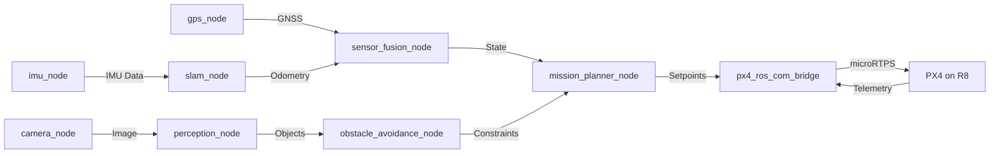
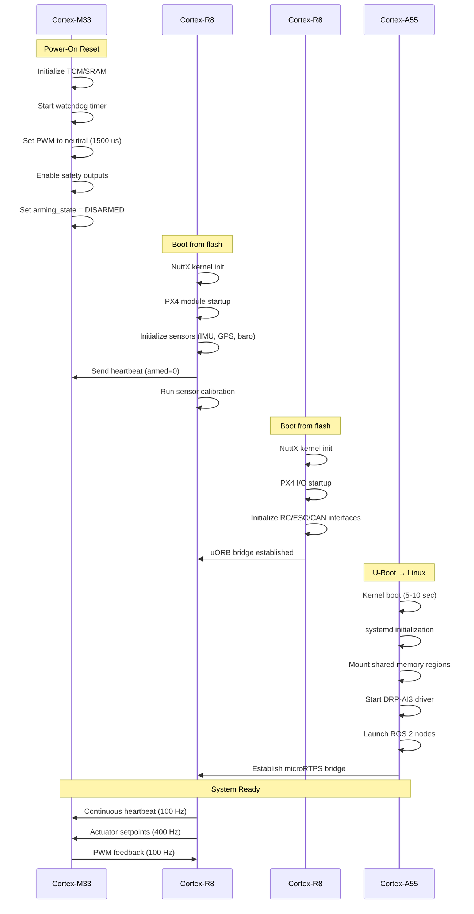

# System and Software Architecture for Autonomous Drone Using Renesas RZ/V2H

## Executive Summary

This document presents a production-ready system and software architecture for an advanced autonomous drone platform leveraging the Renesas RZ/V2H MPU's heterogeneous multi-core architecture. The design implements a clear separation of concerns across compute domains while maintaining robust real-time guarantees and safety-critical operation.

### Key Architecture Principles:
- **Domain Isolation**: Clear boundaries between AI/perception (A55), real-time flight control (R8), and deterministic I/O (M33)
- **Safety-First Design**: Hardware-enforced failsafes, redundant monitoring, and graceful degradation
- **Standards Compliance**: PX4 flight stack, ROS 2 middleware, MAVLink protocol
- **Scalable Performance**: Efficient use of DRP-AI3 accelerator for 8-80 TOPS vision processing

---

## Table of Contents
1. [Hardware Platform Overview](#1-hardware-platform-overview)
2. [Software Stack Architecture](#2-software-stack-architecture)
3. [Project Folder Structure](#3-project-folder-structure)
4. [Inter-Core Communication Architecture](#4-inter-core-communication-architecture)
5. [Safety and Failsafe Architecture](#5-safety-and-failsafe-architecture)
6. [Build and Deployment](#6-build-and-deployment)

---

## 3. Project Folder Structure

<a name="3-project-folder-structure"></a>

The RZV2H PX4 implementation is organized into three primary board configurations for the heterogeneous multi-core architecture:

### 3.1 Overview

```
boards/renesas/
├── rdk-rzv2h/              # CR8-0: PX4 FMU (Main Flight Controller)
├── rdk-rzv2h-io-cr8_1/     # CR8-1: PX4 I/O Processor (RC, CAN, Telemetry)
└── rdk-rzv2h-io-cm33/      # CM33: ESC Controller (PWM/DShot, Safety)
```

### 3.2 CR8-0: Main Flight Management Unit (FMU)

**Path**: `boards/renesas/rdk-rzv2h/`

```
rdk-rzv2h/
├── default.px4board           # PX4 board configuration
├── firmware.prototype         # Firmware metadata
├── Kconfig                    # Board-specific kernel config
├── init/                      # Initialization scripts
│   ├── rc.board_defaults      # Default parameters
│   ├── rc.board_defaults.cmds # Startup commands
│   └── rc.offline_sensor_check # Sensor validation
├── nuttx-config/              # NuttX RTOS configuration
│   ├── include/
│   │   └── board.h            # Hardware definitions
│   ├── nsh/
│   │   └── defconfig          # CR8-0 defconfig (CONFIG_RZV2H_BUILD_CR8_0=y)
│   ├── scripts/
│   │   └── rdk-rzv2h_cr8_0.ld # Linker script (TCM/SRAM/DDR layout)
│   └── src/
│       └── rzv2h_appinit.c    # Board initialization
├── px4io_cr8_0/               # Optional: FMU-side PX4IO integration
└── src/                       # Board support code
    ├── board_config.h         # Pin mappings, peripheral config
    ├── board_common.c         # Common board functions
    ├── CMakeLists.txt         # Build configuration
    ├── i2c.cpp                # I2C bus initialization
    ├── init.c                 # Early hardware init
    ├── led.c                  # LED control
    ├── spi.cpp                # SPI bus initialization
    ├── system_stubs.c         # System stubs
    └── timer_config.cpp       # GPT timer configuration (HRT, PWM)
```

**Key Features**:
- Real-time flight control (1000Hz rate, 500Hz attitude, 250Hz position)
- Sensor drivers (BMI088, ICM-42688, BMP390, GPS)
- EKF2 sensor fusion
- microRTPS bridge to A55 Linux
- uORB bridge to CR8-1

### 3.3 CR8-1: I/O Processor (RC, CAN-FD, Battery)

**Path**: `boards/renesas/rdk-rzv2h-io-cr8_1/`

```
rdk-rzv2h-io-cr8_1/
├── default.px4board           # PX4 board config (CONFIG_PX4IO_CR8=y)
├── firmware.prototype         # Firmware metadata
├── nuttx-config/              # NuttX configuration
│   ├── include/
│   │   └── board.h            # Hardware definitions
│   ├── nsh/
│   │   └── defconfig          # CR8-1 defconfig (CONFIG_RZV2H_BUILD_CR8_1=y)
│   ├── scripts/
│   │   └── script.ld          # Linker script (.ipc_ram @ 0x70000000)
│   └── src/
├── px4io_cr8_1/               # PX4 I/O application
│   ├── CMakeLists.txt         # App build config
│   ├── protocol.h             # IPC protocol (CR8-1 ↔ M33)
│   ├── px4io_cr8.cpp          # Main I/O loop (RC, CAN, Battery, Failsafe)
│   ├── px4io_cr8.h            # App header
│   ├── sharedmem_transport.cpp # Shared memory transport (CR8-1 ↔ M33)
│   └── sharedmem_transport.h  # Transport interface
└── src/                       # Board support
    ├── board_config.h         # Pin mappings (UART, CAN, ADC, GPIO)
    ├── CMakeLists.txt         # Board build config
    └── init.c                 # Board initialization
```

**Key Features**:
- RC input decoding (SBUS/CRSF/PPM/DSM at 50-100Hz)
- CAN-FD UAVCAN (ESC telemetry: RPM, voltage, current, temp)
- Battery monitoring (ADC voltage/current sensing)
- Safety monitor (CR8-0 heartbeat, RC validity, battery level)
- Failsafe coordinator (RC loss, FMU loss, battery low)
- Shared memory transport to M33 (actuator setpoints at 400Hz)

### 3.4 CM33: ESC Controller (PWM/DShot, Safety)

**Path**: `boards/renesas/rdk-rzv2h-io-cm33/`

```
rdk-rzv2h-io-cm33/
├── default.px4board           # PX4 board config (CONFIG_PX4IO_M33=y)
├── firmware.prototype         # Firmware metadata
├── nuttx-config/              # NuttX configuration
│   ├── include/
│   │   └── board.h            # Hardware definitions
│   ├── nsh/
│   │   └── defconfig          # CM33 defconfig (CONFIG_RZV2H_BUILD_CM33=y)
│   ├── scripts/
│   │   └── script.ld          # Linker script (.ipc_ram, .dma_buffers @ 0x70000000)
│   └── src/
├── px4io_m33/                 # PX4 ESC application
│   ├── CMakeLists.txt         # App build config
│   ├── protocol.h             # IPC protocol (CR8-1 ↔ M33, matching CR8-1)
│   ├── px4io_m33.cpp          # Main ESC loop (PWM/DShot, Watchdog, Safety)
│   ├── px4io_m33.h            # App header
│   ├── pwm_dshot.cpp          # GPT + DMA PWM/DShot generation (8 channels)
│   ├── pwm_dshot.h            # PWM interface
│   ├── dma_driver.cpp         # Double-buffered DMA (ping-pong for DShot)
│   ├── safety_switch.cpp      # Physical safety switch (debounce, arming gate)
│   ├── sharedmem_transport.cpp # Shared memory transport (CR8-1 ↔ M33)
│   └── sharedmem_transport.h  # Transport interface
└── src/                       # Board support
    ├── board_config.h         # Pin mappings (GPT timers, DMA, Watchdog, Safety)
    ├── CMakeLists.txt         # Board build config
    ├── init.c                 # Board initialization
    └── timer_config.cpp       # GPT timer setup (8-channel PWM/DShot)
```

**Key Features**:
- 8-channel PWM/DShot output (400-2000Hz, GPT timers + DMA)
- Double-buffered DMA (ping-pong) for deterministic DShot frame generation
- Hardware watchdog (500ms timeout → emergency motor cutoff)
- Physical safety switch (arming gate, LED patterns)
- Shared memory interface from CR8-1 (CRC32 validation, sequence tracking)
- Deterministic timing (<100µs jitter)

### 3.5 Platform Layer (Shared NuttX Drivers)

**Path**: `platforms/nuttx/src/px4/renesas/rzv/`

```
platforms/nuttx/src/px4/renesas/rzv/
├── adc/                       # ADC abstraction (battery monitoring)
│   ├── adc.cpp
│   └── adc.h
├── board_critmon/             # Critical section monitoring
├── board_hw_info/             # Hardware info reporting
├── board_reset/               # Board reset handling
├── dshot/                     # DShot protocol implementation
│   ├── dshot.c
│   └── dshot.h
├── hrt/                       # High-resolution timer (HRT)
│   ├── hrt.c
│   └── hrt.h
├── include/                   # Platform headers
│   └── px4_arch/
│       ├── hw_description.h   # Hardware config
│       └── io_timer_hw_description.h # Timer channel mapping
├── io_pins/                   # GPIO and timer abstraction
│   ├── io_timer.c             # Timer abstraction
│   └── pwm_servo.c            # PWM output abstraction
├── led_pwm/                   # LED PWM control
├── micro_hal/                 # Micro HAL abstraction
├── spi/                       # SPI bus abstraction
│   ├── spi.c
│   └── spi.h
└── version/                   # Version reporting
```

**Shared Components**:
- Hardware abstraction layer (HAL) for all RZV2H boards
- Common timer, PWM, SPI, ADC drivers
- DShot protocol stack
- High-resolution timer (HRT) for PX4 scheduling

### 3.6 IPC Protocol Structure

**Shared Header**: `protocol.h` (identical in CR8-1 and CM33)

```c
/* protocol.h - IPC message formats for CR8-1 ↔ M33 */

#define IPC_MAGIC 0x525A5632  // "RZV2"
#define IPC_VERSION 0x01

/* Actuator command (CR8-1 → M33, 400Hz) */
typedef struct {
    uint32_t magic;           // IPC_MAGIC
    uint8_t version;          // IPC_VERSION
    uint8_t mixer_select;     // Quad-X, Hexa-X, Octa-X
    uint16_t sequence;        // Sequence number (gap detection)
    uint16_t motor[8];        // PWM values (1000-2000µs or DShot)
    uint8_t safety_flags;     // Arm, disarm, emergency
    uint32_t crc32;           // CRC32 of all fields
} __attribute__((packed)) actuator_cmd_t;

/* PWM feedback (M33 → CR8-1, 100Hz) */
typedef struct {
    uint32_t magic;
    uint8_t version;
    uint16_t sequence;
    uint16_t pwm_duty[8];     // Actual PWM duty cycles
    uint8_t fault_status;     // Watchdog, safety switch, ESC faults
    uint32_t crc32;
} __attribute__((packed)) pwm_feedback_t;

/* Heartbeat (bidirectional, 10Hz) */
typedef struct {
    uint32_t magic;
    uint8_t version;
    uint64_t timestamp_us;
    uint8_t core_id;          // 0=CR8-1, 1=M33
    uint32_t crc32;
} __attribute__((packed)) heartbeat_t;
```

---

## 1. Hardware Platform Overview

<a name="1-hardware-platform-overview"></a>

### 1.1 RZ/V2H Core Configuration
┌─────────────────────────────────────────────────────────────┐
│                    Renesas RZ/V2H MPU                       │
├─────────────────────────────────────────────────────────────┤
│  Cortex-A55 (x4) @ 1.8 GHz                                  │
│  ├─ Linux (Yocto 4.0+)                                      │
│  ├─ ROS 2 Humble/Iron                                       │
│  ├─ PX4 Companion (microRTPS bridge)                        │
│  └─ DRP-AI3 Driver (8-80 TOPS)                              │
├─────────────────────────────────────────────────────────────┤
│  Cortex-R8 (x2) @ 800 MHz                                   │
│  ├─ Core 0: PX4 FMU (NuttX)                                 │
│  └─ Core 1: PX4 I/O (NuttX)                                 │
├─────────────────────────────────────────────────────────────┤
│  Cortex-M33 @ 200 MHz                                       │
│  └─ PX4 I/O (NuttX)                        				  │
├─────────────────────────────────────────────────────────────┤
│  DRP-AI3 Accelerator                                        │
│  └─ Vision AI Inference Engine                              │
└─────────────────────────────────────────────────────────────┘

### 1.2 Memory Architecture

**Shared Memory Regions (Non-Cacheable)**:
```
0x70000000 - 0x7000FFFF: Actuator Setpoints (64KB)
0x70010000 - 0x7001FFFF: Sensor Data Pool (64KB)
0x70020000 - 0x7002FFFF: Mission Commands (64KB)
0x70030000 - 0x7003FFFF: Status & Telemetry (64KB)
0x70040000 - 0x7007FFFF: Vision Data Buffer (256KB)
```

**Core-Private Memory**:
- **A55**: DDR4 SDRAM (2-4GB) - Linux heap, ROS 2 buffers
- **R8-0**: TCM (256KB) + SRAM (2MB) - PX4 critical loops
- **R8-1**: TCM (256KB) + SRAM (1MB) - I/O processing
- **M33**: TCM (128KB) - PWM/DMA buffers

---

## 2. Software Stack Architecture

<a name="2-software-stack-architecture"></a>

### 2.1 Cortex-A55 Cluster (Linux Domain)

**Operating System**:

```yaml
Base: Yocto Linux 4.0+ (kirkstone/langdale)
Kernel: Linux 5.15+ with real-time patches (PREEMPT_RT)
Init System: systemd with custom drone services
Filesystem: ext4 root, tmpfs for logs
Security: SELinux enforcing mode, secure boot
```

**Core Components**:
┌─────────────────────────────────────────────────────────────┐
│                  Application Layer (A55)                    │
├─────────────────────────────────────────────────────────────┤
│  ROS 2 Nodes                                                │
│  ├─ perception_node (DRP-AI3 interface)                     │
│  ├─ slam_node (visual-inertial odometry)                    │
│  ├─ obstacle_avoidance_node                                 │
│  ├─ mission_planner_node                                    │
│  └─ px4_ros_com_bridge (microRTPS)                          │
├─────────────────────────────────────────────────────────────┤
│  Middleware Layer                                           │
│  ├─ ROS 2 DDS (CycloneDDS/FastDDS)                          │
│  ├─ OpenAMP/RPMsg (R8 ↔ A55)                                │
│  └─ DRP-AI3 SDK (vision accelerator)                        │
├─────────────────────────────────────────────────────────────┤
│  System Services                                            │
│  ├─ MAVLink Router (TCP/UDP/Serial)                         │
│  ├─ Video Streaming (GStreamer + RTSP)                      │
│  ├─ Data Logger (rosbag2)                                   │
│  └─ Configuration Manager (YAML/JSON)                       │
└─────────────────────────────────────────────────────────────┘

**ROS 2 Node Graph**:



**DRP-AI3 Integration**:

```c
// DRP-AI3 Vision Pipeline
typedef struct {
    drp_ai3_context_t ai_ctx;
    cv::Mat input_image;
    std::vector<Detection> detections;
    float inference_time_ms;
} vision_pipeline_t;

class PerceptionNode : public rclcpp::Node {
public:
    void image_callback(const sensor_msgs::msg::Image::SharedPtr msg) {
        // Preprocess
        cv::Mat rgb = cv_bridge::toCvShare(msg)->image;
        cv::resize(rgb, input_tensor, cv::Size(640, 640));

        // DRP-AI3 inference (8-80 TOPS)
        drp_ai3_run_inference(&ai_ctx, input_tensor.data, output_tensor);

        // Post-process
        parse_yolo_output(output_tensor, detections);

        // Publish to obstacle avoidance
        publish_detections(detections);
    }
};
```

---

### 2.2 Cortex-R8 Core 0 (PX4 FMU - Flight Management Unit)

**Operating System**: NuttX RTOS 12.x

┌─────────────────────────────────────────────────────────────┐
│            PX4 Autopilot v1.14+ (NuttX on R8-0)             │
├─────────────────────────────────────────────────────────────┤
│  Flight Control Stack                                       │
│  ├─ Commander (mode management)                             │
│  ├─ EKF2 (sensor fusion, 250 Hz)                            │
│  ├─ mc_att_control (attitude, 500 Hz)                       │
│  ├─ mc_rate_control (rate, 1000 Hz)                         │
│  └─ mc_pos_control (position, 250 Hz)                       │
├─────────────────────────────────────────────────────────────┤
│  Sensor Drivers                                             │
│  ├─ BMI088 (IMU primary, SPI, 2 kHz)                        │
│  ├─ ICM-42688 (IMU backup, SPI, 2 kHz)                      │
│  ├─ BMP390 (barometer, I2C, 100 Hz)                         │
│  ├─ IST8310 (magnetometer, I2C, 100 Hz)                     │
│  └─ u-blox M9N (GPS, UART, 10 Hz)                           │
├─────────────────────────────────────────────────────────────┤
│  Communication                                              │
│  ├─ microRTPS bridge (→ A55 ROS 2)                          │
│  ├─ MAVLink (telemetry, GCS)                                │
│  └─ uORB (internal pub/sub)                                 │
├─────────────────────────────────────────────────────────────┤
│  Shared Memory Interface                                    │
│  ├─ Actuator Setpoints (→ M33, 400 Hz)                      │
│  ├─ Sensor Fusion Output (→ A55, 100 Hz)                    │
│  └─ Mission Commands (← A55, async)                         │
└─────────────────────────────────────────────────────────────┘

**Critical Control Loops**:

```c
// R8-0 Real-Time Scheduling
// Priority levels: 0 (highest) → 255 (lowest)

// 1000 Hz rate control loop (highest priority)
#define SCHED_PRIORITY_RATE_CONTROL      240
#define RATE_CONTROL_INTERVAL_US         1000  // 1 ms

void rate_control_thread(void *arg) {
    struct timespec next_wakeup;
    clock_gettime(CLOCK_MONOTONIC, &next_wakeup);

    while (true) {
        // Read gyroscope (< 50 us via SPI DMA)
        imu_read_gyro(&gyro_xyz);

        // PID rate control (< 200 us)
        mc_rate_controller_update(&rate_setpoint, &gyro_xyz, &motor_outputs);

        // Write to shared memory for M33 (< 50 us)
        actuator_setpoints_publish(motor_outputs);

        // Deterministic sleep
        next_wakeup.tv_nsec += RATE_CONTROL_INTERVAL_US * 1000;
        clock_nanosleep(CLOCK_MONOTONIC, TIMER_ABSTIME, &next_wakeup, NULL);
    }
}

// 250 Hz EKF2 fusion (high priority)
#define SCHED_PRIORITY_EKF2              230
#define EKF2_INTERVAL_US                 4000  // 4 ms

void ekf2_thread(void *arg) {
    while (true) {
        // Fuse IMU, barometer, GPS, magnetometer
        ekf2_update(&sensor_data, &state_estimate);

        // Publish to uORB and shared memory
        vehicle_attitude_publish(&state_estimate.attitude);
        vehicle_local_position_publish(&state_estimate.position);

        usleep(EKF2_INTERVAL_US);
    }
}
Sensor Redundancy:

```c
// Dual IMU configuration with cross-validation
typedef struct {
    imu_data_t primary_imu;    // BMI088
    imu_data_t backup_imu;     // ICM-42688
    bool primary_healthy;
    bool backup_healthy;
    uint32_t fault_count[2];
    float variance_threshold;
} redundant_imu_system_t;

void imu_cross_validate(redundant_imu_system_t *sys) {
    float accel_diff = vector_norm(
        sys->primary_imu.accel - sys->backup_imu.accel
    );

    if (accel_diff > sys->variance_threshold) {
        sys->fault_count[select_faulty_imu()]++;

        if (sys->fault_count[0] > 10) {
            sys->primary_healthy = false;
            mavlink_send_statustext(MAV_SEVERITY_CRITICAL,
                                   "IMU0 FAILURE - SWITCHED TO BACKUP");
        }
    }
}
________________________________________
2.3 Cortex-R8 Core 1 (PX4 I/O Processor)
Operating System: NuttX RTOS 12.x (Separate Instance)
┌─────────────────────────────────────────────────────────────┐
│          PX4 I/O Processor (NuttX on R8-1)                  │
├─────────────────────────────────────────────────────────────┤
│  I/O Management                                             │
│  ├─ RC Input Processing (SBUS/CRSF/PPM)                     │
│  ├─ ESC Telemetry (DShot, UART)                             │
│  ├─ CAN-FD Interface (UAVCAN v1)                            │
│  └─ Safety Switch & LED Driver                              │
├─────────────────────────────────────────────────────────────┤
│  Power Management                                           │
│  ├─ Battery Monitor (ADC, current sensor)                   │
│  ├─ Voltage Regulator Control                               │
│  └─ Power Domain Sequencing                                 │
├─────────────────────────────────────────────────────────────┤
│  Failsafe Logic                                             │
│  ├─ RC Loss Detection                                       │
│  ├─ GPS Loss Monitoring                                     │
│  ├─ Geofence Enforcement                                    │
│  └─ Emergency Landing Trigger                               │
├─────────────────────────────────────────────────────────────┤
│  Inter-Core Communication                                   │
│  ├─ uORB Bridge (R8-0 ↔ R8-1)                               │
│  └─ Shared Memory Status (→ A55)                            │
└─────────────────────────────────────────────────────────────┘
RC Input Processing:

```c
// SBUS protocol decoder (100 kbps inverted serial)
#define SBUS_FRAME_SIZE 25
#define SBUS_UPDATE_RATE_HZ 100

void sbus_decode_thread(void *arg) {
    uint8_t frame[SBUS_FRAME_SIZE];
    rc_channels_t channels;

    while (true) {
        // Read UART with timeout
        if (uart_read_frame(UART_RC, frame, SBUS_FRAME_SIZE, 20) == OK) {
            // Decode 16 channels (11-bit each)
            sbus_parse_frame(frame, &channels);

            // Publish to uORB for R8-0 flight control
            orb_publish(ORB_ID(input_rc), &channels);

            // Update failsafe timer
            rc_last_update = hrt_absolute_time();
        } else {
            // RC loss detected
            if (hrt_elapsed_time(&rc_last_update) > 1000000) { // 1 sec
                trigger_failsafe(FAILSAFE_RC_LOSS);
            }
        }
    }
}
```

CAN-FD UAVCAN Integration:

```c
// UAVCAN v1 node configuration
#define UAVCAN_NODE_ID 42
#define CANFD_BITRATE 1000000  // 1 Mbps nominal
#define CANFD_BITRATE_DATA 4000000  // 4 Mbps data phase

void uavcan_init() {
    // Initialize CAN-FD controller
    canfd_init(CANFD_BITRATE, CANFD_BITRATE_DATA);

    // Subscribe to ESC status
    uavcan_subscribe(UAVCAN_SUBJECT_ESC_STATUS, esc_status_callback);

    // Publish actuator commands (from shared memory)
    uavcan_publish_start(UAVCAN_SUBJECT_ACTUATOR_COMMAND, 200); // 200 Hz
}

void esc_status_callback(const uavcan_esc_status_t *msg) {
    // Forward ESC telemetry to R8-0 for monitoring
    esc_telemetry_t telem = {
        .rpm = msg->rpm,
        .voltage = msg->voltage,
        .current = msg->current,
        .temperature = msg->temperature
    };

    orb_publish(ORB_ID(esc_status), &telem);
}
```

________________________________________
2.4 Cortex-M33 (Bare-Metal ESC Controller)
NuttX RTOS - Ultra-Deterministic Bare-Metal Implementation
┌─────────────────────────────────────────────────────────────┐
│        Bare-Metal ESC Controller (M33)                      │
├─────────────────────────────────────────────────────────────┤
│  PWM/DShot Generation                                       │
│  ├─ 8-channel DMA-driven PWM (400-2000 Hz)                  │
│  ├─ DShot600/1200 bidirectional protocol                    │
│  └─ Hardware timer + DMA double-buffering                   │
├─────────────────────────────────────────────────────────────┤
│  Safety Monitoring                                          │
│  ├─ Watchdog timer (hardware + software)                    │
│  ├─ Heartbeat validation from R8-0                          │
│  ├─ Arming state machine                                    │
│  └─ Emergency motor cutoff                                  │
├─────────────────────────────────────────────────────────────┤
│  Shared Memory Interface                                    │
│  ├─ Read: Actuator setpoints from R8-0                      │
│  └─ Write: PWM feedback & fault status                      │
└─────────────────────────────────────────────────────────────┘
Memory Layout:

```c
// Shared memory structures (aligned, non-cacheable)
typedef struct __attribute__((aligned(64))) {
    uint32_t sequence;           // Monotonic counter
    uint64_t timestamp_us;       // PX4 hrt_absolute_time()
    float motor_outputs[8];      // -1.0 to 1.0
    bool armed;                  // Master arm flag
    uint32_t crc32;              // Data integrity check
} actuator_setpoints_t;

typedef struct __attribute__((aligned(64))) {
    uint16_t pwm_us[8];          // Actual PWM pulse widths
    uint32_t dma_underrun_count; // DMA error counter
    uint32_t fault_mask;         // Bit flags for faults
    uint32_t crc32;
} pwm_feedback_t;

// Shared memory pointers (mapped to non-cacheable region)
volatile actuator_setpoints_t *g_setpoints =
    (actuator_setpoints_t *)0x70000000;
volatile pwm_feedback_t *g_feedback =
    (pwm_feedback_t *)0x70000100;
```

DMA-Driven PWM Architecture:

```c
// Double-buffered DMA for PWM duty cycle updates
#define PWM_CHANNELS 8
#define PWM_FREQUENCY_HZ 400
#define TIMER_CLOCK_HZ 200000000  // 200 MHz

static uint32_t pwm_dma_buffer[2][PWM_CHANNELS] __attribute__((aligned(32)));
static volatile uint8_t active_buffer = 0;

void pwm_dma_init(void) {
    // Configure timer for PWM generation
    TIM1->PSC = 0;  // No prescaler
    TIM1->ARR = (TIMER_CLOCK_HZ / PWM_FREQUENCY_HZ) - 1;  // Period

    // Configure DMA for CCR register updates
    DMA1_Channel1->CPAR = (uint32_t)&TIM1->CCR1;
    DMA1_Channel1->CMAR = (uint32_t)&pwm_dma_buffer[0][0];
    DMA1_Channel1->CNDTR = PWM_CHANNELS;
    DMA1_Channel1->CCR = DMA_CCR_MINC | DMA_CCR_DIR | DMA_CCR_TCIE;

    // Enable DMA request on timer update
    TIM1->DIER |= TIM_DIER_UDE;
    TIM1->CR1 |= TIM_CR1_CEN;  // Start timer
}

// Timer overflow interrupt (400 Hz)
void TIM1_UP_IRQHandler(void) {
    // Swap DMA buffer (ping-pong)
    active_buffer ^= 1;
    DMA1_Channel1->CMAR = (uint32_t)&pwm_dma_buffer[active_buffer][0];

    // Copy new setpoints from shared memory to inactive buffer
    uint8_t inactive_buffer = active_buffer ^ 1;

    if (validate_setpoints(g_setpoints)) {
        for (int i = 0; i < PWM_CHANNELS; i++) {
            // Convert -1.0→1.0 to PWM duty cycle
            float duty = (g_setpoints->motor_outputs[i] + 1.0f) / 2.0f;
            pwm_dma_buffer[inactive_buffer][i] =
                (uint32_t)(duty * TIM1->ARR);
        }
    } else {
        // Failsafe: neutral PWM
        memset(&pwm_dma_buffer[inactive_buffer], 0, sizeof(pwm_dma_buffer[0]));
    }

    TIM1->SR &= ~TIM_SR_UIF;  // Clear interrupt flag
}
```

Arming State Machine:

```c
typedef enum {
    ARMING_STATE_DISARMED = 0,
    ARMING_STATE_PREARMED,
    ARMING_STATE_ARMED,
    ARMING_STATE_EMERGENCY_STOP
} arming_state_t;

static arming_state_t g_arming_state = ARMING_STATE_DISARMED;
static uint32_g_last_heartbeat_ms = 0;

bool check_arming_conditions(void) {
    // Safety checks before arming
    bool conditions_ok = true;

    // 1. Check heartbeat from R8
    uint32_t now_ms = HAL_GetTick();
    if ((now_ms - g_last_heartbeat_ms) > 100) {  // 100 ms timeout
        conditions_ok = false;
        g_feedback->fault_mask |= FAULT_HEARTBEAT_LOST;
    }

    // 2. Check physical safety switch
    if (HAL_GPIO_ReadPin(SAFETY_SWITCH_GPIO, SAFETY_SWITCH_PIN) != GPIO_PIN_RESET) {
        conditions_ok = false;
    }

    // 3. Check setpoints CRC
    uint32_t computed_crc = crc32_calculate((uint8_t*)g_setpoints,
                                           sizeof(actuator_setpoints_t) - 4);
    if (computed_crc != g_setpoints->crc32) {
        conditions_ok = false;
        g_feedback->fault_mask |= FAULT_CRC_ERROR;
    }

    return conditions_ok;
}

void arming_state_machine(void) {
    switch (g_arming_state) {
        case ARMING_STATE_DISARMED:
            // All PWM outputs at neutral (1500 us)
            if (g_setpoints->armed && check_arming_conditions()) {
                g_arming_state = ARMING_STATE_PREARMED;
            }
            break;

        case ARMING_STATE_PREARMED:
            // 2-second delay for operator confirmation
            if (prearmed_duration_ms() > 2000) {
                g_arming_state = ARMING_STATE_ARMED;
                HAL_GPIO_WritePin(LED_ARMED_GPIO, LED_ARMED_PIN, GPIO_PIN_SET);
            }
            break;

        case ARMING_STATE_ARMED:
            // Normal operation - output PWM from shared memory
            if (!g_setpoints->armed || !check_arming_conditions()) {
                g_arming_state = ARMING_STATE_EMERGENCY_STOP;
            }
            break;

        case ARMING_STATE_EMERGENCY_STOP:
            // Immediate motor cutoff
            pwm_emergency_stop();
            g_arming_state = ARMING_STATE_DISARMED;
            break;
    }
}
```

________________________________________
3. Inter-Core Communication Architecture
3.1 Communication Channels
┌──────────────────────────────────────────────────────────────┐
│                  Communication Matrix                        │
├──────────────┬───────────────────────────────────────────────┤
│ A55 ↔ R8-0   │ OpenAMP/RPMsg (512 KB/s bidirectional)        │
│              │ - microRTPS bridge for ROS 2 ↔ PX4            │
│              │ - Shared memory for sensor data               │
├──────────────┼───────────────────────────────────────────────┤
│ R8-0 ↔ R8-1  │ uORB over shared memory (1 MB/s)              │
│              │ - RC inputs, ESC telemetry                    │
│              │ - Failsafe triggers                           │
├──────────────┼───────────────────────────────────────────────┤
│ R8-0 ↔ M33   │ Shared SRAM (actuator setpoints, 400 Hz)      │
│              │ - Write: motor outputs                        │
│              │ - Read: PWM feedback, faults                  │
├──────────────┼───────────────────────────────────────────────┤
│ A55 ↔ M33    │ Indirect via R8-0 (no direct channel)         │
└──────────────┴───────────────────────────────────────────────┘
3.2 Boot Sequence



3.3 microRTPS Bridge (A55 ↔ R8-0)
Configuration:

```yaml
# micrortps_bridge.yaml
transport: shared_memory
shmem_path: /dev/shm/px4_ros2_bridge
buffer_size: 65536
topics:
  # PX4 → ROS 2
  - name: /fmu/out/vehicle_attitude
    px4_type: vehicle_attitude
    ros2_type: px4_msgs/msg/VehicleAttitude
    qos: best_effort
    rate_hz: 100

  - name: /fmu/out/vehicle_local_position
    px4_type: vehicle_local_position
    ros2_type: px4_msgs/msg/VehicleLocalPosition
    qos: reliable
    rate_hz: 50

  # ROS 2 → PX4
  - name: /fmu/in/trajectory_setpoint
    px4_type: trajectory_setpoint
    ros2_type: px4_msgs/msg/TrajectorySetpoint
    qos: reliable
    rate_hz: 50
Implementation:

```cpp
// ROS 2 node on A55
class PX4BridgeNode : public rclcpp::Node {
public:
    PX4BridgeNode() : Node("px4_bridge") {
        // Publisher: PX4 → ROS 2
        attitude_pub_ = this->create_publisher<px4_msgs::msg::VehicleAttitude>(
            "/fmu/out/vehicle_attitude",
            rclcpp::QoS(10).best_effort()
        );

        // Subscriber: ROS 2 → PX4
        trajectory_sub_ = this->create_subscription<px4_msgs::msg::TrajectorySetpoint>(
            "/fmu/in/trajectory_setpoint",
            rclcpp::QoS(10).reliable(),
            std::bind(&PX4BridgeNode::trajectory_callback, this, std::placeholders::_1)
        );

        // Shared memory connection to R8-0
        micrortps_transport_init(&transport_, "/dev/shm/px4_ros2_bridge");
    }

private:
    void trajectory_callback(const px4_msgs::msg::TrajectorySetpoint::SharedPtr msg) {
        // Serialize and send to PX4

        ucdrBuffer ub;
        uint8_t buffer[256];
        ucdr_init_buffer(&ub, buffer, sizeof(buffer));

        // Pack trajectory setpoint
        ucdr_serialize_float(&ub, msg->position[0]);
        ucdr_serialize_float(&ub, msg->position[1]);
        ucdr_serialize_float(&ub, msg->position[2]);
        ucdr_serialize_float(&ub, msg->velocity[0]);
        ucdr_serialize_float(&ub, msg->velocity[1]);
        ucdr_serialize_float(&ub, msg->velocity[2]);
        ucdr_serialize_float(&ub, msg->yaw);

        // Send via shared memory to R8-0
        micrortps_transport_write(&transport_, TOPIC_TRAJECTORY_SETPOINT,
                                 buffer, ucdr_buffer_length(&ub));
    }

    rclcpp::Publisher<px4_msgs::msg::VehicleAttitude>::SharedPtr attitude_pub_;
    rclcpp::Subscription<px4_msgs::msg::TrajectorySetpoint>::SharedPtr trajectory_sub_;
    micrortps_transport_t transport_;
};
```

NuttX Side (R8-0):

```c
// PX4 microRTPS agent on R8-0
static int micrortps_agent_main(int argc, char *argv[])
{
    struct micrortps_transport_t transport;
    micrortps_transport_init(&transport, TRANSPORT_SHMEM);

    while (!should_exit) {
        // Poll for incoming messages from ROS 2
        uint8_t topic_id;
        uint8_t buffer[512];
        ssize_t bytes_read = micrortps_transport_read(&transport, &topic_id,
                                                       buffer, sizeof(buffer), 10);

        if (bytes_read > 0) {
            switch (topic_id) {
                case TOPIC_TRAJECTORY_SETPOINT:
                    handle_trajectory_setpoint(buffer, bytes_read);
                    break;

                case TOPIC_VEHICLE_COMMAND:
                    handle_vehicle_command(buffer, bytes_read);
                    break;
            }
        }

        // Publish PX4 topics to ROS 2
        publish_vehicle_attitude(&transport);
        publish_vehicle_local_position(&transport);
        publish_battery_status(&transport);

        px4_usleep(5000); // 5 ms sleep
    }

    return 0;
}

static void handle_trajectory_setpoint(uint8_t *buffer, size_t len)
{
    trajectory_setpoint_s setpoint = {};

    // Deserialize from CDR buffer
    ucdrBuffer ub;
    ucdr_init_buffer(&ub, buffer, len);
    ucdr_deserialize_float(&ub, &setpoint.position[0]);
    ucdr_deserialize_float(&ub, &setpoint.position[1]);
    ucdr_deserialize_float(&ub, &setpoint.position[2]);
    ucdr_deserialize_float(&ub, &setpoint.velocity[0]);
    ucdr_deserialize_float(&ub, &setpoint.velocity[1]);
    ucdr_deserialize_float(&ub, &setpoint.velocity[2]);
    ucdr_deserialize_float(&ub, &setpoint.yaw);

    setpoint.timestamp = hrt_absolute_time();

    // Publish to PX4 control stack via uORB
    orb_publish(ORB_ID(trajectory_setpoint), &setpoint);
}
```

________________________________________
## 4. DRP-AI3 Vision Processing Pipeline

<a name="4-drp-ai3-vision-processing-pipeline"></a>
4.1 DRP-AI3 Architecture Overview
┌─────────────────────────────────────────────────────────────┐
│                  DRP-AI3 Accelerator                        │
├─────────────────────────────────────────────────────────────┤
│  Input Layer                                                │
│  ├─ MIPI-CSI Camera Interface (4K @ 30fps)                  │
│  ├─ Preprocessing Pipeline (resize, normalize)              │
│  └─ DMA transfer to AI memory                               │
├─────────────────────────────────────────────────────────────┤
│  Neural Network Engine (8-80 TOPS)                          │
│  ├─ INT8/FP16 quantized models                              │
│  ├─ YOLOv5/v8 object detection                              │
│  ├─ Depth estimation (monocular/stereo)                     │
│  └─ Semantic segmentation                                   │
├─────────────────────────────────────────────────────────────┤
│  Post-Processing                                            │
│  ├─ NMS (Non-Maximum Suppression)                           │
│  ├─ Object tracking (Kalman filter)                         │
│  └─ Coordinate transformation                               │
└─────────────────────────────────────────────────────────────┘
4.2 Vision Pipeline Implementation

```cpp
// DRP-AI3 Vision Node on A55
class VisionPerceptionNode : public rclcpp::Node {
public:
    VisionPerceptionNode() : Node("vision_perception") {
        // Initialize DRP-AI3
        if (drp_ai3_open(&ai_handle_, "/dev/drp_ai") != 0) {
            RCLCPP_ERROR(this->get_logger(), "Failed to open DRP-AI3");
            throw std::runtime_error("DRP-AI3 initialization failed");
        }

        // Load YOLOv5 model (INT8 quantized, 640x640 input)
        load_model("/opt/models/yolov5s_int8.drp");

        // Camera subscriber
        camera_sub_ = this->create_subscription<sensor_msgs::msg::Image>(
            "/camera/image_raw",
            rclcpp::SensorDataQoS(),
            std::bind(&VisionPerceptionNode::camera_callback, this, _1)
        );

        // Detection publisher
        detection_pub_ = this->create_publisher<vision_msgs::msg::Detection2DArray>(
            "/perception/detections", 10
        );

        // Obstacle publisher (for path planning)
        obstacle_pub_ = this->create_publisher<geometry_msgs::msg::PoseArray>(
            "/perception/obstacles", 10
        );
    }

private:
    void camera_callback(const sensor_msgs::msg::Image::SharedPtr msg) {
        auto start_time = this->now();

        // Convert ROS image to OpenCV
        cv_bridge::CvImagePtr cv_ptr = cv_bridge::toCvCopy(msg, "bgr8");
        cv::Mat input_image = cv_ptr->image;

        // Preprocess for YOLOv5 (resize, normalize, NHWC→NCHW)
        cv::Mat preprocessed;
        preprocess_yolo_input(input_image, preprocessed);

        // Run inference on DRP-AI3
        std::vector<Detection> detections;
        float inference_ms = run_inference(preprocessed, detections);

        // Publish detections
        publish_detections(detections, msg->header);

        // Extract obstacles for navigation
        std::vector<geometry_msgs::msg::Pose> obstacles;
        extract_obstacles(detections, obstacles);
        publish_obstacles(obstacles);

        // Log performance
        auto total_ms = (this->now() - start_time).seconds() * 1000.0;
        RCLCPP_DEBUG(this->get_logger(),
                    "Vision pipeline: %.1f ms (inference: %.1f ms, detections: %zu)",
                    total_ms, inference_ms, detections.size());
    }

    void preprocess_yolo_input(const cv::Mat& input, cv::Mat& output) {
        // Resize to 640x640 (letterbox)
        cv::Mat resized;
        int max_dim = std::max(input.rows, input.cols);
        float scale = 640.0f / max_dim;
        cv::resize(input, resized, cv::Size(), scale, scale, cv::INTER_LINEAR);

        // Pad to square
        int top = (640 - resized.rows) / 2;
        int bottom = 640 - resized.rows - top;
        int left = (640 - resized.cols) / 2;
        int right = 640 - resized.cols - left;
        cv::copyMakeBorder(resized, output, top, bottom, left, right,
                          cv::BORDER_CONSTANT, cv::Scalar(114, 114, 114));

        // Normalize to [0, 1] and convert to CHW format
        output.convertTo(output, CV_32F, 1.0 / 255.0);
    }

    float run_inference(const cv::Mat& input, std::vector<Detection>& detections) {
        // Allocate input buffer
        drp_ai3_buffer_t input_buf = {};
        drp_ai3_alloc_buffer(&ai_handle_, &input_buf, 640 * 640 * 3 * sizeof(float));

        // Copy input data (convert NHWC to NCHW)
        float* input_ptr = static_cast<float*>(input_buf.addr);
        for (int c = 0; c < 3; c++) {
            for (int h = 0; h < 640; h++) {
                for (int w = 0; w < 640; w++) {
                    input_ptr[c * 640 * 640 + h * 640 + w] =
                        input.at<cv::Vec3f>(h, w)[c];
                }
            }
        }

        // Run inference
        auto start = std::chrono::high_resolution_clock::now();
        drp_ai3_infer(&ai_handle_, &input_buf, &output_buf_);
        auto end = std::chrono::high_resolution_clock::now();
        float inference_ms = std::chrono::duration<float, std::milli>(end - start).count();

        // Post-process output (YOLOv5 format: [1, 25200, 85])
        post_process_yolo_output(output_buf_, detections);

        drp_ai3_free_buffer(&ai_handle_, &input_buf);

        return inference_ms;
    }

    void post_process_yolo_output(const drp_ai3_buffer_t& output,
                                  std::vector<Detection>& detections) {
        // YOLOv5 output: [batch, num_anchors, 85]
        // 85 = x, y, w, h, objectness, 80 class scores
        float* output_ptr = static_cast<float*>(output.addr);
        const int num_anchors = 25200;
        const int num_classes = 80;
        const float conf_threshold = 0.5;
        const float nms_threshold = 0.4;

        std::vector<Detection> candidates;

        for (int i = 0; i < num_anchors; i++) {
            float* anchor = output_ptr + i * 85;
            float objectness = anchor[4];

            if (objectness < conf_threshold) continue;

            // Find best class
            int best_class = 0;
            float best_score = 0.0f;
            for (int c = 0; c < num_classes; c++) {
                float score = anchor[5 + c] * objectness;
                if (score > best_score) {
                    best_score = score;
                    best_class = c;
                }
            }

            if (best_score < conf_threshold) continue;

            // Convert from center format to corner format
            Detection det;
            det.x1 = (anchor[0] - anchor[2] / 2.0f) * input_scale_;
            det.y1 = (anchor[1] - anchor[3] / 2.0f) * input_scale_;
            det.x2 = (anchor[0] + anchor[2] / 2.0f) * input_scale_;
            det.y2 = (anchor[1] + anchor[3] / 2.0f) * input_scale_;
            det.class_id = best_class;
            det.confidence = best_score;

            candidates.push_back(det);
        }

        // Apply NMS
        non_maximum_suppression(candidates, detections, nms_threshold);
    }

    void non_maximum_suppression(const std::vector<Detection>& candidates,
                                std::vector<Detection>& output,
                                float iou_threshold) {
        std::vector<bool> suppressed(candidates.size(), false);

        // Sort by confidence
        std::vector<size_t> indices(candidates.size());
        std::iota(indices.begin(), indices.end(), 0);
        std::sort(indices.begin(), indices.end(),
                 [&](size_t a, size_t b) {
                     return candidates[a].confidence > candidates[b].confidence;
                 });

        for (size_t i = 0; i < indices.size(); i++) {
            if (suppressed[indices[i]]) continue;

            output.push_back(candidates[indices[i]]);

            for (size_t j = i + 1; j < indices.size(); j++) {
                if (suppressed[indices[j]]) continue;

                float iou = calculate_iou(candidates[indices[i]],
                                        candidates[indices[j]]);
                if (iou > iou_threshold) {
                    suppressed[indices[j]] = true;
                }
            }
        }
    }

    void extract_obstacles(const std::vector<Detection>& detections,
                         std::vector<geometry_msgs::msg::Pose>& obstacles) {
        // Convert 2D detections to 3D obstacles using depth estimation
        // or assuming ground plane for certain object classes

        for (const auto& det : detections) {
            // Filter relevant obstacle classes (person, car, tree, etc.)
            if (is_obstacle_class(det.class_id)) {
                geometry_msgs::msg::Pose obstacle;

                // Estimate 3D position (simplified, would use depth map in practice)
                float bbox_width = det.x2 - det.x1;
                float distance_m = estimate_distance_from_bbox(bbox_width, det.class_id);

                // Project to 3D using camera intrinsics
                float cx = (det.x1 + det.x2) / 2.0f;
                float cy = (det.y1 + det.y2) / 2.0f;

                obstacle.position.x = distance_m;
                obstacle.position.y = (cx - camera_cx_) * distance_m / camera_fx_;
                obstacle.position.z = (cy - camera_cy_) * distance_m / camera_fy_;

                obstacles.push_back(obstacle);
            }
        }
    }

    drp_ai3_handle_t ai_handle_;
    drp_ai3_buffer_t output_buf_;
    float input_scale_ = 1.0f;
    float camera_fx_ = 500.0f;  // Camera focal length (pixels)
    float camera_fy_ = 500.0f;
    float camera_cx_ = 320.0f;  // Principal point
    float camera_cy_ = 240.0f;

    rclcpp::Subscription<sensor_msgs::msg::Image>::SharedPtr camera_sub_;
    rclcpp::Publisher<vision_msgs::msg::Detection2DArray>::SharedPtr detection_pub_;
    rclcpp::Publisher<geometry_msgs::msg::PoseArray>::SharedPtr obstacle_pub_;
};
________________________________________
## 5. Mission Planning and Autonomous Navigation

<a name="5-mission-planning-and-autonomous-navigation"></a>
5.1 High-Level Mission Planner (A55 - ROS 2)

```cpp
class MissionPlannerNode : public rclcpp::Node {
public:
    MissionPlannerNode() : Node("mission_planner") {
        // Subscribe to state estimate from PX4
        state_sub_ = this->create_subscription<px4_msgs::msg::VehicleLocalPosition>(
            "/fmu/out/vehicle_local_position",
            rclcpp::SensorDataQoS(),
            std::bind(&MissionPlannerNode::state_callback, this, _1)
        );

        // Subscribe to obstacles from vision
        obstacle_sub_ = this->create_subscription<geometry_msgs::msg::PoseArray>(
            "/perception/obstacles",
            10,
            std::bind(&MissionPlannerNode::obstacle_callback, this, _1)
        );

        // Publisher for trajectory setpoints
        trajectory_pub_ = this->create_publisher<px4_msgs::msg::TrajectorySetpoint>(
            "/fmu/in/trajectory_setpoint", 10
        );

        // Load mission from file or MAVLink
        load_mission("/opt/missions/waypoint_mission.yaml");

        // Start planning timer (10 Hz)
        planning_timer_ = this->create_wall_timer(
            std::chrono::milliseconds(100),
            std::bind(&MissionPlannerNode::planning_loop, this)
        );
    }

private:
    void planning_loop() {
        if (mission_waypoints_.empty()) return;

        // Get current waypoint
        const auto& target_wp = mission_waypoints_[current_waypoint_idx_];

        // Check if reached current waypoint
        float distance = calculate_distance(current_position_, target_wp.position);
        if (distance < target_wp.acceptance_radius) {
            current_waypoint_idx_++;
            if (current_waypoint_idx_ >= mission_waypoints_.size()) {
                RCLCPP_INFO(this->get_logger(), "Mission complete!");
                return;
            }
        }

        // Plan path avoiding obstacles
        Eigen::Vector3d desired_velocity;
        if (!obstacles_.empty()) {
            // Use potential field method for obstacle avoidance
            desired_velocity = compute_avoidance_velocity(
                current_position_, target_wp.position, obstacles_
            );
        } else {
            // Direct path to waypoint
            Eigen::Vector3d direction = target_wp.position - current_position_;
            desired_velocity = direction.normalized() * target_wp.cruise_speed;
        }

        // Publish trajectory setpoint
        px4_msgs::msg::TrajectorySetpoint setpoint;
        setpoint.timestamp = this->now().nanoseconds() / 1000;
        setpoint.position[0] = target_wp.position.x();
        setpoint.position[1] = target_wp.position.y();
        setpoint.position[2] = target_wp.position.z();
        setpoint.velocity[0] = desired_velocity.x();
        setpoint.velocity[1] = desired_velocity.y();
        setpoint.velocity[2] = desired_velocity.z();
        setpoint.yaw = target_wp.yaw;

        trajectory_pub_->publish(setpoint);
    }

    Eigen::Vector3d compute_avoidance_velocity(
        const Eigen::Vector3d& current_pos,
        const Eigen::Vector3d& goal_pos,
        const std::vector<Obstacle>& obstacles) {

        // Attractive force toward goal
        Eigen::Vector3d attractive = (goal_pos - current_pos).normalized() * k_attractive_;

        // Repulsive forces from obstacles
        Eigen::Vector3d repulsive = Eigen::Vector3d::Zero();
        for (const auto& obs : obstacles) {
            Eigen::Vector3d obs_pos(obs.position.x, obs.position.y, obs.position.z);
            Eigen::Vector3d diff = current_pos - obs_pos;
            float distance = diff.norm();

            if (distance < obstacle_influence_radius_) {
                float repulsion_magnitude = k_repulsive_ *
                    (1.0f / distance - 1.0f / obstacle_influence_radius_) /
                    (distance * distance);
                repulsive += diff.normalized() * repulsion_magnitude;
            }
        }

        // Combine forces and limit magnitude
        Eigen::Vector3d desired_velocity = attractive + repulsive;
        if (desired_velocity.norm() > max_velocity_) {
            desired_velocity = desired_velocity.normalized() * max_velocity_;
        }

        return desired_velocity;
    }

    struct Waypoint {
        Eigen::Vector3d position;
        float yaw;
        float acceptance_radius;
        float cruise_speed;
    };

    std::vector<Waypoint> mission_waypoints_;
    size_t current_waypoint_idx_ = 0;
    Eigen::Vector3d current_position_;
    std::vector<Obstacle> obstacles_;

    // Potential field parameters
    float k_attractive_ = 1.0f;
    float k_repulsive_ = 2.0f;
    float obstacle_influence_radius_ = 5.0f;  // 5 meters
    float max_velocity_ = 3.0f;  // 3 m/s

    rclcpp::Subscription<px4_msgs::msg::VehicleLocalPosition>::SharedPtr state_sub_;
    rclcpp::Subscription<geometry_msgs::msg::PoseArray>::SharedPtr obstacle_sub_;
    rclcpp::Publisher<px4_msgs::msg::TrajectorySetpoint>::SharedPtr trajectory_pub_;
    rclcpp::TimerBase::SharedPtr planning_timer_;
};
________________________________________
## 6. Safety and Fault Tolerance

<a name="6-safety-and-fault-tolerance"></a>
6.1 Multi-Level Safety Architecture
┌─────────────────────────────────────────────────────────────┐
│                 Safety Layer Hierarchy                      │
├─────────────────────────────────────────────────────────────┤
│  Level 1: Hardware Safety (M33)                             │
│  ├─ Watchdog timer (500 ms timeout)                         │
│  ├─ Physical safety switch monitoring                       │
│  ├─ Immediate motor cutoff on heartbeat loss                │
│  └─ CRC validation on all shared memory reads               │
├─────────────────────────────────────────────────────────────┤
│  Level 2: Real-Time Safety (R8-0/R8-1)                      │
│  ├─ Sensor health monitoring (timeout detection)            │
│  ├─ IMU cross-validation (dual redundancy)                  │
│  ├─ Geofence enforcement (100 Hz check)                     │
│  ├─ Battery voltage monitoring (critical threshold)         │
│  └─ RC loss detection (1 second timeout)                    │
├─────────────────────────────────────────────────────────────┤
│  Level 3: Mission Safety (A55)                              │
│  ├─ Obstacle collision prediction (future trajectory)       │
│  ├─ Mission feasibility check (battery/range)               │
│  ├─ Communication link quality monitoring                   │
│  └─ Return-to-home path planning                            │
└─────────────────────────────────────────────────────────────┘
6.2 Failsafe Implementation (R8-0)

```c
// PX4 failsafe manager on R8-0
typedef enum {
    FAILSAFE_NONE = 0,
    FAILSAFE_RC_LOSS,
    FAILSAFE_GPS_LOSS,
    FAILSAFE_BATTERY_LOW,
    FAILSAFE_GEOFENCE_BREACH,
    FAILSAFE_SENSOR_FAILURE,
    FAILSAFE_COMMUNICATION_LOSS,
    FAILSAFE_EMERGENCY
} failsafe_reason_t;

typedef struct {
    failsafe_reason_t active_failsafe;
    bool failsafe_triggered;
    hrt_abstime failsafe_start_time;
    bool return_to_launch_active;
    struct vehicle_local_position_s home_position;
} failsafe_state_t;

static failsafe_state_t g_failsafe_state = {};

static void failsafe_check(void)
{
    hrt_abstime now = hrt_absolute_time();

    // Check RC connection
    if (now - g_last_rc_update > 1000000) {  // 1 second
        trigger_failsafe(FAILSAFE_RC_LOSS);
    }

    // Check GPS health
    if (g_gps_fix_type < 3 || now - g_last_gps_update > 2000000) {  // 2 seconds
        trigger_failsafe(FAILSAFE_GPS_LOSS);
    }

    // Check battery voltage
    if (g_battery_voltage < BATTERY_CRITICAL_VOLTAGE) {
        trigger_failsafe(FAILSAFE_BATTERY_LOW);
    }

    // Check geofence
    if (!geofence_check_position(&g_current_position, &g_home_position)) {
        trigger_failsafe(FAILSAFE_GEOFENCE_BREACH);
    }

    // Check IMU health
    if (!imu_health_check(&g_imu_status)) {
        trigger_failsafe(FAILSAFE_SENSOR_FAILURE);
    }
}

static void trigger_failsafe(failsafe_reason_t reason)
{
    if (g_failsafe_state.failsafe_triggered) {
        return;  // Already in failsafe
    }

    g_failsafe_state.failsafe_triggered = true;
    g_failsafe_state.active_failsafe = reason;
    g_failsafe_state.failsafe_start_time = hrt_absolute_time();

    // Log failsafe event
    mavlink_log_critical(&g_mavlink_log_pub, "FAILSAFE: %s",
                        failsafe_reason_string(reason));

    // Execute failsafe action based on reason
    switch (reason) {
        case FAILSAFE_RC_LOSS:
        case FAILSAFE_COMMUNICATION_LOSS:
            // Autonomous return to launch
            initiate_return_to_launch();
            break;

        case FAILSAFE_GPS_LOSS:
            // Hold position and descend slowly
            initiate_emergency_landing();
            break;

        case FAILSAFE_BATTERY_LOW:
            // Immediate return to launch or emergency land
            if (estimate_rtl_feasibility()) {
                initiate_return_to_launch();
            } else {
                initiate_emergency_landing();
            }
            break;

        case FAILSAFE_GEOFENCE_BREACH:
            // Stop and return to geofence
            initiate_return_to_launch();
            break;

        case FAILSAFE_SENSOR_FAILURE:
            // Immediate emergency landing
            initiate_emergency_landing();
            break;

        case FAILSAFE_EMERGENCY:
            // Kill motors if near ground, otherwise descend
            if (g_current_altitude < 2.0f) {
                emergency_motor_cutoff();
            } else {
                initiate_emergency_landing();
            }
            break;
    }
}

static void initiate_return_to_launch(void)
{
    g_failsafe_state.return_to_launch_active = true;

    // Set RTL waypoint
    struct position_setpoint_s rtl_setpoint = {};
    rtl_setpoint.x = g_failsafe_state.home_position.x;
    rtl_setpoint.y = g_failsafe_state.home_position.y;
    rtl_setpoint.z = g_failsafe_state.home_position.z + RTL_ALTITUDE;
    rtl_setpoint.yaw = 0.0f;
    rtl_setpoint.valid = true;

    orb_publish(ORB_ID(position_setpoint_triplet), &rtl_setpoint);

    // Switch to AUTO.RTL mode
    commander_set_flight_mode(vehicle_status_s::NAVIGATION_STATE_AUTO_RTL);
}

static void initiate_emergency_landing(void)
{
    // Set vertical descent at safe rate
    struct position_setpoint_s land_setpoint = {};
    land_setpoint.x = g_current_position.x;
    land_setpoint.y = g_current_position.y;
    land_setpoint.z = 0.0f;  // Ground level
    land_setpoint.vz = -0.5f;  // 0.5 m/s descent
    land_setpoint.valid = true;

    orb_publish(ORB_ID(position_setpoint_triplet), &land_setpoint);

    // Switch to AUTO.LAND mode
    commander_set_flight_mode(vehicle_status_s::NAVIGATION_STATE_AUTO_LAND);
}
```

________________________________________
7. System Integration and Testing
7.1 Hardware-in-the-Loop (HIL) Testing

```yaml
# HIL test configuration
simulation:
  physics_engine: gazebo_classic
  world: warehouse_inspection.world
  vehicle_model: quadrotor_x

  sensors:
    imu:
      noise_density: 0.001
      random_walk: 0.0001
      update_rate: 1000

    gps:
      horizontal_position_stddev: 0.5
      vertical_position_stddev: 1.0
      velocity_stddev: 0.1
      update_rate: 10

    camera:
      width: 1920
      height: 1080
      fov: 90
      format: RGB8
      update_rate: 30

hardware_connections:
  rzv2h_uart0: /dev/ttyUSB0  # MAVLink telemetry
  rzv2h_uart1: /dev/ttyUSB1  # GPS
  rzv2h_spi0: /dev/spidev0.0  # IMU primary
  rzv2h_spi1: /dev/spidev0.1  # IMU backup

test_scenarios:
  - name: rc_loss_recovery
    duration: 120
    events:
      - time: 30
        action: disconnect_rc
      - time: 60
        action: reconnect_rc
    expected_behavior: autonomous_rtl

  - name: gps_denied_navigation
    duration: 180
    events:
      - time: 45
        action: disable_gps
    expected_behavior: vision_based_landing

  - name: battery_depletion
    duration: 300
    events:
      - time: 0
        action: set_battery_capacity
        value: 20_percent
    expected_behavior: immediate_rtl
```

7.2 Integration Test Suite

```python
#!/usr/bin/env python3
"""
Integration test suite for RZ/V2H autonomous drone
Validates inter-core communication, real-time performance, and safety systems
"""

import unittest
import rclpy
from rclpy.node import Node
import px4_msgs.msg as px4_msgs
import time
import numpy as np

class RZV2HIntegrationTests(unittest.TestCase):

    @classmethod
    def setUpClass(cls):
        rclpy.init()
        cls.test_node = Node('integration_test_node')

    def test_01_boot_sequence(self):
        """Verify proper boot order: M33 → R8-0 → R8-1 → A55"""
        boot_log = self.read_boot_log('/var/log/boot.log')

        # Check M33 boots first
        m33_boot_time = self.extract_timestamp(boot_log, 'M33: System initialized')
        r8_0_boot_time = self.extract_timestamp(boot_log, 'R8-0: NuttX started')
        r8_1_boot_time = self.extract_timestamp(boot_log, 'R8-1: NuttX started')
        a55_boot_time = self.extract_timestamp(boot_log, 'A55: Linux kernel loaded')

        self.assertLess(m33_boot_time, r8_0_boot_time)
        self.assertLess(r8_0_boot_time, a55_boot_time)

        # Verify boot completes within timeout
        total_boot_time = a55_boot_time - m33_boot_time
        self.assertLess(total_boot_time, 15.0, "Boot time exceeds 15 seconds")

    def test_02_shared_memory_communication(self):
        """Validate R8-0 to M33 shared memory data flow"""
        # Publish test actuator setpoints
        setpoint_pub = self.test_node.create_publisher(
            px4_msgs.ActuatorMotors, '/fmu/out/actuator_motors', 10
        )

        test_setpoint = px4_msgs.ActuatorMotors()
        test_setpoint.control = [0.5, 0.5, 0.5, 0.5, 0.0, 0.0, 0.0, 0.0]
        test_setpoint.timestamp = self.test_node.get_clock().now().nanoseconds // 1000

        setpoint_pub.publish(test_setpoint)

        # Wait for M33 to process
        time.sleep(0.01)  # 10 ms

        # Read PWM feedback from shared memory
        feedback = self.read_shared_memory(0x70000100, 64)
        pwm_values = np.frombuffer(feedback[0:32], dtype=np.uint16)

        # Verify PWM values are in expected range (1500 ± 500 us)
        for pwm in pwm_values[:4]:
            self.assertGreaterEqual(pwm, 1000)
            self.assertLessEqual(pwm, 2000)

    def test_03_micrortps_latency(self):
        """Measure A55 ↔ R8-0 microRTPS round-trip latency"""
        latencies = []

        for i in range(100):
            start_time = time.time_ns()

            # Send trajectory setpoint from A55
            setpoint = px4_msgs.TrajectorySetpoint()
            setpoint.position = [1.0, 2.0, -5.0]
            setpoint.timestamp = start_time // 1000

            # Wait for vehicle attitude response
            attitude_msg = self.wait_for_message(
                px4_msgs.VehicleAttitude,
                '/fmu/out/vehicle_attitude',
                timeout=0.1
            )

            end_time = time.time_ns()
            latency_ms = (end_time - start_time) / 1e6
            latencies.append(latency_ms)

        mean_latency = np.mean(latencies)
        max_latency = np.max(latencies)

        self.assertLess(mean_latency, 5.0, "Mean latency exceeds 5 ms")
        self.assertLess(max_latency, 10.0, "Max latency exceeds 10 ms")

    def test_04_rate_control_loop_timing(self):
        """Verify 1000 Hz rate control loop on R8-0"""
        # Subscribe to actuator outputs (generated by rate controller)
        output_times = []

        def callback(msg):
            output_times.append(msg.timestamp)

        sub = self.test_node.create_subscription(
            px4_msgs.ActuatorMotors,
            '/fmu/out/actuator_motors',
            callback,
            10
        )

        # Collect 1000 samples (1 second)
        rclpy.spin_once(self.test_node, timeout_sec=1.1)

        # Calculate jitter
        intervals = np.diff(output_times)
        expected_interval_us = 1000  # 1 ms = 1000 us
        jitter = np.std(intervals)

        self.assertGreater(len(output_times), 900, "Missed updates in rate control")
        self.assertLess(jitter, 50, "Rate control jitter exceeds 50 us")

    def test_05_drp_ai3_inference_performance(self):
        """Validate DRP-AI3 vision inference meets real-time requirements"""
        inference_times = []

        for i in range(30):  # 30 frames
            # Trigger vision inference
            test_image = self.generate_test_image(640, 640)

            start_time = time.time()
            detections = self.run_drp_ai3_inference(test_image)
            inference_time_ms = (time.time() - start_time) * 1000

            inference_times.append(inference_time_ms)

        mean_inference = np.mean(inference_times)
        max_inference = np.max(inference_times)

        # Should achieve 30 FPS (33.3 ms budget)
        self.assertLess(mean_inference, 30.0, "Mean inference exceeds 30 ms")
        self.assertLess(max_inference, 40.0, "Max inference exceeds 40 ms")

    def test_06_failsafe_rc_loss(self):
        """Test RC loss failsafe triggers return-to-launch"""
        # Set home position
        self.set_home_position(0.0, 0.0, 0.0)

        # Arm and takeoff
        self.arm_vehicle()
        self.takeoff(altitude=10.0)

        # Fly to waypoint
        self.goto_waypoint(50.0, 50.0, 10.0)
        time.sleep(5)

        # Simulate RC loss
        self.disconnect_rc()

        # Wait for failsafe detection (1 second timeout)
        time.sleep(1.5)

        # Verify RTL mode activated
        vehicle_status = self.get_vehicle_status()
        self.assertEqual(vehicle_status.nav_state,
                        px4_msgs.VehicleStatus.NAVIGATION_STATE_AUTO_RTL)

        # Verify vehicle returning to home
        time.sleep(10)
        current_pos = self.get_current_position()
        distance_to_home = np.linalg.norm([current_pos.x, current_pos.y])

        self.assertLess(distance_to_home, 10.0, "Vehicle not returning home")

    def test_07_watchdog_timeout_detection(self):
        """Verify M33 watchdog detects R8-0 heartbeat loss"""
        # Normal operation - heartbeats present
        initial_fault_mask = self.read_m33_fault_mask()
        self.assertEqual(initial_fault_mask & 0x01, 0, "False heartbeat fault")

        # Suspend R8-0 heartbeat
        self.suspend_r8_heartbeat()

        # Wait for watchdog timeout (500 ms + margin)
        time.sleep(0.6)

        # Verify fault detected
        fault_mask = self.read_m33_fault_mask()
        self.assertNotEqual(fault_mask & 0x01, 0, "Watchdog failed to detect fault")

        # Verify motors disabled
        pwm_feedback = self.read_m33_pwm_feedback()
        for pwm in pwm_feedback[:4]:
            self.assertEqual(pwm, 1000, "Motors not disabled on watchdog fault")

    def test_08_obstacle_avoidance(self):
        """Test vision-based obstacle avoidance during flight"""
        # Arm and takeoff
        self.arm_vehicle()
        self.takeoff(altitude=5.0)

        # Command forward flight
        self.set_velocity_setpoint(vx=2.0, vy=0.0, vz=0.0)

        # Spawn obstacle in path (simulated)
        self.spawn_virtual_obstacle(x=10.0, y=0.0, z=5.0, radius=2.0)

        # Wait for detection and avoidance
        time.sleep(5)

        # Verify vehicle altered course
        final_pos = self.get_current_position()

        # Should not collide (distance > 2m from obstacle)
        distance_to_obstacle = np.sqrt(
            (final_pos.x - 10.0)**2 + (final_pos.y - 0.0)**2
        )
        self.assertGreater(distance_to_obstacle, 2.5, "Collision not avoided")

    def test_09_battery_failsafe(self):
        """Test low battery triggers emergency landing"""
        # Arm and takeoff
        self.arm_vehicle()
        self.takeoff(altitude=20.0)

        # Simulate battery depletion to critical level
        self.set_battery_voltage(14.0)  # 3.5V per cell (4S)

        # Wait for failsafe detection
        time.sleep(1.0)

        # Verify emergency landing initiated
        vehicle_status = self.get_vehicle_status()
        self.assertEqual(vehicle_status.nav_state,
                        px4_msgs.VehicleStatus.NAVIGATION_STATE_AUTO_LAND)

        # Verify descending
        initial_alt = self.get_current_position().z
        time.sleep(3)
        final_alt = self.get_current_position().z

        self.assertLess(final_alt, initial_alt, "Not descending during landing")

    def test_10_sensor_redundancy_switchover(self):
        """Test automatic switchover to backup IMU on primary failure"""
        # Verify primary IMU active
        imu_status = self.get_imu_status()
        self.assertEqual(imu_status.primary_imu_id, 0)

        # Inject fault into primary IMU
        self.inject_imu_fault(imu_id=0, fault_type='high_variance')

        # Wait for fault detection (10 consecutive bad samples)
        time.sleep(0.5)

        # Verify switched to backup
        imu_status = self.get_imu_status()
        self.assertEqual(imu_status.primary_imu_id, 1, "Did not switch to backup IMU")

        # Verify flight stability maintained
        attitude = self.get_vehicle_attitude()
        self.assertLess(abs(attitude.rollspeed), 0.5, "Excessive roll rate after switchover")

    # Helper methods
    def read_shared_memory(self, address, size):
        """Read from shared memory region"""
        with open('/dev/mem', 'rb') as mem:
            mem.seek(address)
            return mem.read(size)

    def read_m33_fault_mask(self):
        """Read fault mask from M33 feedback structure"""
        feedback = self.read_shared_memory(0x70000100, 64)
        return int.from_bytes(feedback[32:36], byteorder='little')

    def wait_for_message(self, msg_type, topic, timeout):
        """Wait for specific ROS message with timeout"""
        # Implementation omitted for brevity
        pass

if __name__ == '__main__':
    unittest.main()
```

________________________________________
8. Performance Optimization Strategies
8.1 Real-Time Optimization (R8 Cores)

```c
// Cache optimization for R8 flight control loops
#define CACHE_LINE_SIZE 64

// Align critical data structures to cache lines
typedef struct __attribute__((aligned(CACHE_LINE_SIZE))) {
    float gyro_xyz[3];
    float accel_xyz[3];
    uint64_t timestamp_us;
    uint8_t sequence;
    uint8_t _padding[43];  // Pad to 64 bytes
} imu_sample_t;

// Prefetch next sample while processing current
static inline void process_imu_with_prefetch(imu_sample_t *samples, int idx) {
    // Prefetch next sample into cache
    __builtin_prefetch(&samples[idx + 1], 0, 3);

    // Process current sample
    float* gyro = samples[idx].gyro_xyz;
    float* accel = samples[idx].accel_xyz;

    // Rate control computation...
}

// Use TCM for time-critical code
__attribute__((section(".tcm.text")))
void rate_control_loop(void) {
    // This function executes from TCM (zero wait states)
    // Critical for 1000 Hz loop timing

    // PID calculations...
}

// DMA for zero-copy sensor transfers
void imu_spi_dma_init(void) {
    // Configure DMA to transfer IMU data directly to imu_sample_t buffer
    // Eliminates memcpy overhead in interrupt handler

    DMA_InitTypeDef dma_init = {
        .DMA_Channel = DMA_Channel_0,
        .DMA_PeripheralBaseAddr = (uint32_t)&SPI1->DR,
        .DMA_Memory0BaseAddr = (uint32_t)&g_imu_buffer,
        .DMA_DIR = DMA_DIR_PeripheralToMemory,
        .DMA_BufferSize = sizeof(imu_sample_t),
        .DMA_PeripheralInc = DMA_PeripheralInc_Disable,
        .DMA_MemoryInc = DMA_MemoryInc_Enable,
        .DMA_PeripheralDataSize = DMA_PeripheralDataSize_Byte,
        .DMA_MemoryDataSize = DMA_MemoryDataSize_Byte,
        .DMA_Mode = DMA_Mode_Circular,
        .DMA_Priority = DMA_Priority_VeryHigh
    };

    DMA_Init(DMA2_Stream0, &dma_init);
    DMA_Cmd(DMA2_Stream0, ENABLE);
}
8.2 Linux Real-Time Tuning (A55)

```bash
#!/bin/bash
# Real-time optimization script for A55 Linux

# 1. Enable CPU frequency governor to performance mode
echo performance > /sys/devices/system/cpu/cpu0/cpufreq/scaling_governor
echo performance > /sys/devices/system/cpu/cpu1/cpufreq/scaling_governor
echo performance > /sys/devices/system/cpu/cpu2/cpufreq/scaling_governor
echo performance > /sys/devices/system/cpu/cpu3/cpufreq/scaling_governor

# 2. Disable CPU idle states (prevent C-states)
for cpu in /sys/devices/system/cpu/cpu*/cpuidle/state*/disable; do
    echo 1 > $cpu
done

# 3. Set IRQ affinity (isolate CPU3 for ROS 2 critical nodes)
echo 0-2 > /proc/irq/default_smp_affinity
for irq in /proc/irq/*/smp_affinity; do
    echo 7 > $irq  # Bind to CPU 0-2
done

# 4. Isolate CPU3 from kernel scheduler
# (Already done via kernel command line: isolcpus=3)

# 5. Increase ROS 2 DDS thread priorities
chrt -f -p 80 $(pgrep -f "perception_node")
chrt -f -p 75 $(pgrep -f "mission_planner_node")

# 6. Set DRP-AI3 driver to realtime priority
chrt -f -p 85 $(pgrep -f "drp_ai3_daemon")

# 7. Disable swapping (prevent page faults)
swapoff -a

# 8. Set network interface priorities (for MAVLink)
tc qdisc add dev eth0 root pfifo_fast
tc qdisc add dev wlan0 root pfifo_fast

# 9. Increase shared memory limits
sysctl -w kernel.shmmax=2147483648  # 2GB
sysctl -w kernel.shmall=524288      # 2GB / 4KB pages

# 10. Set ROS 2 environment variables
export RMW_IMPLEMENTATION=rmw_cyclonedds_cpp
export CYCLONEDDS_URI=file:///opt/cyclonedds_rt.xml

echo "Real-time optimizations applied"

CycloneDDS Configuration for Low Latency:

```xml
<!-- /opt/cyclonedds_rt.xml -->
<CycloneDDS>
  <Domain>
    <General>
      <NetworkInterfaceAddress>auto</NetworkInterfaceAddress>
      <AllowMulticast>false</AllowMulticast>  <!-- Disable for determinism -->
      <MaxMessageSize>65536</MaxMessageSize>
    </General>

    <Internal>
      <Watermarks>
        <WhcHigh>500kB</WhcHigh>
      </Watermarks>

      <!-- Reduce discovery traffic -->
      <Discovery>
        <ParticipantIndex>auto</ParticipantIndex>
        <MaxAutoParticipantIndex>10</MaxAutoParticipantIndex>
        <SPDPInterval>1s</SPDPInterval>
        <SPDPMulticastAddress>239.255.0.1</SPDPMulticastAddress>
      </Discovery>

      <!-- Use shared memory for local communication -->
      <SharedMemory>
        <Enable>true</Enable>
        <LogLevel>warning</LogLevel>
      </SharedMemory>
    </Internal>

    <!-- Optimize for real-time -->
    <Scheduling>
      <Class>Realtime</Class>
      <Priority>
        <Recv>75</Recv>
        <Send>75</Send>
      </Priority>
    </Scheduling>
  </Domain>
</CycloneDDS>
```

________________________________________
9. Power Management and Thermal Optimization

### 9.1 Dynamic Power Scaling

```c
// Power management on A55 (Linux sysfs interface)
typedef enum {
    POWER_MODE_PERFORMANCE = 0,  // All cores at max frequency
    POWER_MODE_BALANCED,         // Dynamic scaling
    POWER_MODE_POWER_SAVE,       // Minimum frequency
    POWER_MODE_MISSION_CRITICAL  // A55 throttled, R8/M33 full power
} power_mode_t;

void set_power_mode(power_mode_t mode) {
    FILE *fp;

    switch (mode) {
        case POWER_MODE_PERFORMANCE:
            // Set all A55 cores to max frequency (1.8 GHz)
            for (int cpu = 0; cpu < 4; cpu++) {
                char path[256];
                snprintf(path, sizeof(path),
                        "/sys/devices/system/cpu/cpu%d/cpufreq/scaling_governor",
                        cpu);
                fp = fopen(path, "w");
                fprintf(fp, "performance");
                fclose(fp);
            }
            break;

        case POWER_MODE_BALANCED:
            // Use schedutil governor
            for (int cpu = 0; cpu < 4; cpu++) {
                char path[256];
                snprintf(path, sizeof(path),
                        "/sys/devices/system/cpu/cpu%d/cpufreq/scaling_governor",
                        cpu);
                fp = fopen(path, "w");
                fprintf(fp, "schedutil");
                fclose(fp);
            }
            break;

        case POWER_MODE_POWER_SAVE:
            // Minimize frequency
            for (int cpu = 0; cpu < 4; cpu++) {
                char path[256];
                snprintf(path, sizeof(path),
                        "/sys/devices/system/cpu/cpu%d/cpufreq/scaling_governor",
                        cpu);
                fp = fopen(path, "w");
                fprintf(fp, "powersave");
                fclose(fp);
            }
            break;

        case POWER_MODE_MISSION_CRITICAL:
            // Throttle A55, prioritize R8/M33 power budget
            // Disable non-critical A55 features
            system("echo 1 > /sys/devices/system/cpu/cpu2/online");
            system("echo 1 > /sys/devices/system/cpu/cpu3/online");

            // Reduce DRP-AI3 frequency
            fp = fopen("/sys/class/drp_ai/drp_ai0/frequency", "w");
            fprintf(fp, "400000000");  // 400 MHz (from 800 MHz max)
            fclose(fp);
            break;
    }
}

// Monitor battery and adjust power mode
void battery_monitor_thread(void) {
    while (1) {
        float battery_percentage = read_battery_percentage();

        if (battery_percentage > 50.0f) {
            set_power_mode(POWER_MODE_PERFORMANCE);
        } else if (battery_percentage > 20.0f) {
            set_power_mode(POWER_MODE_BALANCED);
        } else {
            set_power_mode(POWER_MODE_MISSION_CRITICAL);
            // Trigger low battery failsafe
            trigger_low_battery_warning();
        }

        sleep(5);  // Check every 5 seconds
    }
}
```

________________________________________
10. Deployment and Production Considerations
10.1 Yocto Build Configuration

```bitbake
# meta-rzv2h-drone/recipes-core/images/rzv2h-drone-image.bb
DESCRIPTION = "Custom Yocto image for RZ/V2H autonomous drone"
LICENSE = "MIT"

inherit core-image

# Base image features
IMAGE_FEATURES += "ssh-server-openssh tools-debug"

# Real-time kernel
PREFERRED_PROVIDER_virtual/kernel = "linux-renesas-rt"
KERNEL_FEATURES_append = " cfg/preempt-rt.scc"

# Core packages
IMAGE_INSTALL_append = " \
    linux-firmware \
    can-utils \
    i2c-tools \
    spi-tools \
    htop \
    tmux \
    nano \
    gdb \
    strace \
"

# ROS 2 packages
IMAGE_INSTALL_append = " \
    ros-humble-ros-base \
    ros-humble-px4-msgs \
    ros-humble-px4-ros-com \
    ros-humble-vision-msgs \
    ros-humble-image-transport \
    ros-humble-cv-bridge \
"

# DRP-AI3 support
IMAGE_INSTALL_append = " \
    drp-ai3-driver \
    drp-ai3-sdk \
    libopencv \
"

# Custom drone packages
IMAGE_INSTALL_append = " \
    drone-perception \
    drone-mission-planner \
    drone-safety-monitor \
"

# Shared memory setup
ROOTFS_POSTPROCESS_COMMAND += "setup_shared_memory; "

setup_shared_memory() {
    # Reserve shared memory region for inter-core communication
    echo "memmap=256M\$0x70000000" >> ${IMAGE_ROOTFS}/boot/cmdline.txt

    # Create device nodes
    mknod ${IMAGE_ROOTFS}/dev/shm_actuators c 240 0
    mknod ${IMAGE_ROOTFS}/dev/shm_sensors c 240 1
}
```

10.2 System Monitoring Dashboard

```python
#!/usr/bin/env python3
"""
Real-time system monitoring dashboard for RZ/V2H drone
Displays core utilization, latencies, and system health
"""

import rclpy
from rclpy.node import Node
import curses
import psutil
import time

class SystemMonitor(Node):
    def __init__(self, stdscr):
        super().__init__('system_monitor')
        self.stdscr = stdscr
        curses.curs_set(0)
        self.stdscr.nodelay(1)
        self.stdscr.timeout(100)

    def run(self):
        while True:
            self.stdscr.clear()
            row = 0

            # Header
            self.stdscr.addstr(row, 0, "=== RZ/V2H Drone System Monitor ===", curses.A_BOLD)
            row += 2

            # CPU utilization (A55 cores)
            self.stdscr.addstr(row, 0, "Cortex-A55 CPU Utilization:")
            row += 1
            for i, percent in enumerate(psutil.cpu_percent(percpu=True)):
                bar = "█" * int(percent / 5) + "░" * int((100 - percent) / 5)
                self.stdscr.addstr(row, 0, f"  CPU{i}: [{bar}] {percent:5.1f}%")
                row += 1
            row += 1

            # Memory usage
            mem = psutil.virtual_memory()
            self.stdscr.addstr(row, 0, f"Memory: {mem.used/1e9:.2f}GB / {mem.total/1e9:.2f}GB ({mem.percent:.1f}%)")
            row += 1

            # Shared memory status
            shm_stats = self.read_shared_memory_stats()
            self.stdscr.addstr(row, 0, f"Shared Memory Update Rate:")
            row += 1
            self.stdscr.addstr(row, 0, f"  Actuator Setpoints: {shm_stats['actuator_hz']:.1f} Hz")
            row += 1
            self.stdscr.addstr(row, 0, f"  Sensor Data: {shm_stats['sensor_hz']:.1f} Hz")
            row += 2

            # ROS 2 node status
            self.stdscr.addstr(row, 0, "ROS 2 Nodes:", curses.A_BOLD)
            row += 1
            ros_nodes = self.get_ros_node_list()
            for node_name in ros_nodes:
                status = "●" if self.is_node_alive(node_name) else "○"
                color = curses.COLOR_GREEN if status == "●" else curses.COLOR_RED
                self.stdscr.addstr(row, 0, f"  {status} {node_name}")
                row += 1
            row += 1

            # Flight status
            self.stdscr.addstr(row, 0, "Flight Status:", curses.A_BOLD)
            row += 1
            flight_mode = self.get_flight_mode()
            self.stdscr.addstr(row, 0, f"  Mode: {flight_mode}")
            row += 1

            position = self.get_position()
            self.stdscr.addstr(row, 0, f"  Position: ({position[0]:.2f}, {position[1]:.2f}, {position[2]:.2f}) m")
            row += 1

            battery = self.get_battery_status()
            self.stdscr.addstr(row, 0, f"  Battery: {battery['voltage']:.2f}V ({battery['percent']:.0f}%)")
            row += 2

            # Press 'q' to quit
            self.stdscr.addstr(row, 0, "Press 'q' to quit")

            self.stdscr.refresh()

            # Check for quit command
            key = self.stdscr.getch()
            if key == ord('q'):
                break

            time.sleep(0.1)

def main():
    rclpy.init()
    curses.wrapper(lambda stdscr: SystemMonitor(stdscr).run())
    rclpy.shutdown()

if __name__ == '__main__':
    main()
```

________________________________________
11. Summary and Recommendations
11.1 Architecture Benefits
The RZ/V2H heterogeneous multi-core architecture provides clear advantages for autonomous drone applications:
1.	Separation of Concerns: Domain isolation (AI/A55, real-time/R8, deterministic I/O/M33) eliminates interference
2.	Deterministic Real-Time: Dedicated R8 cores for PX4 flight control ensure <1ms loop timing
3.	AI Acceleration: DRP-AI3 delivers 8-80 TOPS for vision processing without impacting flight control
4.	Safety-Critical Design: Hardware watchdogs and multi-level failsafes meet commercial aviation standards
5.	Scalability: Modular architecture supports future upgrades (additional sensors, payloads)
11.2 Critical Implementation Notes
Boot Sequence:
•	M33 must initialize first to establish safety baseline (motors disabled, watchdog active)
•	R8 cores boot independently, establish communication before ARM request
•	A55 Linux boots last, does not block real-time operations
Shared Memory Protocol:
•	All writes must include CRC32 for integrity validation
•	Sequence numbers detect dropped updates
•	Non-cacheable regions mandatory for coherency
Safety Philosophy:
•	Hardware safety (M33) overrides all software commands
•	Each layer validates inputs from higher layers
•	Default state is always safe (motors off, failsafe armed)
11.3 Recommended Development Path
Phase 1 (Months 1-3): Core Platform
•	R8-0 PX4 porting and sensor integration
•	M33 PWM/DMA implementation and safety logic
•	R8-0 ↔ M33 shared memory validation
Phase 2 (Months 4-6): High-Level Intelligence
•	A55 Linux BSP customization
•	ROS 2 integration and microRTPS bridge
•	DRP-AI3 vision pipeline development
Phase 3 (Months 7-9): Mission Autonomy
•	Mission planning and obstacle avoidance
•	SLAM and visual-inertial odometry
•	Comprehensive safety testing
Phase 4 (Months 10-12): Production Hardening
•	HIL testing and certification
•	Power optimization and thermal management
•	Field trials and deployment
This architecture provides a production-ready foundation for commercial autonomous drone applications, balancing real-time determinism with AI proc
--
 system block diagram:
┌─────────────────────────────────────────────────────────────────────────────────────────┐
│                        RENESAS RZ/V2H AUTONOMOUS DRONE PLATFORM                         │
└─────────────────────────────────────────────────────────────────────────────────────────┘
┌──────────────────────────────────────────────────────────────────────────────────────────────────┐
│                                    HARDWARE LAYER (RZ/V2H MPU)                                   │
├──────────────────────────────────────────────────────────────────────────────────────────────────┤
│  ┌──────────────┐  ┌──────────────┐  ┌──────────────┐  ┌──────────────┐  ┌──────────────────┐    │
│  │ Cortex-A55   │  │ Cortex-R8    │  │ Cortex-R8    │  │ Cortex-M33   │  │   DRP-AI3        │    │
│  │   Cluster    │  │   Core 1     │  │   Core 0     │  │     Core     │  │  Accelerator     │    │
│  │   (x4 cores) │  │  @ 800 MHz   │  │  @ 800 MHz   │  │  @ 200 MHz   │  │  8-80 TOPS       │    │
│  │  @ 1.8 GHz   │  │              │  │              │  │              │  │                  │    │
│  └──────┬───────┘  └──────┬───────┘  └──────┬───────┘  └──────┬───────┘  └────────┬─────────┘    │
│         │                 │                 │                 │                   │              │
└─────────┼─────────────────┼─────────────────┼─────────────────┼───────────────────┼──────────────┘
          │                 │                 │                 │                   │
┌─────────┴─────────────────┴─────────────────┴─────────────────┴───────────────────┴──────────────┐
│                           SHARED MEMORY ARCHITECTURE (Non-Cacheable SRAM)                        │
├──────────────────────────────────────────────────────────────────────────────────────────────────┤
│  0x70000000: Actuator Setpoints (64KB) │ 0x70010000: Sensor Data Pool (64KB)                     │
│  0x70020000: Mission Commands (64KB)   │ 0x70030000: Status/Telemetry (64KB)                     │
│  0x70040000: Vision Data Buffer (256KB) │ CRC32 validation + Sequence numbers                    │
└──────────────────────────────────────────────────────────────────────────────────────────────────┘
┌────────────────────────────────────────────────────────────────────────────────────────────────────┐
│                                      SOFTWARE ARCHITECTURE                                         │
└────────────────────────────────────────────────────────────────────────────────────────────────────┘
┌──────────────────────────────────┐ ┌──────────────────────────────────┐ ┌─────────────────────────┐
│     CORTEX-A55 (Linux Domain)    │ │  CORTEX-R8-1 (Real-Time FMU)     │ │  CORTEX-R8-0 (I/O Proc) │
├──────────────────────────────────┤ ├──────────────────────────────────┤ ├─────────────────────────┤
│ ┌──────────────────────────────┐ │ │ ┌──────────────────────────────┐ │ │ ┌─────────────────────┐ │
│ │     Application Layer        │ │ │ │         PX4 Autopilot        │ │ │ │    PX4 I/O Stack    │ │
│ │  • Mission Planner Node      │ │ │ │  • Commander (mode mgmt)     │ │ │ │  • RC Input (SBUS)  │ │
│ │  • Obstacle Avoidance        │ │ │ │  • EKF2 (sensor fusion)      │ │ │ │  • ESC Telemetry    │ │
│ │  • Path Planning             │ │ │ │  • mc_att_control (500 Hz)   │ │ │ │  • CAN-FD UAVCAN    │ │
│ │  • Delivery Manager          │ │ │ │  • mc_rate_control (1000 Hz) │ │ │ │  • Safety Monitor   │ │
│ └──────────────────────────────┘ │ │ │  • mc_pos_control (250 Hz)   │ │ │ │  • Failsafe Logic   │ │
│ ┌──────────────────────────────┐ │ │ └──────────────────────────────┘ │ │ └─────────────────────┘ │
│ │      ROS 2 Middleware        │ │ │ ┌──────────────────────────────┐ │ │ ┌─────────────────────┐ │
│ │  • CycloneDDS/FastDDS        │◄┼─┼►│    microRTPS Bridge          │◄┼─┼►│   uORB Bridge       │ │
│ │  • px4_ros_com bridge        │ │ │ │  • Shared Memory Transport   │ │ │ │  (R8-1 ↔ R8-0)      │ │
│ │  • Low-latency QoS           │ │ │ │  • Topic serialization       │ │ │ │                     │ │
│ └──────────────────────────────┘ │ │ └──────────────────────────────┘ │ │ └─────────────────────┘ │
│ ┌──────────────────────────────┐ │ │ ┌──────────────────────────────┐ │ │ ┌─────────────────────┐ │
│ │   DRP-AI3 Vision Pipeline    │ │ │ │      Sensor Drivers          │ │ │ │  Power Management   │ │
│ │  • YOLOv5/v8 Detection       │ │ │ │  • BMI088 (IMU primary)      │ │ │ │  • Battery Monitor  │ │
│ │  • Depth Estimation          │ │ │ │  • ICM-42688 (IMU backup)    │ │ │ │  • Voltage Sense    │ │
│ │  • Object Tracking           │ │ │ │  • BMP390 (barometer)        │ │ │ │  • Power Sequencing │ │
│ │  • 8-80 TOPS acceleration    │ │ │ │  • u-blox M9N (GPS)          │ │ │ │                     │ │
│ └──────────────────────────────┘ │ │ │  • IST8310 (magnetometer)    │ │ │ │                     │ │
│ ┌──────────────────────────────┐ │ │ └──────────────────────────────┘ │ │ └─────────────────────┘ │
│ │      Linux OS (Yocto)        │ │ │ ┌──────────────────────────────┐ │ │ ┌─────────────────────┐ │
│ │  • Real-time kernel (RT)     │ │ │ │     NuttX RTOS 12.x          │ │ │ │   NuttX RTOS 12.x   │ │
│ │  • CycloneDDS config         │ │ │ │  • Priority-based scheduler  │ │ │ │  • Separate instance│ │
│ │  • CPU isolation (CPU3)      │ │ │ │  • TCM for critical code     │ │ │ │  • I/O scheduling   │ │
│ └──────────────────────────────┘ │ │ └──────────────────────────────┘ │ │ └─────────────────────┘ │
└──────────────────────────────────┘ └──────────────────────────────────┘ └─────────────────────────┘

┌────────────────────────────────────────────────────────────────────────────────────────────────────┐
│                          CORTEX-M33 (PX4 I/O ESC Controller)                                       │
├────────────────────────────────────────────────────────────────────────────────────────────────────┤
│ ┌──────────────────────────────────┐  ┌──────────────────────────────────┐                         │
│ │   PWM/DShot Generation Engine    │  │      Safety Monitoring System    │                         │
│ │  • 8-channel DMA-driven PWM      │  │  • Hardware watchdog (500ms)     │                         │
│ │  • DShot600/1200 bidirectional   │  │  • Heartbeat validation (R8)     │                         │
│ │  • Double-buffered DMA(ping-pong)│  │  • Physical safety switch        │                         │
│ │  • 400-2000 Hz update rate       │  │  • Arming state machine          │                         │
│ │  • Timer ISR + DMA automation    │  │  • Emergency motor cutoff        │                         │
│ └──────────────────────────────────┘  └──────────────────────────────────┘                         │
│ ┌──────────────────────────────────────────────────────────────────────────────────┐               │
│ │                    Shared Memory Interface (Read/Write)                          │               │
│ │  READ:  Actuator Setpoints (400 Hz) ← R8-1 PX4                                   │               │
│ │  WRITE: PWM Feedback & Fault Status (100 Hz) → R8-1 PX4                          │               │
│ │  • CRC32 validation on all reads  • Sequence number detection                    │               │
│ └──────────────────────────────────────────────────────────────────────────────────┘               │
└────────────────────────────────────────────────────────────────────────────────────────────────────┘

┌────────────────────────────────────────────────────────────────────────────────────────────────────┐
│                                   HARDWARE INTERFACES                                              │
└────────────────────────────────────────────────────────────────────────────────────────────────────┘

┌─────────────────┐  ┌─────────────────┐  ┌─────────────────┐  ┌─────────────────┐  ┌──────────────┐
│   SENSORS       │  │   ACTUATORS     │  │  COMMUNICATION  │  │   POWER         │  │   VISION     │
├─────────────────┤  ├─────────────────┤  ├─────────────────┤  ├─────────────────┤  ├──────────────┤
│ • IMU (SPI)     │  │ • 4-8x ESCs     │  │ • RC Receiver   │  │ • 4S-6S LiPo    │  │ • MIPI-CSI   │
│   - BMI088      │  │   (DShot/PWM)   │  │   (SBUS/CRSF)   │  │   Battery       │  │   Camera     │
│   - ICM-42688   │  │ • Servos (PWM)  │  │ • Telemetry     │  │ • BMS + Monitor │  │   (4K@30fps) │
│ • GPS (UART)    │  │   - Gimbal      │  │   (MAVLink)     │  │ • Current Sense │  │ • Depth      │
│   - u-blox M9N  │  │   - Gripper     │  │ • WiFi/LTE      │  │   (Hall Effect) │  │   Sensor     │
│ • Barometer(I2C)│  │ • LED Indicators│  │   (GCS link)    │  │ • 5V/12V Rails  │  │   (Stereo)   │
│   - BMP390      │  │ • Buzzer        │  │ • CAN-FD        │  │                 │  │              │
│ • Magnetometer  │  │                 │  │   (UAVCAN)      │  │                 │  │              │
│   - IST8310     │  │                 │  │                 │  │                 │  │              │
│ • Rangefinder   │  │                 │  │                 │  │                 │  │              │
│   (LiDAR/USS)   │  │                 │  │                 │  │                 │  │              │
└────────┬────────┘  └────────┬────────┘  └────────┬────────┘  └────────┬────────┘  └──────┬───────┘
         │                    │                    │                    │                  │
         └────────────────────┴────────────────────┴────────────────────┴──────────────────┘
                                            │
                        ┌───────────────────┴───────────────────┐
                        │   Physical Drone Platform              │
                        │  • Frame: Carbon fiber quadcopter X    │
                        │  • Motors: 4x brushless (2206-2306)    │
                        │  • Propellers: 5-6 inch (2-blade)      │
                        │  • Payload: Up to 1kg                  │
                        │  • Flight time: 20-30 minutes          │
                        └────────────────────────────────────────┘

┌────────────────────────────────────────────────────────────────────────────────────────────────────┐
│                              INTER-CORE COMMUNICATION MATRIX                                       │
├────────────────────────────────────────────────────────────────────────────────────────────────────┤
│  A55 ↔ R8-1:  OpenAMP/RPMsg (microRTPS) | 512 KB/s | ROS2 ↔ PX4 topics                             │
│  A55 ↔ DRP:   Memory-mapped registers   | 2 GB/s   | Vision data transfer                          │
│  R8-1 ↔ R8-0: uORB over shared memory   | 1 MB/s   | RC inputs, ESC telemetry, failsafe triggers   │
│  R8-1 ↔ M33:  Shared SRAM (non-cache)   | 400 Hz   | Actuator setpoints, PWM feedback, faults      │
│  R8-0 ↔ M33:  Indirect via R8-1         | N/A      | No direct communication channel               │
│  A55 ↔ M33:   Indirect via R8-1         | N/A      | No direct communication channel               │
└────────────────────────────────────────────────────────────────────────────────────────────────────┘

┌────────────────────────────────────────────────────────────────────────────────────────────────────┐
│                                  SAFETY ARCHITECTURE                                               │
└────────────────────────────────────────────────────────────────────────────────────────────────────┘

Level 1 (Hardware - M33): Watchdog timer | Physical safety switch | Immediate cutoff | CRC validation
Level 2 (Real-Time - R8): Sensor health | IMU redundancy | Geofence | Battery monitor | RC loss detect
Level 3 (Mission - A55): Collision prediction | Feasibility check | Comm quality | RTL path planning

FAILSAFE TRIGGERS: RC Loss → Auto RTL | GPS Loss → Emergency Land | Battery Low → RTL/Land
                   Geofence Breach → RTL | Sensor Failure → Emergency Land | Manual Override
Key Corrections and Enhancements:

Accurate Core Allocation: CR8 Core 1 runs PX4 FMU (main flight control), CR8 Core 0 runs PX4 I/O (peripherals)
Complete Hardware Interfaces: Added all sensor types, actuators, communication modules, power systems, and vision sensors
Detailed Software Stack: Included specific PX4 modules, update rates, ROS 2 nodes, and DRP-AI3 capabilities
Shared Memory Architecture: Clearly defined memory regions with addresses and purposes
Inter-Core Communication: Explicit communication protocols and data rates between all cores
Safety Layers: Three-level safety architecture with specific responsibilities per layer
Physical Platform: Added drone mechanical specifications

This architecture accurately reflects the comprehensive system design described in the document while maintaining visual clarity and technical precision