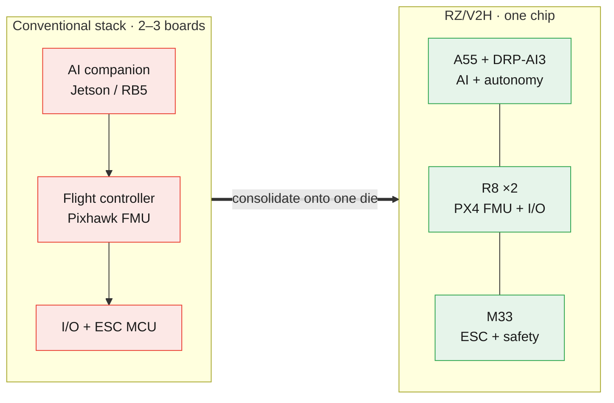
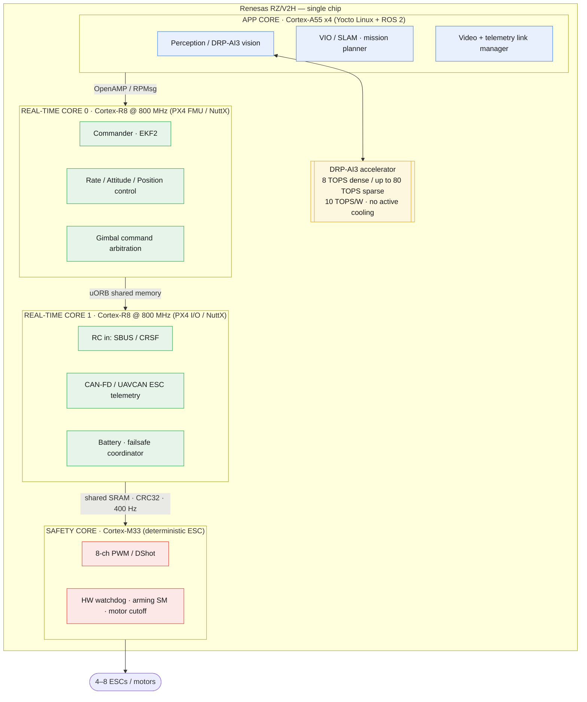
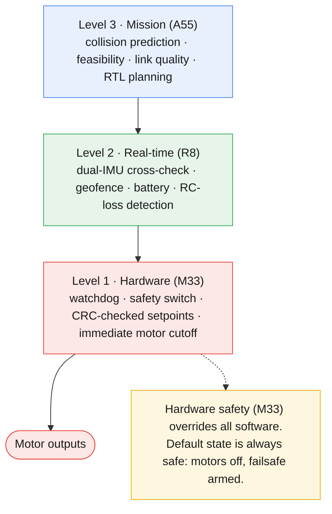
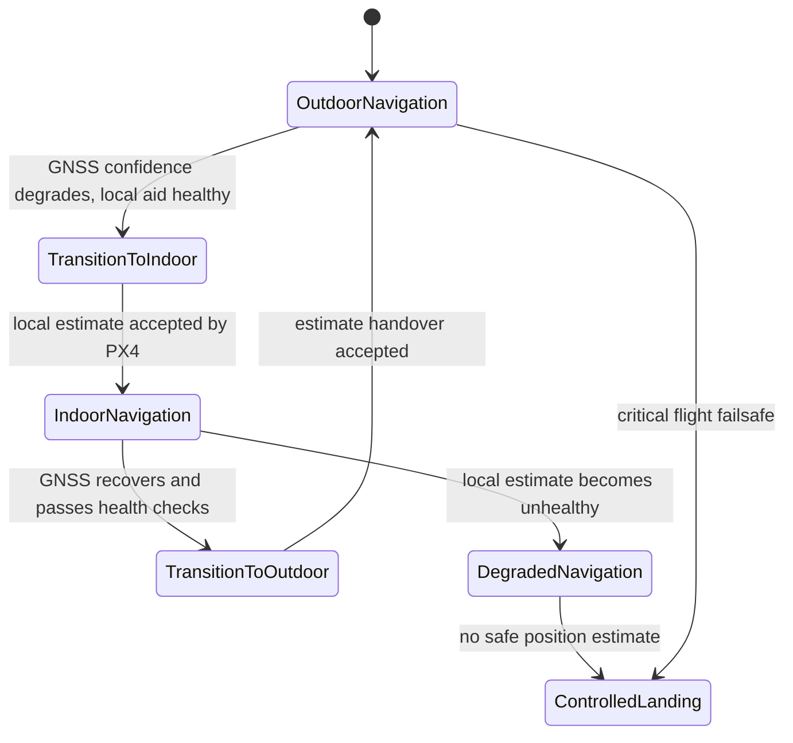
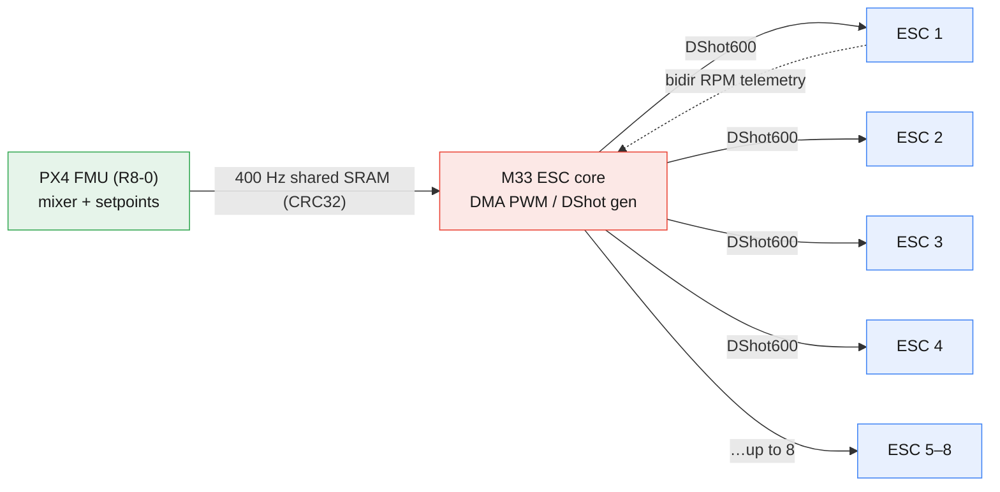

# RZ/V2H Single-Chip Autonomous Drone — Marketing Solution & Research Report

> **Claims discipline.** This report separates *architecture capability* (what the RZ/V2H silicon + this software design enables) from *shipped product*. Present in-progress capabilities as "reference / evaluation platform," not "production." Every headline claim carries a claim boundary. See §7.

## Table of Contents

- [Executive Summary](#executive-summary)
- [1. The One-Chip Value Proposition](#1-the-one-chip-value-proposition)
- [2. Solution Architecture](#2-solution-architecture)
- [3. Competitive Landscape](#3-competitive-landscape)
- [4. Target Markets & Use Cases](#4-target-markets--use-cases)
- [5. Motor Control & Advanced Airframes](#5-motor-control--advanced-airframes)
- [6. Marketing Messages & Proof Points](#6-marketing-messages--proof-points)
- [7. Claims Discipline](#7-claims-discipline)
- [Sources](#sources)
- [Recommendations & Open Items](#recommendations--open-items)

---

## Executive Summary

This is a fully autonomous drone platform on a single processor. It is built on the Renesas RZ/V2H processor, which integrates a **DRP-AI3 accelerator delivering 8 TOPS (dense) and up to 80 TOPS (sparse)** at **10 TOPS/W with no active cooling required**. The same chip carries four Cortex-A55 application cores (Linux / ROS 2 autonomy), two Cortex-R8 @ 800 MHz hard-real-time cores (PX4 flight control), and one Cortex-M33 deterministic I/O / safety core.

Conventional autonomous drones bolt an **AI companion computer** (NVIDIA Jetson, Qualcomm RB5) onto a **separate flight-controller MCU board** (Pixhawk-class). The RZ/V2H collapses **perception, autonomy, flight control, and motor/ESC control onto one die** — one BOM part, one power domain, one thermal solution. The direct consequence is **lower total system power and weight than an AI-companion + flight-MCU stack**, because an entire multi-watt companion board (and its regulators, connectors, and cooling) is removed while a passive-cooled DRP-AI3 does the vision work.

The platform keeps **flight safety physically isolated** from vision, payload, and radio services: a perception or link fault can never reach the motor-control path. It targets the fastest-growing commercial-drone segments — **inspection** (projected to exceed 25% of commercial drone revenue by 2030), **delivery verification**, and **indoor/outdoor GPS-denied operations** — inside a market forecast at **$24–28 B (2025–26) rising to ~$52 B by 2033** (commercial-only, Grand View), where autonomy, onboard AI, and BVLOS are the primary growth drivers.

---

## 1. The One-Chip Value Proposition

Conventional autonomous drones stack multiple compute boards. RZ/V2H replaces them with on-die domains:

| Conventional stack (2+ boards) | Typical part | RZ/V2H on-die equivalent |
|---|---|---|
| AI / autonomy companion computer | NVIDIA Jetson Orin, Qualcomm RB5 | Cortex-A55 cluster + DRP-AI3 |
| Flight controller (FMU) | Pixhawk STM32H7 | Cortex-R8 core 0 (PX4 / NuttX) |
| I/O co-processor | STM32 IOMCU | Cortex-R8 core 1 |
| ESC / safety controller | dedicated MCU | Cortex-M33 |

**Why one chip wins:**

- **Lower system power and weight.** Removing a discrete AI companion board eliminates its multi-watt draw, its power regulators/connectors, and typically an active cooler. The Jetson Orin Nano alone is ~140 g **and still requires a separate flight controller**. RZ/V2H does the AI on a passive-cooled **10 TOPS/W** DRP-AI3 and runs flight control on the same die.
- **Deterministic, µs-class inter-core links.** On-die shared-memory / MHU IPC drives the 400 Hz actuator path, versus board-to-board serial links (2–5 ms on a split FMU/IO topology).
- **Uncompromised real-time.** PX4 loops (1000 Hz rate, 500 Hz attitude, 250 Hz position) run on **dedicated R8 cores**, physically isolated from the Linux/AI domain — no RTOS-on-Linux jitter trade-off.
- **One supply-chain part, one qualification.** A single MPU to source, thermally design, and certify instead of two independent compute subsystems.

**One-line message:** *One chip, from perception to propeller — replacing the companion computer **plus** the flight controller **plus** the I/O board, at lower power and weight.*

---

## 2. Solution Architecture

### 2.1 Heterogeneous domains on one die

### 2.2 Three-tier safety architecture — the core differentiator

Each layer validates inputs from the layer above; the safe default is always motors-off. **Payload isolation:** vision, gimbal (MAVLink Gimbal Protocol v2), video, and the replaceable radio/cellular *signal module* live on the A55 and never enter the motor-control path. AI tracking is an *assistive* function proposing gimbal targets only — the pilot always overrides and PX4 retains flight-command authority.

### 2.3 Estimator-health-driven indoor/outdoor navigation

Mission behavior follows estimator health, not a binary GPS/no-GPS switch:

Outdoor uses GNSS + IMU + baro + mag; GPS-denied indoor uses VIO / optical-flow with range aiding on the A55. Position-source handover applies hysteresis and innovation checks; collision avoidance stays advisory when distance quality is unknown. The R8 real-time controller always owns mode and failsafe selection.

---

## 3. Competitive Landscape

| Platform | AI compute | On-chip real-time flight | Integration | Positioning note |
|---|---|---|---|---|
| **RZ/V2H (this solution)** | DRP-AI3 8 / up to 80 TOPS · 10 TOPS/W | **Yes** — R8 ×2 + M33 (PX4) | **Single chip: AI + FMU + I/O + ESC** | Passive-cooled AI; safety-domain isolation |
| NVIDIA Jetson Orin Nano | 40 TOPS | No — needs separate FMU | Companion only (+Pixhawk) | Mature CUDA / JetPack ecosystem; ~140 g module |
| NVIDIA Jetson AGX Orin | up to 275 TOPS | No — needs separate FMU | Companion only | Highest raw AI; high power / weight |
| Qualcomm Flight RB5 | 15 TOPS | No (companion) | Companion + 5G modem | Integrated 5G, 7-camera ISP, low power |
| Pixhawk (STM32H7) | none | STM32 FMU + IOMCU | 2 boards, no AI | Industry-standard FC, no autonomy AI |

**Positioning takeaways:**

- **Do not compete on raw TOPS.** Jetson AGX Orin reaches 275 TOPS. RZ/V2H wins on **integration + determinism + TOPS/W + safety isolation** — it is the only platform here that puts **hard-real-time flight control and AI on the same die**. Jetson and RB5 are companion computers that *still require an external flight controller*.
- **Lead with:** single-chip autonomous flight; 8 / up-to-80 TOPS passive-cooled edge AI at 10 TOPS/W; safety-domain isolation; open standards (PX4, ROS 2, MAVLink, UAVCAN).
- Against Pixhawk: RZ/V2H adds a full onboard autonomy + AI tier without a second board.

Market tailwind: **sensor shipments are forecast to grow ~4× vs ~2.3× unit growth (2025–2036)** — the market is buying *more perception per aircraft*, favoring an integrated AI-capable flight computer.

---

## 4. Target Markets & Use Cases

| Segment | RZ/V2H fit | Design-backed capability |
|---|---|---|
| **Industrial inspection** (>25% of commercial revenue by 2030) | Stabilized 3-axis gimbal + AI framing + evidence log; DRP-AI3 object/defect detection | MAVLink Gimbal v2, timestamped payload events, ROI tracking |
| **Delivery verification** | Downward gimbal on final approach, package-confirmation capture | Confirmation is a mission policy, not an arming bypass |
| **Indoor/outdoor GPS-denied** | VIO / optical-flow + range aiding on A55; estimator-health-driven mode changes | Health-gated GNSS↔local handover with hysteresis |
| **Public safety / mapping** | Onboard perception + secure MAVLink 2 signed command path | Remote ID-*ready* (not "compliant" until aircraft-level approval) |

**Regional GTM priority** (market data): North America (>40% share, progressive airspace regulation) → APAC (fastest growth, domestic type-certification push) → Europe (U-space harmonization for cross-border inspection).

> Airframe class, payload, endurance, and range are **customer-defined** per aircraft configuration. This solution provides the compute, flight stack, and motor-control capability; the customer specifies the vehicle.

---

## 5. Motor Control & Advanced Airframes

The M33 safety core drives **8 channels of PWM / DShot**, enabling **4–6 (up to 8) ESCs** — i.e., quadcopter, hexacopter, and octocopter class **advanced airframes** — with digital, error-checked motor control.

**Why DShot matters for advanced/commercial airframes** (market research):

- **Digital, checksummed signaling.** DShot sends a 16-bit CRC-protected frame (11-bit throttle + telemetry-request + 4-bit CRC). A corrupted frame is discarded and the last valid value held — a single-packet stall instead of a random motor spike. No calibration, no analog-noise throttle drift.
- **High resolution + control precision.** 2000 throttle steps improve vehicle control, valuable across all motors of a multi-rotor.
- **Bidirectional DShot / RPM telemetry → RPM filtering.** BDShot returns per-revolution motor RPM to the flight controller, feeding dynamic notch filtering that keeps flight smooth and stable — the biggest gain for hexacopters and larger commercial UAVs with 6+ motors.
- **DShot600 with bidirectional telemetry is the 2025/2026 gold standard** for modern builds; RZ/V2H's dedicated deterministic M33 timing (DMA-driven, low jitter) is well matched to it.

**Airframe-design notes for sales engineering:** all ESCs on a vehicle must run the same DShot rate; long motor-wire runs on large airframes (>15 cm) favor lower DShot rates or CAN-bus ESCs; modern BLHeli_32 / AM32 / BLHeli_S ESCs support DShot and bidirectional telemetry.

---

## 6. Marketing Messages & Proof Points

**Approved headline messages (capability tier):**

1. *"Perception to propeller on a single chip."* — AI, autonomy, flight control, and ESC on one RZ/V2H MPU.
2. *"8 TOPS dense / up to 80 TOPS sparse vision AI, 10 TOPS/W, no fan."* — always state "dense/sparse."
3. *"Lower power and weight than an AI-companion + flight-MCU stack."* — one chip removes a whole companion board.
4. *"Flight safety that vision can't crash."* — three-tier hardware-enforced domain isolation.
5. *"PX4 + ROS 2, integrated."* — open standards, not a closed stack.
6. *"Digital motor control for advanced airframes."* — DShot / bidirectional DShot on 4–8 ESCs.

**Proof points available today:** open PX4/NuttX RZ/V2H port with defined build targets; documented multi-core memory map, IPC protocol, and three-tier safety architecture; on-target SIH (simulated-sensor) demo. These prove **architecture**, not field readiness — see §7.

---

## 7. Claims Discipline

- Use **"reference architecture," "evaluation platform," "roadmap capability"** — not "production," "certified," or "available."
- **DRP-AI3:** always **"8 TOPS dense / up to 80 TOPS sparse."** Never a naked "80 TOPS."
- **Power/weight advantage:** frame as a *system benefit* — one chip integrating AI + FMU + I/O + ESC removes a discrete AI-companion board (and its regulators, connectors, and active cooler), so total system power and weight are lower than an AI-companion + flight-MCU stack.
- **Remote ID-ready**, not "compliant"; **modular signal-module ready** without fixed range/cellular-generation claims until the chosen radio is tested. Regulatory compliance is aircraft-configuration-specific.
- Airframe, payload, endurance, and range are **customer-defined** — do not publish as product specs.

---

## Sources

External:

- [Renesas — RZ/V2H product page](https://www.renesas.com/en/products/rz-v2h) · [RZ/V2H launch newsroom](https://www.renesas.com/en/about/newsroom/renesas-unveils-powerful-single-chip-rzv2h-mpu-next-gen-robotics-vision-ai-and-real-time-control)
- [CNX Software — RZ/V2H 80 TOPS MPU](https://www.cnx-software.com/2024/03/04/renesas-rz-v2h-cortex-a55-r8-m33-mpu-80-tops-ai-accelerator-robotics-autonomous-applications/) · [Hackster.io — RZ/V2H edge AI](https://www.hackster.io/news/renesas-promises-high-efficiency-edge-ai-computer-vision-for-your-next-robot-with-the-rz-v2h-4ce5e86ee1b4)
- [Qualcomm Flight RB5 5G Platform](https://www.qualcomm.com/internet-of-things/products/flight-rb5-platform) · [ModalAI — Top 5 UAV companion computers](https://www.modalai.com/blogs/blog/top-5-companion-computers-for-uavs) · [RidgeRun — RB5 platform comparison](https://developer.ridgerun.com/wiki/index.php/Qualcomm_Robotics_RB5/Introduction/Platform_Comparison)
- [Grand View Research — Commercial Drone Market 2026–2033](https://www.grandviewresearch.com/industry-analysis/global-commercial-drones-market) · [Technavio — Commercial Drones 2026–2030](https://www.technavio.com/report/commercial-drones-market-industry-analysis) · [Edge AI + Vision Alliance / IDTechEx — Drones 2026–2036](https://www.edge-ai-vision.com/2025/12/drones-market-2026-2036-technologies-markets-and-opportunities/)
- [Betaflight — DShot](https://betaflight.com/docs/development/API/Dshot) · [ArduPilot — DShot ESCs](https://ardupilot.org/copter/docs/common-dshot-escs.html) · [UAVMODEL — ESC protocols compared 2026](https://blog.uavmodel.com/fpv-esc-protocols-explained-dshot-pwm-multishot-and-proshot-comparison-2026/)

---

## Recommendations & Open Items

**Reference demo airframe (recommended):** build a **hexacopter (X6), ~450–550 mm class, DShot600 bidirectional** as the flagship customer-facing demo, with a **5–7″ quad as a secondary bench/bring-up rig**.

Rationale:

- **Maximizes the safety story** — a hexa has motor-out redundancy, enabling a live "lose a motor, keep flying" demo that directly proves the three-tier hardware-isolated safety architecture (§2.2). A quad cannot.
- **Exercises the 6+ motor DShot claim** — bidirectional DShot RPM telemetry → dynamic notch filtering (§5) delivers its biggest benefit on 6+ motors; the hexa shows it doing real work.
- **Fits the #1 target market** — inspection (>25% of commercial revenue by 2030) is dominated by hexa/heavy-lift frames carrying a gimbal + EO/IR payload; a hexa is credible to inspection buyers where a small FPV quad is not.
- **Carries the sensor suite** — 550 mm class accommodates MIPI camera, optical-flow, rangefinder/LiDAR, and gimbal with thermal/power headroom for the RZ/V2H.
- **Quad as bench rig** — cheaper and faster for bring-up, and easier to fly indoors for the GPS-denied VIO demo.

Avoid: octocopter (added cost/size, no demo value over a hexa) and sub-5″ FPV (undersells the enterprise positioning).

Caveats: a hexa costs more and needs more flight space; endurance and payload remain **customer-defined** — the demo vehicle proves *capability*, not a published spec.
