# System and Software Architecture for Autonomous Drone Using Renesas RZ/V2H

> **Document status:** capability baseline. Payload, RF, performance, and regulatory claims require validation on the selected aircraft configuration.

## At a Glance

- **Platform:** heterogeneous edge AI, real-time flight control, and deterministic I/O on one MPU family.
- **Missions:** inspection, mapping, public safety, delivery verification, and indoor/outdoor operations.
- **Payload:** MAVLink Gimbal Protocol v2 integration, AI-assisted framing, video evidence, and operator override.
- **Claims discipline:** wireless range, cellular support, payload capacity, and regulatory compliance remain configuration-specific.

## Contents

- [Hardware Platform](#1-hardware-platform-overview)
- [Software Stack](#2-software-stack-architecture)
- [Payload, Gimbal, and Signal Services](#3-integrated-payload-gimbal-and-signal-services)
- [Project Structure](#4-project-folder-structure)
- [Vision Pipeline](#5-drp-ai3-vision-processing-pipeline)
- [Mission Navigation](#6-mission-planning-and-autonomous-navigation)
- [Safety and Fault Tolerance](#7-safety-and-fault-tolerance)
- [Integration and Testing](#8-system-integration-and-testing)
- [Production Considerations](#11-deployment-and-production-considerations)
- [Summary and Recommendations](#12-summary-and-recommendations)

## Executive Summary

This document presents a production-ready system and software architecture for an advanced autonomous drone platform leveraging the Renesas RZ/V2H MPU's heterogeneous multi-core architecture. The design implements a clear separation of concerns across compute domains while maintaining robust real-time guarantees and safety-critical operation.

**Market proposition:** an integrated edge-AI aircraft platform for inspection, public-safety, mapping, and enterprise operations that need autonomous perception, stable sensor pointing, secure telemetry, and a credible upgrade path for connected payloads. The platform keeps flight safety independent from vision, gimbal, and radio services so a payload or link fault cannot take control of the aircraft.

### Key Architecture Principles:
- **Domain Isolation**: Clear boundaries between AI/perception (A55), real-time flight control (R8), and deterministic I/O (M33)
- **Safety-First Design**: Hardware-enforced failsafes, redundant monitoring, and graceful degradation
- **Standards Compliance**: PX4 flight stack, ROS 2 middleware, MAVLink protocol
- **Scalable Performance**: Efficient use of DRP-AI3 accelerator for 8-80 TOPS vision processing

## 1. Hardware Platform Overview

### 1.1 RZ/V2H Core Configuration

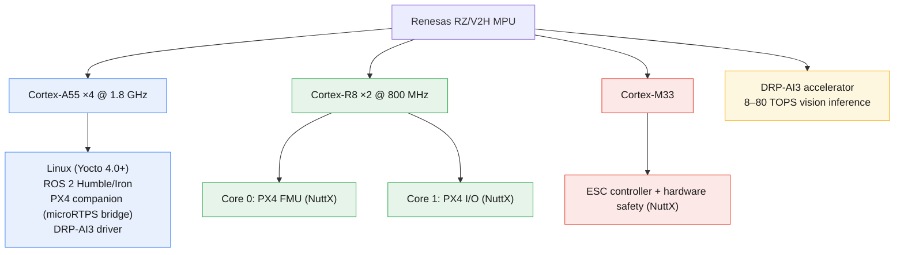

### 1.2 Memory Architecture

**Shared Memory Regions (Non-Cacheable):**

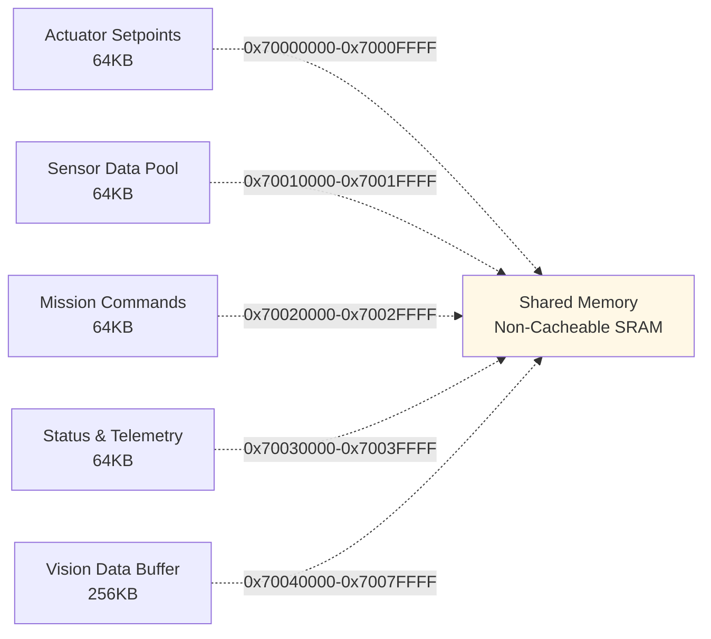

**Core-Private Memory**:
- **A55**: DDR4 SDRAM (2-4GB) - Linux heap, ROS 2 buffers
- **R8-0**: TCM (256KB) + SRAM (2MB) - PX4 critical loops
- **R8-1**: TCM (256KB) + SRAM (1MB) - I/O processing
- **M33**: TCM (128KB) - PWM/DMA buffers

### 1.3 Integrated Payload, Signal, and Market Differentiation

The RZ/V2H is the edge-compute and control MPU; it is **not** an RF transceiver. A production aircraft therefore pairs it with a qualified, region-appropriate radio or cellular modem module (referred to here as the *signal module*). This keeps radio certification, band selection, antenna design, and carrier approval independent from the flight computer.

| Customer outcome | Integrated capability | Claim boundary |
|---|---|---|
| Stable inspection and cinematic capture | Compatible 3-axis EO/IR or visible-light gimbal, stabilized independently of airframe attitude | Payload-dependent; validate mass, power, and vibration envelope |
| AI-assisted subject or point-of-interest framing | DRP-AI3 detection/tracking on A55 proposes gimbal targets; PX4 retains command arbitration | Tracking assists the operator; it does not replace pilot responsibility |
| Reliable mission visibility | Primary telemetry/video link plus optional secondary signal module; health-aware link selection | Range, throughput, and availability depend on selected module, antenna, terrain, and regulation |
| Enterprise-ready deployment | Signed MAVLink command path, auditable payload events, and optional Remote ID integration | Do not advertise regulatory compliance until the selected module and aircraft complete applicable approval |

The RZ/V2H exposes practical expansion paths for this integration: PCIe Gen3 and USB 3.2 for high-throughput signal modules, MIPI CSI-2 for payload cameras, CAN-FD/serial links for avionics, and hardware video processing for a low-latency payload-video pipeline. Hardware selection must preserve antenna isolation, power-domain separation, thermal margin, and EMI/EMC validation.

## 2. Software Stack Architecture

### 2.1 Cortex-A55 Cluster (Linux Domain)

**Operating System**:

```yaml
Base: Yocto Linux 4.0+ (kirkstone/langdale)
Kernel: Linux 5.15+ with real-time patches (PREEMPT_RT)
Init System: systemd with custom drone services
Filesystem: ext4 root, tmpfs for logs
Security: SELinux enforcing mode, secure boot
```

**Core Components**:

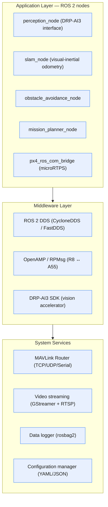

**ROS 2 Node Graph**:

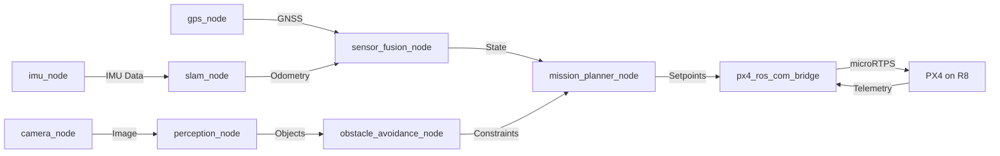

**DRP-AI3 Integration**:

```c
// DRP-AI3 Vision Pipeline
typedef struct {
    drp_ai3_context_t ai_ctx;
    cv::Mat input_image;
    std::vector<Detection> detections;
    float inference_time_ms;
} vision_pipeline_t;

class PerceptionNode : public rclcpp::Node {
public:
    void image_callback(const sensor_msgs::msg::Image::SharedPtr msg) {
        // Preprocess
        cv::Mat rgb = cv_bridge::toCvShare(msg)->image;
        cv::resize(rgb, input_tensor, cv::Size(640, 640));

        // DRP-AI3 inference (8-80 TOPS)
        drp_ai3_run_inference(&ai_ctx, input_tensor.data, output_tensor);

        // Post-process
        parse_yolo_output(output_tensor, detections);

        // Publish to obstacle avoidance
        publish_detections(detections);
    }
};
```

### 2.2 Cortex-R8 Core 0 (PX4 FMU - Flight Management Unit)

**Operating System**: NuttX RTOS 12.x

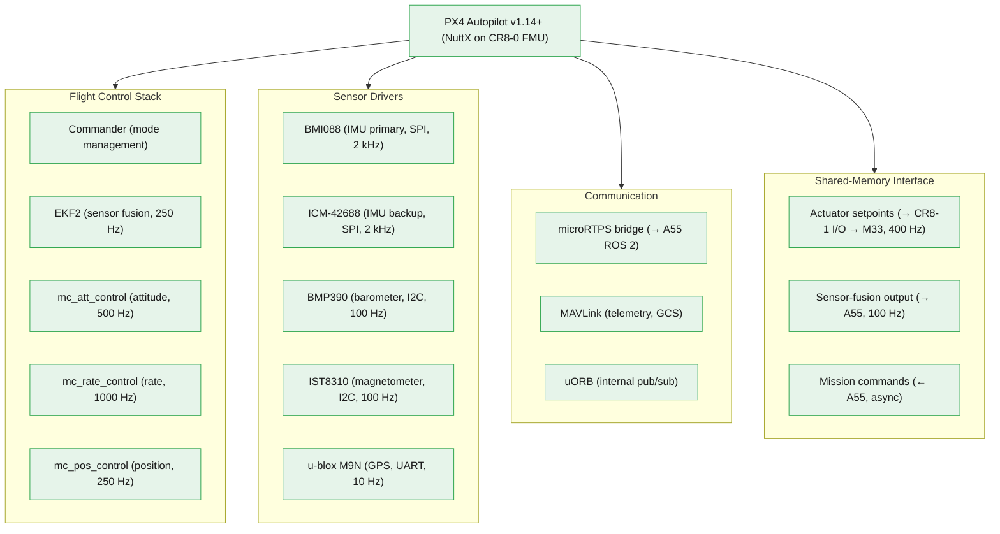

**Critical Control Loops**:

```c
// R8-0 Real-Time Scheduling
// Priority levels: 0 (highest) → 255 (lowest)

// 1000 Hz rate control loop (highest priority)
```

# define SCHED_PRIORITY_RATE_CONTROL      240

# define RATE_CONTROL_INTERVAL_US         1000  // 1 ms

void rate_control_thread(void *arg) {
    struct timespec next_wakeup;
    clock_gettime(CLOCK_MONOTONIC, &next_wakeup);

    while (true) {
        // Read gyroscope (< 50 us via SPI DMA)
        imu_read_gyro(&gyro_xyz);

        // PID rate control (< 200 us)
        mc_rate_controller_update(&rate_setpoint, &gyro_xyz, &motor_outputs);

        // Write to shared memory for M33 (< 50 us)
        actuator_setpoints_publish(motor_outputs);

        // Deterministic sleep
        next_wakeup.tv_nsec += RATE_CONTROL_INTERVAL_US * 1000;
        clock_nanosleep(CLOCK_MONOTONIC, TIMER_ABSTIME, &next_wakeup, NULL);
    }
}

// 250 Hz EKF2 fusion (high priority)

# define SCHED_PRIORITY_EKF2              230

# define EKF2_INTERVAL_US                 4000  // 4 ms

void ekf2_thread(void *arg) {
    while (true) {
        // Fuse IMU, barometer, GPS, magnetometer
        ekf2_update(&sensor_data, &state_estimate);

        // Publish to uORB and shared memory
        vehicle_attitude_publish(&state_estimate.attitude);
        vehicle_local_position_publish(&state_estimate.position);

        usleep(EKF2_INTERVAL_US);
    }
}
```

**Rate Control and EKF2 Loop:**

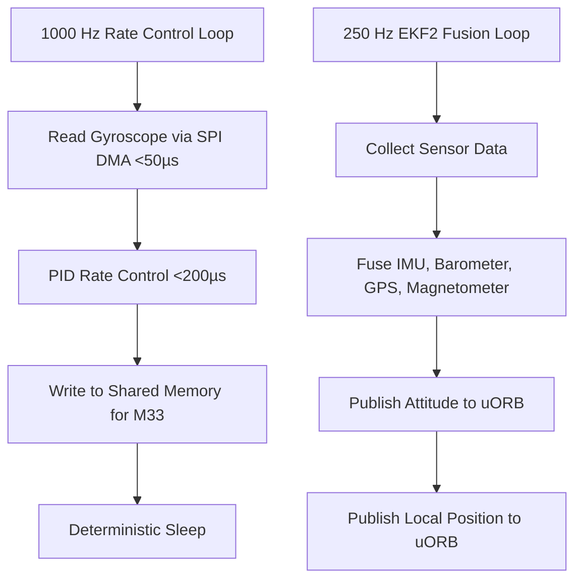

#### Sensor Redundancy

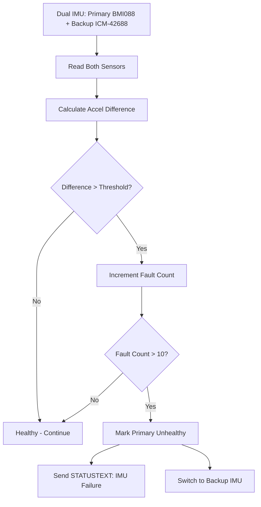

### 2.3 Cortex-R8 Core 1 (PX4 I/O Processor)

**Operating System**: NuttX RTOS 12.x (Separate Instance)

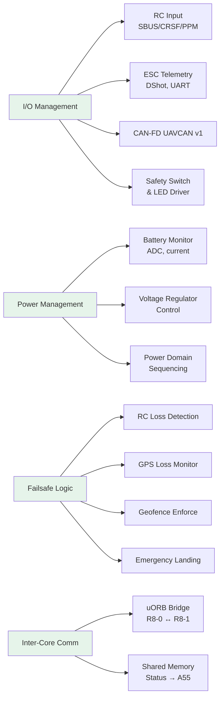

**RC Input Processing:**

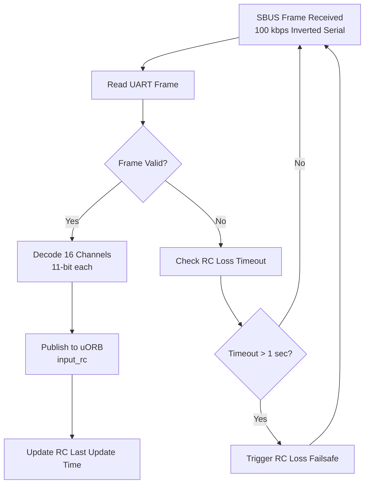

**CAN-FD UAVCAN Integration:**

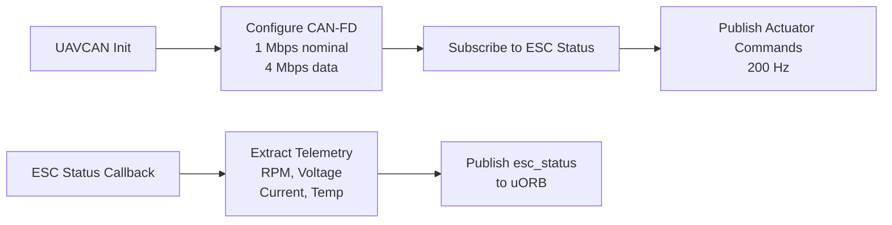

### 2.4 Cortex-M33 (Bare-Metal ESC Controller)

**Operating System**: NuttX RTOS - Ultra-Deterministic Bare-Metal Implementation

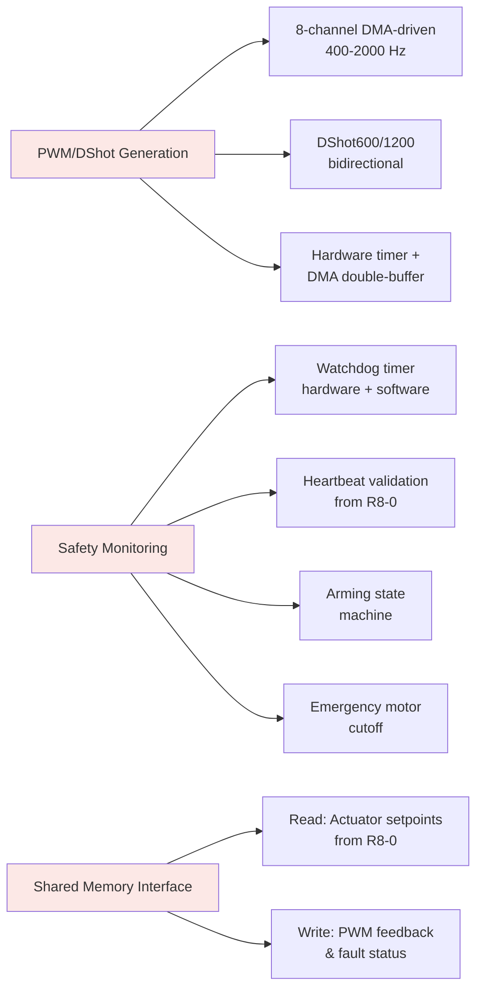

**Shared Memory Structures:**

```c
// Shared memory structures (aligned, non-cacheable)
typedef struct __attribute__((aligned(64))) {
    uint32_t sequence;           // Monotonic counter
    uint64_t timestamp_us;       // PX4 hrt_absolute_time()
    float motor_outputs[8];      // -1.0 to 1.0
    bool armed;                  // Master arm flag
    uint32_t crc32;              // Data integrity check
} actuator_setpoints_t;

typedef struct __attribute__((aligned(64))) {
    uint16_t pwm_us[8];          // Actual PWM pulse widths
    uint32_t dma_underrun_count; // DMA error counter
    uint32_t fault_mask;         // Bit flags for faults
    uint32_t crc32;
} pwm_feedback_t;

// Shared memory pointers (mapped to non-cacheable region)
volatile actuator_setpoints_t *g_setpoints =
    (actuator_setpoints_t *)0x70000000;
volatile pwm_feedback_t *g_feedback =
    (pwm_feedback_t *)0x70000100;
```

**DMA-Driven PWM Architecture:**

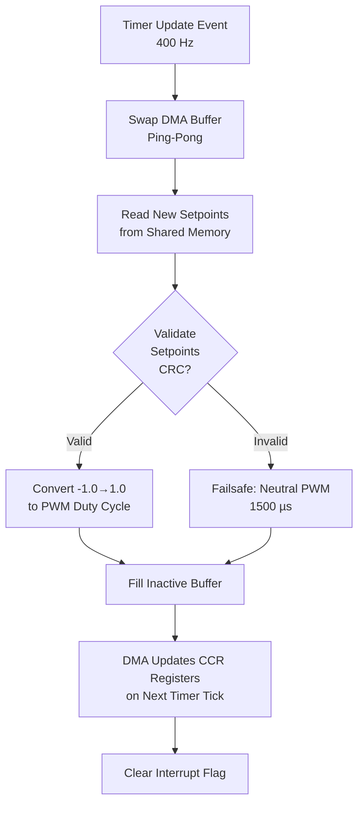

**Arming State Machine:**

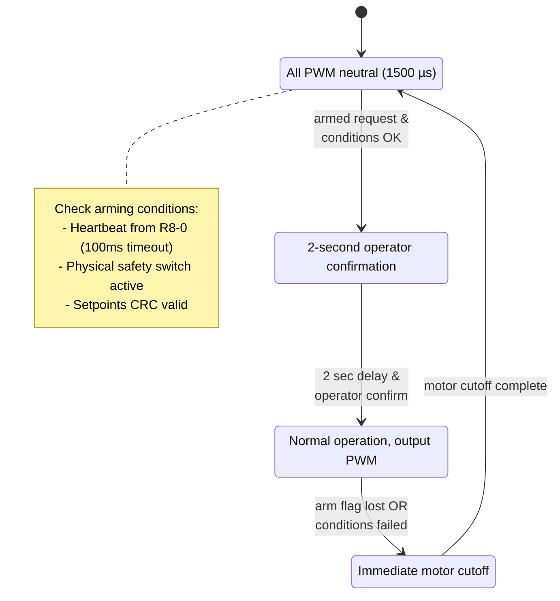

## 3. Integrated Payload, Gimbal, and Signal Services

### 3.1 Product Architecture Boundary

Payload and connectivity services enrich the mission but never enter the motor-control safety path. The A55 runs vision, video, payload metadata, and link-health services; PX4 on R8 remains the authoritative flight and gimbal-command arbiter; M33 preserves motor-output safety.

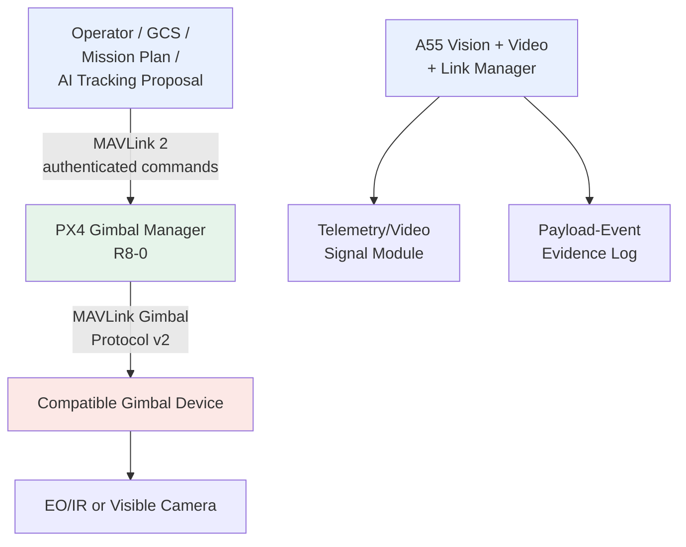

### 3.2 Gimbal Control

- Use MAVLink Gimbal Protocol v2 for gimbal discovery, capability reporting, control ownership, attitude status, and mission actions.
- Connect a compatible gimbal over a dedicated serial MAVLink or CAN/serial gateway; keep gimbal power and payload data interfaces separately protected.
- Support manual joystick control, mission pitch/yaw commands, and AI-assisted region-of-interest tracking. The operator can take control at any time.

### 3.3 Control-Arbitration Policy

| Source | Role | Priority |
|---|---|---|
| Pilot/GCS | Manual framing and immediate override | Highest |
| Mission planner | Waypoint framing and survey presets | Normal |
| AI tracker | Proposed subject/ROI updates, rate-limited | Lowest |

The gimbal manager must publish current ownership and attitude, reject stale or unauthorized commands, and select an aircraft-safe hold or stow action when payload telemetry is lost. A gimbal fault must raise a mission-health event, not alter flight-control setpoints.

### 3.4 Signal Module and Link Policy

- Use PCIe Gen3 or USB 3.2 for a high-throughput Wi-Fi/LTE/5G-class signal module; use UART only for lower-rate telemetry, Remote ID, or modem control when appropriate.
- Treat the signal module as a replaceable, qualified hardware option. Select bands, antenna system, SIM/eSIM, RF front end, and certification per sales region and aircraft variant.
- The A55 link manager measures link health and can select an approved primary or backup path for telemetry/video. PX4 retains its independently configured communication-loss failsafe.

### 3.5 Security, Evidence, and Compliance Readiness

- Require MAVLink 2 message signing for command authentication; add a separately designed encrypted transport where confidentiality is required because signing alone does not encrypt payload data.
- Log mission, gimbal, camera, and link events with synchronized timestamps for inspection evidence and post-flight review.
- Offer Remote ID as an optional, market-specific broadcast integration; it is a compliance feature only after the chosen module and complete aircraft configuration are approved for the target jurisdiction.

#### Marketing-Safe Claims

- "AI-assisted stable inspection payload control" is supportable after payload qualification.
- "Modular signal-module ready" is supportable; do not claim a fixed range, cellular generation, or link availability without the selected radio's test results.
- "Remote ID-ready" is preferable to "Remote ID compliant" until product-level compliance is established.

### 3.6 Indoor / Outdoor Operations and Navigation Degradation

Mission behavior must follow estimator health rather than a GPS/no-GPS binary. The A55 supplies perception and localisation aids; PX4 on R8 decides whether those aids are valid for the active flight mode.

| Operating context | Preferred localisation | Perception role | Gimbal profile |
|---|---|---|---|
| Outdoor transit | GNSS, IMU, barometer, magnetometer | Obstacle and mission context | Follow or operator framing |
| Doorway / transition | Blended GNSS and local estimate after health checks | Opening and obstacle awareness | Forward or operator-selected view |
| GPS-denied indoor | VIO and/or optical flow with range aiding | Obstacle avoidance and landing-zone context | Downward verification or operator framing |
| Localisation degraded | Valid attitude/altitude only, then controlled landing | Advisory only; never fabricate a position estimate | Hold or stow per payload policy |

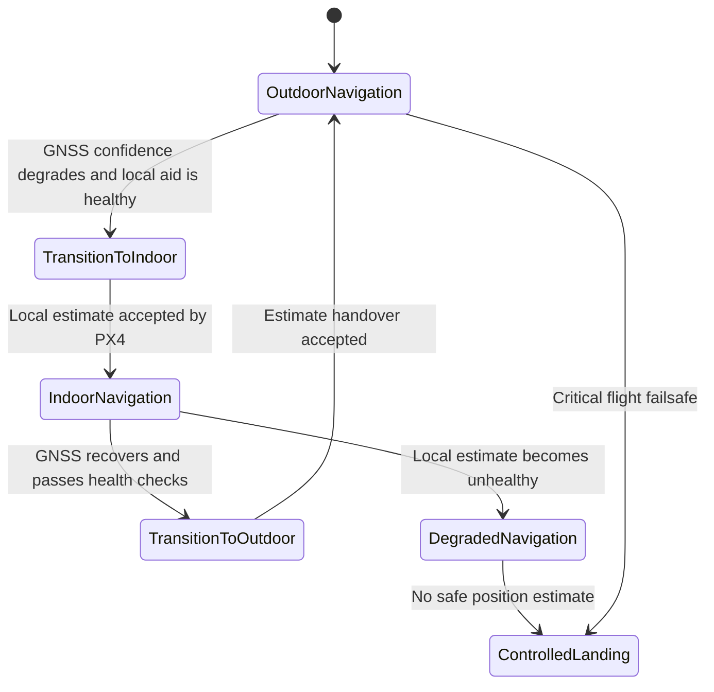

- Apply hysteresis, innovation checks, and an operator-visible transition state; do not force a position-source handover on raw satellite count alone.
- Keep collision avoidance advisory when distance quality is unknown. The real-time controller remains responsible for mode and failsafe selection.
- Treat indoor/outdoor and delivery/inspection profiles as selectable, testable mission configurations rather than automatic regulatory or autonomy claims.

### 3.7 Delivery and Inspection Payload Profiles

| Profile | Gimbal behavior | Evidence / safety boundary |
|---|---|---|
| Delivery verification | Point down during final approach or package confirmation | Timestamped payload view; confirmation remains a mission policy, not an arming bypass |
| Inspection scan | Operator or mission requests ROI and sweep patterns | Pilot override always wins; AI proposes targets within configured rate and angle limits |
| Indoor transition | Forward or downward view selected by the mission profile | Perception source and payload view remain independently qualified |

- A gimbal fault is non-flight-critical by default: report the fault, preserve aircraft failsafes, and request the device's hold or stow action.
- Record payload-control ownership, target, attitude, and capture events with vehicle state for evidence traceability.
- AI tracking is an assistive payload function; it must not directly change the aircraft trajectory or bypass gimbal-command arbitration.

## 4. Project Folder Structure

#### The RZV2H PX4 implementation is organized into three primary board configurations for the heterogeneous multi-core architecture

### 4.1 Overview

```
boards/renesas/
├── rdk-rzv2h/              # CR8-0: PX4 FMU (Main Flight Controller)
├── rdk-rzv2h-io-cr8_1/     # CR8-1: PX4 I/O Processor (RC, CAN, Telemetry)
└── rdk-rzv2h-io-cm33/      # CM33: ESC Controller (PWM/DShot, Safety)
```

### 4.2 CR8-0: Main Flight Management Unit (FMU)

**Path**: `boards/renesas/rdk-rzv2h/`

```
rdk-rzv2h/
├── default.px4board           # PX4 board configuration
├── firmware.prototype         # Firmware metadata
├── Kconfig                    # Board-specific kernel config
├── init/                      # Initialization scripts
│   ├── rc.board_defaults      # Default parameters
│   ├── rc.board_defaults.cmds # Startup commands
│   └── rc.offline_sensor_check # Sensor validation
├── nuttx-config/              # NuttX RTOS configuration
│   ├── include/
│   │   └── board.h            # Hardware definitions
│   ├── nsh/
│   │   └── defconfig          # CR8-0 defconfig (CONFIG_RZV2H_BUILD_CR8_0=y)
│   ├── scripts/
│   │   └── rdk-rzv2h_cr8_0.ld # Linker script (TCM/SRAM/DDR layout)
│   └── src/
│       └── rzv2h_appinit.c    # Board initialization
├── px4io_cr8_0/               # Optional: FMU-side PX4IO integration
└── src/                       # Board support code
    ├── board_config.h         # Pin mappings, peripheral config
    ├── board_common.c         # Common board functions
    ├── CMakeLists.txt         # Build configuration
    ├── i2c.cpp                # I2C bus initialization
    ├── init.c                 # Early hardware init
    ├── led.c                  # LED control
    ├── spi.cpp                # SPI bus initialization
    ├── system_stubs.c         # System stubs
    └── timer_config.cpp       # GPT timer configuration (HRT, PWM)
```

**Key Features**:
- Real-time flight control (1000Hz rate, 500Hz attitude, 250Hz position)
- Sensor drivers (BMI088, ICM-42688, BMP390, GPS)
- EKF2 sensor fusion
- microRTPS bridge to A55 Linux
- uORB bridge to CR8-1

### 4.3 CR8-1: I/O Processor (RC, CAN-FD, Battery)

**Path**: `boards/renesas/rdk-rzv2h-io-cr8_1/`

```
rdk-rzv2h-io-cr8_1/
├── default.px4board           # PX4 board config (CONFIG_PX4IO_CR8=y)
├── firmware.prototype         # Firmware metadata
├── nuttx-config/              # NuttX configuration
│   ├── include/
│   │   └── board.h            # Hardware definitions
│   ├── nsh/
│   │   └── defconfig          # CR8-1 defconfig (CONFIG_RZV2H_BUILD_CR8_1=y)
│   ├── scripts/
│   │   └── script.ld          # Linker script (.ipc_ram @ 0x70000000)
│   └── src/
├── px4io_cr8_1/               # PX4 I/O application
│   ├── CMakeLists.txt         # App build config
│   ├── protocol.h             # IPC protocol (CR8-1 ↔ M33)
│   ├── px4io_cr8.cpp          # Main I/O loop (RC, CAN, Battery, Failsafe)
│   ├── px4io_cr8.h            # App header
│   ├── sharedmem_transport.cpp # Shared memory transport (CR8-1 ↔ M33)
│   └── sharedmem_transport.h  # Transport interface
└── src/                       # Board support
    ├── board_config.h         # Pin mappings (UART, CAN, ADC, GPIO)
    ├── CMakeLists.txt         # Board build config
    └── init.c                 # Board initialization
```

**Key Features**:
- RC input decoding (SBUS/CRSF/PPM/DSM at 50-100Hz)
- CAN-FD UAVCAN (ESC telemetry: RPM, voltage, current, temp)
- Battery monitoring (ADC voltage/current sensing)
- Safety monitor (CR8-0 heartbeat, RC validity, battery level)
- Failsafe coordinator (RC loss, FMU loss, battery low)
- Shared memory transport to M33 (actuator setpoints at 400Hz)

### 4.4 CM33: ESC Controller (PWM/DShot, Safety)

**Path**: `boards/renesas/rdk-rzv2h-io-cm33/`

```
rdk-rzv2h-io-cm33/
├── default.px4board           # PX4 board config (CONFIG_PX4IO_M33=y)
├── firmware.prototype         # Firmware metadata
├── nuttx-config/              # NuttX configuration
│   ├── include/
│   │   └── board.h            # Hardware definitions
│   ├── nsh/
│   │   └── defconfig          # CM33 defconfig (CONFIG_RZV2H_BUILD_CM33=y)
│   ├── scripts/
│   │   └── script.ld          # Linker script (.ipc_ram, .dma_buffers @ 0x70000000)
│   └── src/
├── px4io_m33/                 # PX4 ESC application
│   ├── CMakeLists.txt         # App build config
│   ├── protocol.h             # IPC protocol (CR8-1 ↔ M33, matching CR8-1)
│   ├── px4io_m33.cpp          # Main ESC loop (PWM/DShot, Watchdog, Safety)
│   ├── px4io_m33.h            # App header
│   ├── pwm_dshot.cpp          # GPT + DMA PWM/DShot generation (8 channels)
│   ├── pwm_dshot.h            # PWM interface
│   ├── dma_driver.cpp         # Double-buffered DMA (ping-pong for DShot)
│   ├── safety_switch.cpp      # Physical safety switch (debounce, arming gate)
│   ├── sharedmem_transport.cpp # Shared memory transport (CR8-1 ↔ M33)
│   └── sharedmem_transport.h  # Transport interface
└── src/                       # Board support
    ├── board_config.h         # Pin mappings (GPT timers, DMA, Watchdog, Safety)
    ├── CMakeLists.txt         # Board build config
    ├── init.c                 # Board initialization
    └── timer_config.cpp       # GPT timer setup (8-channel PWM/DShot)
```

**Key Features**:
- 8-channel PWM/DShot output (400-2000Hz, GPT timers + DMA)
- Double-buffered DMA (ping-pong) for deterministic DShot frame generation
- Hardware watchdog (500ms timeout → emergency motor cutoff)
- Physical safety switch (arming gate, LED patterns)
- Shared memory interface from CR8-1 (CRC32 validation, sequence tracking)
- Deterministic timing (<100µs jitter)

### 4.5 Platform Layer (Shared NuttX Drivers)

**Path**: `platforms/nuttx/src/px4/renesas/rzv/`

```
platforms/nuttx/src/px4/renesas/rzv/
├── adc/                       # ADC abstraction (battery monitoring)
│   ├── adc.cpp
│   └── adc.h
├── board_critmon/             # Critical section monitoring
├── board_hw_info/             # Hardware info reporting
├── board_reset/               # Board reset handling
├── dshot/                     # DShot protocol implementation
│   ├── dshot.c
│   └── dshot.h
├── hrt/                       # High-resolution timer (HRT)
│   ├── hrt.c
│   └── hrt.h
├── include/                   # Platform headers
│   └── px4_arch/
│       ├── hw_description.h   # Hardware config
│       └── io_timer_hw_description.h # Timer channel mapping
├── io_pins/                   # GPIO and timer abstraction
│   ├── io_timer.c             # Timer abstraction
│   └── pwm_servo.c            # PWM output abstraction
├── led_pwm/                   # LED PWM control
├── micro_hal/                 # Micro HAL abstraction
├── spi/                       # SPI bus abstraction
│   ├── spi.c
│   └── spi.h
└── version/                   # Version reporting
```

**Shared Components**:
- Hardware abstraction layer (HAL) for all RZV2H boards
- Common timer, PWM, SPI, ADC drivers
- DShot protocol stack
- High-resolution timer (HRT) for PX4 scheduling

### 4.6 IPC Protocol Structure

**Shared Header**: `protocol.h` (identical in CR8-1 and CM33)

**IPC Message Types:**

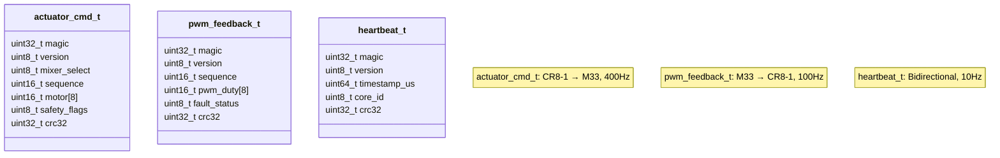

**Protocol Implementation:**

```c
/* protocol.h - IPC message formats for CR8-1 ↔ M33 */

# define IPC_MAGIC 0x525A5632  // "RZV2"

# define IPC_VERSION 0x01

/* Actuator command (CR8-1 → M33, 400Hz) */
typedef struct {
    uint32_t magic;           // IPC_MAGIC
    uint8_t version;          // IPC_VERSION
    uint8_t mixer_select;     // Quad-X, Hexa-X, Octa-X
    uint16_t sequence;        // Sequence number (gap detection)
    uint16_t motor[8];        // PWM values (1000-2000µs or DShot)
    uint8_t safety_flags;     // Arm, disarm, emergency
    uint32_t crc32;           // CRC32 of all fields
} __attribute__((packed)) actuator_cmd_t;

/* PWM feedback (M33 → CR8-1, 100Hz) */
typedef struct {
    uint32_t magic;
    uint8_t version;
    uint16_t sequence;
    uint16_t pwm_duty[8];     // Actual PWM duty cycles
    uint8_t fault_status;     // Watchdog, safety switch, ESC faults
    uint32_t crc32;
} __attribute__((packed)) pwm_feedback_t;

/* Heartbeat (bidirectional, 10Hz) */
typedef struct {
    uint32_t magic;
    uint8_t version;
    uint64_t timestamp_us;
    uint8_t core_id;          // 0=CR8-1, 1=M33
    uint32_t crc32;
} __attribute__((packed)) heartbeat_t;
```

## 4. Inter-Core Communication Architecture

**Communication Channels:**

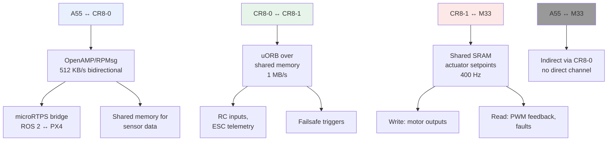

**Boot Sequence:**

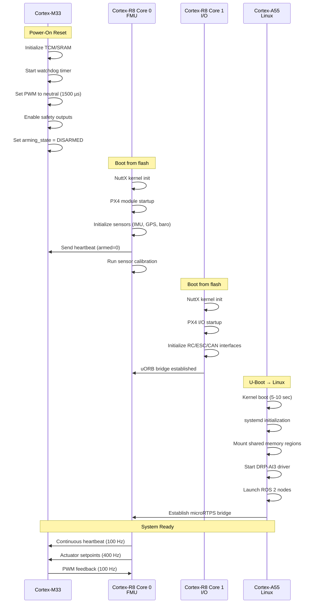

**microRTPS Bridge (A55 ↔ CR8-0):**


**Configuration:

```

# micrortps_bridge.yaml
transport: shared_memory
shmem_path: /dev/shm/px4_ros2_bridge
buffer_size: 65536

#### topics
  # PX4 → ROS 2
  - name: /fmu/out/vehicle_attitude
    px4_type: vehicle_attitude
    ros2_type: px4_msgs/msg/VehicleAttitude
    qos: best_effort
    rate_hz: 100

  - name: /fmu/out/vehicle_local_position
    px4_type: vehicle_local_position
    ros2_type: px4_msgs/msg/VehicleLocalPosition
    qos: reliable
    rate_hz: 50

  # ROS 2 → PX4
  - name: /fmu/in/trajectory_setpoint
    px4_type: trajectory_setpoint
    ros2_type: px4_msgs/msg/TrajectorySetpoint
    qos: reliable
    rate_hz: 50

#### Implementation

```cpp
// ROS 2 node on A55
class PX4BridgeNode : public rclcpp::Node {
public:
    PX4BridgeNode() : Node("px4_bridge") {
        // Publisher: PX4 → ROS 2
        attitude_pub_ = this->create_publisher<px4_msgs::msg::VehicleAttitude>(
            "/fmu/out/vehicle_attitude",
            rclcpp::QoS(10).best_effort()
        );

        // Subscriber: ROS 2 → PX4
        trajectory_sub_ = this->create_subscription<px4_msgs::msg::TrajectorySetpoint>(
            "/fmu/in/trajectory_setpoint",
            rclcpp::QoS(10).reliable(),
            std::bind(&PX4BridgeNode::trajectory_callback, this, std::placeholders::_1)
        );

        // Shared memory connection to R8-0
        micrortps_transport_init(&transport_, "/dev/shm/px4_ros2_bridge");
    }

private:
    void trajectory_callback(const px4_msgs::msg::TrajectorySetpoint::SharedPtr msg) {
        // Serialize and send to PX4

        ucdrBuffer ub;
        uint8_t buffer[256];
        ucdr_init_buffer(&ub, buffer, sizeof(buffer));

        // Pack trajectory setpoint
        ucdr_serialize_float(&ub, msg->position[0]);
        ucdr_serialize_float(&ub, msg->position[1]);
        ucdr_serialize_float(&ub, msg->position[2]);
        ucdr_serialize_float(&ub, msg->velocity[0]);
        ucdr_serialize_float(&ub, msg->velocity[1]);
        ucdr_serialize_float(&ub, msg->velocity[2]);
        ucdr_serialize_float(&ub, msg->yaw);

        // Send via shared memory to R8-0
        micrortps_transport_write(&transport_, TOPIC_TRAJECTORY_SETPOINT,
                                 buffer, ucdr_buffer_length(&ub));
    }

    rclcpp::Publisher<px4_msgs::msg::VehicleAttitude>::SharedPtr attitude_pub_;
    rclcpp::Subscription<px4_msgs::msg::TrajectorySetpoint>::SharedPtr trajectory_sub_;
    micrortps_transport_t transport_;
};
```

#### NuttX Side (R8-0)

```c
// PX4 microRTPS agent on R8-0
static int micrortps_agent_main(int argc, char *argv[])
{
    struct micrortps_transport_t transport;
    micrortps_transport_init(&transport, TRANSPORT_SHMEM);

    while (!should_exit) {
        // Poll for incoming messages from ROS 2
        uint8_t topic_id;
        uint8_t buffer[512];
        ssize_t bytes_read = micrortps_transport_read(&transport, &topic_id,
                                                       buffer, sizeof(buffer), 10);

        if (bytes_read > 0) {
            switch (topic_id) {
                case TOPIC_TRAJECTORY_SETPOINT:
                    handle_trajectory_setpoint(buffer, bytes_read);
                    break;

                case TOPIC_VEHICLE_COMMAND:
                    handle_vehicle_command(buffer, bytes_read);
                    break;
            }
        }

        // Publish PX4 topics to ROS 2
        publish_vehicle_attitude(&transport);
        publish_vehicle_local_position(&transport);
        publish_battery_status(&transport);

        px4_usleep(5000); // 5 ms sleep
    }

    return 0;
}

static void handle_trajectory_setpoint(uint8_t *buffer, size_t len)
{
    trajectory_setpoint_s setpoint = {};

    // Deserialize from CDR buffer
    ucdrBuffer ub;
    ucdr_init_buffer(&ub, buffer, len);
    ucdr_deserialize_float(&ub, &setpoint.position[0]);
    ucdr_deserialize_float(&ub, &setpoint.position[1]);
    ucdr_deserialize_float(&ub, &setpoint.position[2]);
    ucdr_deserialize_float(&ub, &setpoint.velocity[0]);
    ucdr_deserialize_float(&ub, &setpoint.velocity[1]);
    ucdr_deserialize_float(&ub, &setpoint.velocity[2]);
    ucdr_deserialize_float(&ub, &setpoint.yaw);

    setpoint.timestamp = hrt_absolute_time();

    // Publish to PX4 control stack via uORB
    orb_publish(ORB_ID(trajectory_setpoint), &setpoint);
}
```

## 5. DRP-AI3 Vision Processing Pipeline

### 5.1 DRP-AI3 Architecture Overview

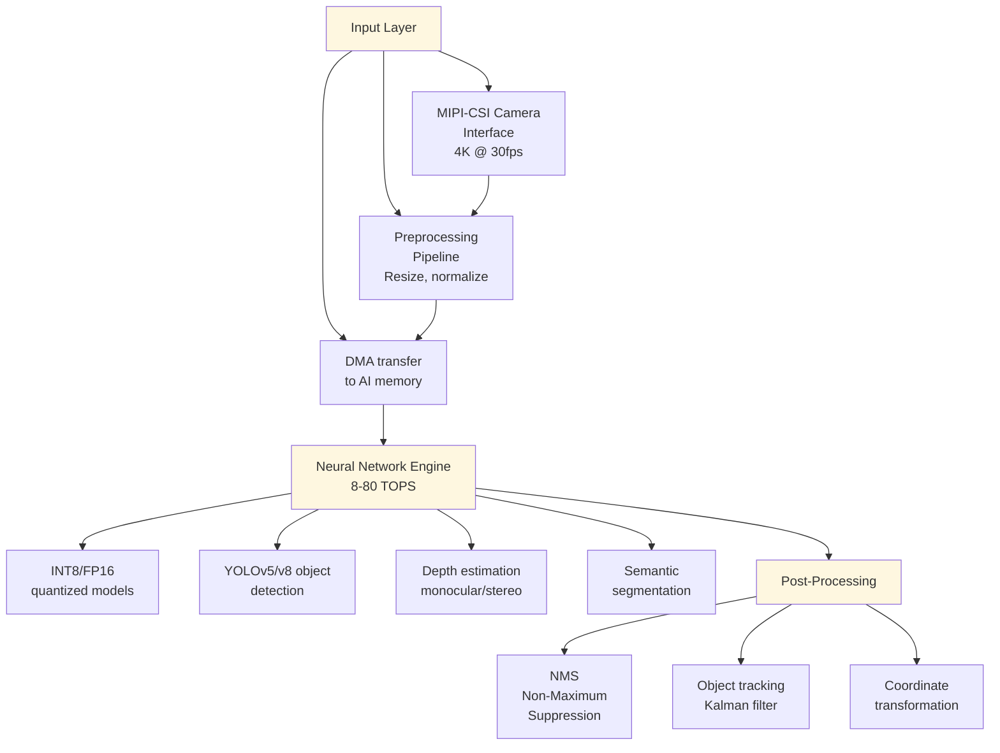

### 5.2 Vision Pipeline Implementation

**Vision Perception Pipeline:**

```mermaid
flowchart TD
    INIT["Initialize DRP-AI3<br/>Load YOLOv5 model<br/>640x640 input"]
    
    CAM["Camera Callback:<br/>Receive Image Frame"] --> PREPROCESS["Preprocess for YOLOv5<br/>Resize to 640x640<br/>Letterbox padding<br/>Normalize to 0-1"]
    
    PREPROCESS --> INFER["Run DRP-AI3 Inference<br/>8-80 TOPS<br/>Measure latency"]
    
    INFER --> POSTPROC["Post-Process YOLOv5 Output<br/>Extract 25200 anchors<br/>Filter by confidence (0.5)<br/>Find best class per anchor"]
    
    POSTPROC --> NMS["Apply Non-Maximum<br/>Suppression<br/>IOU threshold 0.4"]
    
    NMS --> EXTRACT["Extract Obstacles<br/>Convert 2D detections<br/>to 3D poses<br/>Estimate distance"]
    
    EXTRACT --> PUB1["Publish Detections<br/>Detection2DArray"]
    EXTRACT --> PUB2["Publish Obstacles<br/>PoseArray<br/>for path planning"]
    
    PUB1 --> LOG["Log Performance<br/>Total latency<br/>Inference time<br/>Detection count"]
    
    style INIT fill:#fef7e0
    style INFER fill:#fef7e0
    style CAM fill:#e8f0fe
```

**Vision Node Implementation:**

```cpp
// DRP-AI3 Vision Node on A55
class VisionPerceptionNode : public rclcpp::Node {
public:
    VisionPerceptionNode() : Node("vision_perception") {
        // Initialize DRP-AI3
        if (drp_ai3_open(&ai_handle_, "/dev/drp_ai") != 0) {
            RCLCPP_ERROR(this->get_logger(), "Failed to open DRP-AI3");
            throw std::runtime_error("DRP-AI3 initialization failed");
        }

        // Load YOLOv5 model (INT8 quantized, 640x640 input)
        load_model("/opt/models/yolov5s_int8.drp");

        // Camera subscriber
        camera_sub_ = this->create_subscription<sensor_msgs::msg::Image>(
            "/camera/image_raw",
            rclcpp::SensorDataQoS(),
            std::bind(&VisionPerceptionNode::camera_callback, this, _1)
        );

        // Detection publisher
        detection_pub_ = this->create_publisher<vision_msgs::msg::Detection2DArray>(
            "/perception/detections", 10
        );

        // Obstacle publisher (for path planning)
        obstacle_pub_ = this->create_publisher<geometry_msgs::msg::PoseArray>(
            "/perception/obstacles", 10
        );
    }

private:
    void camera_callback(const sensor_msgs::msg::Image::SharedPtr msg) {
        auto start_time = this->now();

        // Convert ROS image to OpenCV
        cv_bridge::CvImagePtr cv_ptr = cv_bridge::toCvCopy(msg, "bgr8");
        cv::Mat input_image = cv_ptr->image;

        // Preprocess for YOLOv5 (resize, normalize, NHWC→NCHW)
        cv::Mat preprocessed;
        preprocess_yolo_input(input_image, preprocessed);

        // Run inference on DRP-AI3
        std::vector<Detection> detections;
        float inference_ms = run_inference(preprocessed, detections);

        // Publish detections
        publish_detections(detections, msg->header);

        // Extract obstacles for navigation
        std::vector<geometry_msgs::msg::Pose> obstacles;
        extract_obstacles(detections, obstacles);
        publish_obstacles(obstacles);

        // Log performance
        auto total_ms = (this->now() - start_time).seconds() * 1000.0;
        RCLCPP_DEBUG(this->get_logger(),
                    "Vision pipeline: %.1f ms (inference: %.1f ms, detections: %zu)",
                    total_ms, inference_ms, detections.size());
    }

    void preprocess_yolo_input(const cv::Mat& input, cv::Mat& output) {
        // Resize to 640x640 (letterbox)
        cv::Mat resized;
        int max_dim = std::max(input.rows, input.cols);
        float scale = 640.0f / max_dim;
        cv::resize(input, resized, cv::Size(), scale, scale, cv::INTER_LINEAR);

        // Pad to square
        int top = (640 - resized.rows) / 2;
        int bottom = 640 - resized.rows - top;
        int left = (640 - resized.cols) / 2;
        int right = 640 - resized.cols - left;
        cv::copyMakeBorder(resized, output, top, bottom, left, right,
                          cv::BORDER_CONSTANT, cv::Scalar(114, 114, 114));

        // Normalize to [0, 1] and convert to CHW format
        output.convertTo(output, CV_32F, 1.0 / 255.0);
    }

    float run_inference(const cv::Mat& input, std::vector<Detection>& detections) {
        // Allocate input buffer
        drp_ai3_buffer_t input_buf = {};
        drp_ai3_alloc_buffer(&ai_handle_, &input_buf, 640 * 640 * 3 * sizeof(float));

        // Copy input data (convert NHWC to NCHW)
        float* input_ptr = static_cast<float*>(input_buf.addr);
        for (int c = 0; c < 3; c++) {
            for (int h = 0; h < 640; h++) {
                for (int w = 0; w < 640; w++) {
                    input_ptr[c * 640 * 640 + h * 640 + w] =
                        input.at<cv::Vec3f>(h, w)[c];
                }
            }
        }

        // Run inference
        auto start = std::chrono::high_resolution_clock::now();
        drp_ai3_infer(&ai_handle_, &input_buf, &output_buf_);
        auto end = std::chrono::high_resolution_clock::now();
        float inference_ms = std::chrono::duration<float, std::milli>(end - start).count();

        // Post-process output (YOLOv5 format: [1, 25200, 85])
        post_process_yolo_output(output_buf_, detections);

        drp_ai3_free_buffer(&ai_handle_, &input_buf);

        return inference_ms;
    }

    void post_process_yolo_output(const drp_ai3_buffer_t& output,
                                  std::vector<Detection>& detections) {
        // YOLOv5 output: [batch, num_anchors, 85]
        // 85 = x, y, w, h, objectness, 80 class scores
        float* output_ptr = static_cast<float*>(output.addr);
        const int num_anchors = 25200;
        const int num_classes = 80;
        const float conf_threshold = 0.5;
        const float nms_threshold = 0.4;

        std::vector<Detection> candidates;

        for (int i = 0; i < num_anchors; i++) {
            float* anchor = output_ptr + i * 85;
            float objectness = anchor[4];

            if (objectness < conf_threshold) continue;

            // Find best class
            int best_class = 0;
            float best_score = 0.0f;
            for (int c = 0; c < num_classes; c++) {
                float score = anchor[5 + c] * objectness;
                if (score > best_score) {
                    best_score = score;
                    best_class = c;
                }
            }

            if (best_score < conf_threshold) continue;

            // Convert from center format to corner format
            Detection det;
            det.x1 = (anchor[0] - anchor[2] / 2.0f) * input_scale_;
            det.y1 = (anchor[1] - anchor[3] / 2.0f) * input_scale_;
            det.x2 = (anchor[0] + anchor[2] / 2.0f) * input_scale_;
            det.y2 = (anchor[1] + anchor[3] / 2.0f) * input_scale_;
            det.class_id = best_class;
            det.confidence = best_score;

            candidates.push_back(det);
        }

        // Apply NMS
        non_maximum_suppression(candidates, detections, nms_threshold);
    }

    void non_maximum_suppression(const std::vector<Detection>& candidates,
                                std::vector<Detection>& output,
                                float iou_threshold) {
        std::vector<bool> suppressed(candidates.size(), false);

        // Sort by confidence
        std::vector<size_t> indices(candidates.size());
        std::iota(indices.begin(), indices.end(), 0);
        std::sort(indices.begin(), indices.end(),
                 [&](size_t a, size_t b) {
                     return candidates[a].confidence > candidates[b].confidence;
                 });

        for (size_t i = 0; i < indices.size(); i++) {
            if (suppressed[indices[i]]) continue;

            output.push_back(candidates[indices[i]]);

            for (size_t j = i + 1; j < indices.size(); j++) {
                if (suppressed[indices[j]]) continue;

                float iou = calculate_iou(candidates[indices[i]],
                                        candidates[indices[j]]);
                if (iou > iou_threshold) {
                    suppressed[indices[j]] = true;
                }
            }
        }
    }

    void extract_obstacles(const std::vector<Detection>& detections,
                         std::vector<geometry_msgs::msg::Pose>& obstacles) {
        // Convert 2D detections to 3D obstacles using depth estimation
        // or assuming ground plane for certain object classes

        for (const auto& det : detections) {
            // Filter relevant obstacle classes (person, car, tree, etc.)
            if (is_obstacle_class(det.class_id)) {
                geometry_msgs::msg::Pose obstacle;

                // Estimate 3D position (simplified, would use depth map in practice)
                float bbox_width = det.x2 - det.x1;
                float distance_m = estimate_distance_from_bbox(bbox_width, det.class_id);

                // Project to 3D using camera intrinsics
                float cx = (det.x1 + det.x2) / 2.0f;
                float cy = (det.y1 + det.y2) / 2.0f;

                obstacle.position.x = distance_m;
                obstacle.position.y = (cx - camera_cx_) * distance_m / camera_fx_;
                obstacle.position.z = (cy - camera_cy_) * distance_m / camera_fy_;

                obstacles.push_back(obstacle);
            }
        }
    }

    drp_ai3_handle_t ai_handle_;
    drp_ai3_buffer_t output_buf_;
    float input_scale_ = 1.0f;
    float camera_fx_ = 500.0f;  // Camera focal length (pixels)
    float camera_fy_ = 500.0f;
    float camera_cx_ = 320.0f;  // Principal point
    float camera_cy_ = 240.0f;

    rclcpp::Subscription<sensor_msgs::msg::Image>::SharedPtr camera_sub_;
    rclcpp::Publisher<vision_msgs::msg::Detection2DArray>::SharedPtr detection_pub_;
    rclcpp::Publisher<geometry_msgs::msg::PoseArray>::SharedPtr obstacle_pub_;
};

```

### 5.4 Shared Camera Fan-Out for AI, Video, and Evidence
```mermaid
flowchart LR
    Camera[Camera source] --> Capture[Capture and timestamp]
    Capture --> Buffer[Bounded frame buffer]
    Buffer --> AI[DRP-AI3 inference]
    Buffer --> Encode[H.264 or H.265 encode]
    AI --> Navigation[Perception and obstacle context]
    Encode --> Stream[Low-latency video stream]
    Stream --> Link[Signal module]
    Link --> GCS[Ground control station]
```
Inference, video, and evidence consumers use bounded timestamped buffers. Inference latency must never block video delivery or flight control.
## 6. Mission Planning and Autonomous Navigation

- **Scheduling:** sample AI frames independently from camera capture and video encode.
- **Overload:** drop or decimate best-effort frames; preserve frame, vehicle, gimbal, and link timestamps.
- **Safety:** report stale perception/video as mission-quality faults; R8/M33 keep flight-control and failsafe authority.

### 6.1 High-Level Mission Planner (A55 - ROS 2)

**Mission Planning Loop (10 Hz):**

```mermaid
flowchart TD
    START["Initialize Mission Planner<br/>Subscribe to vehicle state<br/>Subscribe to obstacles<br/>Load mission from file"]
    
    LOOP["Planning Loop 10Hz"] --> GETWP["Get Current Waypoint"]
    
    GETWP --> CALC["Calculate Distance<br/>to Target"]
    
    CALC --> CHECK{Reached<br/>Waypoint?}
    
    CHECK -->|Yes| INCR["Increment Waypoint Index"]
    INCR --> DONE{Mission<br/>Complete?}
    DONE -->|Yes| END["End mission"]
    DONE -->|No| GETWP
    
    CHECK -->|No| OBS{Obstacles<br/>Detected?}
    
    OBS -->|Yes| AVOID["Compute Avoidance Velocity<br/>Potential field method<br/>Attractive force to goal<br/>Repulsive force from obstacles"]
    
    OBS -->|No| DIRECT["Direct Path<br/>to Waypoint"]
    
    AVOID --> PUB["Publish Trajectory Setpoint<br/>Position, velocity, yaw"]
    DIRECT --> PUB
    
    PUB --> LOOP
    
    style START fill:#e8f0fe
    style LOOP fill:#e8f0fe
    style AVOID fill:#fff8e6
    style PUB fill:#e6f4ea
```

**Mission Planner Node Implementation:**

```cpp
class MissionPlannerNode : public rclcpp::Node {
public:
    MissionPlannerNode() : Node("mission_planner") {
        // Subscribe to state estimate from PX4
        state_sub_ = this->create_subscription<px4_msgs::msg::VehicleLocalPosition>(
            "/fmu/out/vehicle_local_position",
            rclcpp::SensorDataQoS(),
            std::bind(&MissionPlannerNode::state_callback, this, _1)
        );

        // Subscribe to obstacles from vision
        obstacle_sub_ = this->create_subscription<geometry_msgs::msg::PoseArray>(
            "/perception/obstacles",
            10,
            std::bind(&MissionPlannerNode::obstacle_callback, this, _1)
        );

        // Publisher for trajectory setpoints
        trajectory_pub_ = this->create_publisher<px4_msgs::msg::TrajectorySetpoint>(
            "/fmu/in/trajectory_setpoint", 10
        );

        // Load mission from file or MAVLink
        load_mission("/opt/missions/waypoint_mission.yaml");

        // Start planning timer (10 Hz)
        planning_timer_ = this->create_wall_timer(
            std::chrono::milliseconds(100),
            std::bind(&MissionPlannerNode::planning_loop, this)
        );
    }

private:
    void planning_loop() {
        if (mission_waypoints_.empty()) return;

        // Get current waypoint
        const auto& target_wp = mission_waypoints_[current_waypoint_idx_];

        // Check if reached current waypoint
        float distance = calculate_distance(current_position_, target_wp.position);
        if (distance < target_wp.acceptance_radius) {
            current_waypoint_idx_++;
            if (current_waypoint_idx_ >= mission_waypoints_.size()) {
                RCLCPP_INFO(this->get_logger(), "Mission complete!");
                return;
            }
        }

        // Plan path avoiding obstacles
        Eigen::Vector3d desired_velocity;
        if (!obstacles_.empty()) {
            // Use potential field method for obstacle avoidance
            desired_velocity = compute_avoidance_velocity(
                current_position_, target_wp.position, obstacles_
            );
        } else {
            // Direct path to waypoint
            Eigen::Vector3d direction = target_wp.position - current_position_;
            desired_velocity = direction.normalized() * target_wp.cruise_speed;
        }

        // Publish trajectory setpoint
        px4_msgs::msg::TrajectorySetpoint setpoint;
        setpoint.timestamp = this->now().nanoseconds() / 1000;
        setpoint.position[0] = target_wp.position.x();
        setpoint.position[1] = target_wp.position.y();
        setpoint.position[2] = target_wp.position.z();
        setpoint.velocity[0] = desired_velocity.x();
        setpoint.velocity[1] = desired_velocity.y();
        setpoint.velocity[2] = desired_velocity.z();
        setpoint.yaw = target_wp.yaw;

        trajectory_pub_->publish(setpoint);
    }

    Eigen::Vector3d compute_avoidance_velocity(
        const Eigen::Vector3d& current_pos,
        const Eigen::Vector3d& goal_pos,
        const std::vector<Obstacle>& obstacles) {

        // Attractive force toward goal
        Eigen::Vector3d attractive = (goal_pos - current_pos).normalized() * k_attractive_;

        // Repulsive forces from obstacles
        Eigen::Vector3d repulsive = Eigen::Vector3d::Zero();
        for (const auto& obs : obstacles) {
            Eigen::Vector3d obs_pos(obs.position.x, obs.position.y, obs.position.z);
            Eigen::Vector3d diff = current_pos - obs_pos;
            float distance = diff.norm();

            if (distance < obstacle_influence_radius_) {
                float repulsion_magnitude = k_repulsive_ *
                    (1.0f / distance - 1.0f / obstacle_influence_radius_) /
                    (distance * distance);
                repulsive += diff.normalized() * repulsion_magnitude;
            }
        }

        // Combine forces and limit magnitude
        Eigen::Vector3d desired_velocity = attractive + repulsive;
        if (desired_velocity.norm() > max_velocity_) {
            desired_velocity = desired_velocity.normalized() * max_velocity_;
        }

        return desired_velocity;
    }

    struct Waypoint {
        Eigen::Vector3d position;
        float yaw;
        float acceptance_radius;
        float cruise_speed;
    };

    std::vector<Waypoint> mission_waypoints_;
    size_t current_waypoint_idx_ = 0;
    Eigen::Vector3d current_position_;
    std::vector<Obstacle> obstacles_;

    // Potential field parameters
    float k_attractive_ = 1.0f;
    float k_repulsive_ = 2.0f;
    float obstacle_influence_radius_ = 5.0f;  // 5 meters
    float max_velocity_ = 3.0f;  // 3 m/s

    rclcpp::Subscription<px4_msgs::msg::VehicleLocalPosition>::SharedPtr state_sub_;
    rclcpp::Subscription<geometry_msgs::msg::PoseArray>::SharedPtr obstacle_sub_;
    rclcpp::Publisher<px4_msgs::msg::TrajectorySetpoint>::SharedPtr trajectory_pub_;
    rclcpp::TimerBase::SharedPtr planning_timer_;
};

```

## 7. Safety and Fault Tolerance

### 7.1 Multi-Level Safety Architecture

```mermaid
graph TB
    L1["Level 1: Hardware Safety<br/>M33"] --> L1A["Watchdog timer<br/>500 ms timeout"]
    L1 --> L1B["Physical safety<br/>switch monitoring"]
    L1 --> L1C["Immediate motor<br/>cutoff on heartbeat loss"]
    L1 --> L1D["CRC validation<br/>on all shared memory reads"]
    
    L2["Level 2: Real-Time Safety<br/>CR8-0 & CR8-1"] --> L2A["Sensor health<br/>monitoring<br/>timeout detection"]
    L2 --> L2B["IMU cross-validation<br/>dual redundancy"]
    L2 --> L2C["Geofence enforcement<br/>100 Hz check"]
    L2 --> L2D["Battery voltage<br/>monitoring<br/>critical threshold"]
    L2 --> L2E["RC loss detection<br/>1 second timeout"]
    
    L3["Level 3: Mission Safety<br/>A55"] --> L3A["Obstacle collision<br/>prediction<br/>future trajectory"]
    L3 --> L3B["Mission feasibility<br/>check<br/>battery/range"]
    L3 --> L3C["Communication link<br/>quality monitoring"]
    L3 --> L3D["Return-to-home<br/>path planning"]
    
    style L1 fill:#fce8e6
    style L2 fill:#e6f4ea
    style L3 fill:#e8f0fe
```

### 7.2 Failsafe Implementation (CR8-0)

**Failsafe Check and Trigger Flow:**

```mermaid
flowchart TD
    CHK["Failsafe Check Loop"] --> RC{RC Lost?<br/>timeout &gt; 1s}
    RC -->|Yes| RC_FS["Trigger RC Loss<br/>Failsafe"]
    RC -->|No| GPS{GPS Lost?<br/>timeout &gt; 2s}
    GPS -->|Yes| GPS_FS["Trigger GPS Loss<br/>Failsafe"]
    GPS -->|No| BATT{Battery<br/>Critical?}
    BATT -->|Yes| BATT_FS["Trigger Battery Low<br/>Failsafe"]
    BATT -->|No| GEO{Geofence<br/>Breached?}
    GEO -->|Yes| GEO_FS["Trigger Geofence<br/>Failsafe"]
    GEO -->|No| IMU{IMU<br/>Unhealthy?}
    IMU -->|Yes| IMU_FS["Trigger Sensor<br/>Failure Failsafe"]
    IMU -->|No| CHK
    
    RC_FS --> RTL["Initiate RTL<br/>Return-to-Launch"]
    GPS_FS --> EMLAND["Initiate Emergency<br/>Landing"]
    BATT_FS --> RTLFEAS{RTL<br/>Feasible?}
    RTLFEAS -->|Yes| RTL
    RTLFEAS -->|No| EMLAND
    GEO_FS --> RTL
    IMU_FS --> EMLAND
    
    RTL --> LOG["Log Failsafe Event"]
    EMLAND --> LOG
    LOG --> CMDMODE["Switch Flight Mode<br/>RTL or Land"]
    
    style CHK fill:#e6f4ea
    style RTL fill:#fce8e6
    style EMLAND fill:#fce8e6
```

**Failsafe Reasons:**

```c
// PX4 failsafe manager on CR8-0
typedef enum {
    FAILSAFE_NONE = 0,
    FAILSAFE_RC_LOSS,
    FAILSAFE_GPS_LOSS,
    FAILSAFE_BATTERY_LOW,
    FAILSAFE_GEOFENCE_BREACH,
    FAILSAFE_SENSOR_FAILURE,
    FAILSAFE_COMMUNICATION_LOSS,
    FAILSAFE_EMERGENCY
} failsafe_reason_t;

typedef struct {
    failsafe_reason_t active_failsafe;
    bool failsafe_triggered;
    hrt_abstime failsafe_start_time;
    bool return_to_launch_active;
    struct vehicle_local_position_s home_position;
} failsafe_state_t;

static failsafe_state_t g_failsafe_state = {};

static void failsafe_check(void)
{
    hrt_abstime now = hrt_absolute_time();

    // Check RC connection
    if (now - g_last_rc_update > 1000000) {  // 1 second
        trigger_failsafe(FAILSAFE_RC_LOSS);
    }

    // Check GPS health
    if (g_gps_fix_type < 3 || now - g_last_gps_update > 2000000) {  // 2 seconds
        trigger_failsafe(FAILSAFE_GPS_LOSS);
    }

    // Check battery voltage
    if (g_battery_voltage < BATTERY_CRITICAL_VOLTAGE) {
        trigger_failsafe(FAILSAFE_BATTERY_LOW);
    }

    // Check geofence
    if (!geofence_check_position(&g_current_position, &g_home_position)) {
        trigger_failsafe(FAILSAFE_GEOFENCE_BREACH);
    }

    // Check IMU health
    if (!imu_health_check(&g_imu_status)) {
        trigger_failsafe(FAILSAFE_SENSOR_FAILURE);
    }
}

static void trigger_failsafe(failsafe_reason_t reason)
{
    if (g_failsafe_state.failsafe_triggered) {
        return;  // Already in failsafe
    }

    g_failsafe_state.failsafe_triggered = true;
    g_failsafe_state.active_failsafe = reason;
    g_failsafe_state.failsafe_start_time = hrt_absolute_time();

    // Log failsafe event
    mavlink_log_critical(&g_mavlink_log_pub, "FAILSAFE: %s",
                        failsafe_reason_string(reason));

    // Execute failsafe action based on reason
    switch (reason) {
        case FAILSAFE_RC_LOSS:
        case FAILSAFE_COMMUNICATION_LOSS:
            // Autonomous return to launch
            initiate_return_to_launch();
            break;

        case FAILSAFE_GPS_LOSS:
            // Hold position and descend slowly
            initiate_emergency_landing();
            break;

        case FAILSAFE_BATTERY_LOW:
            // Immediate return to launch or emergency land
            if (estimate_rtl_feasibility()) {
                initiate_return_to_launch();
            } else {
                initiate_emergency_landing();
            }
            break;

        case FAILSAFE_GEOFENCE_BREACH:
            // Stop and return to geofence
            initiate_return_to_launch();
            break;

        case FAILSAFE_SENSOR_FAILURE:
            // Immediate emergency landing
            initiate_emergency_landing();
            break;

        case FAILSAFE_EMERGENCY:
            // Kill motors if near ground, otherwise descend
            if (g_current_altitude < 2.0f) {
                emergency_motor_cutoff();
            } else {
                initiate_emergency_landing();
            }
            break;
    }
}

static void initiate_return_to_launch(void)
{
    g_failsafe_state.return_to_launch_active = true;

    // Set RTL waypoint
    struct position_setpoint_s rtl_setpoint = {};
    rtl_setpoint.x = g_failsafe_state.home_position.x;
    rtl_setpoint.y = g_failsafe_state.home_position.y;
    rtl_setpoint.z = g_failsafe_state.home_position.z + RTL_ALTITUDE;
    rtl_setpoint.yaw = 0.0f;
    rtl_setpoint.valid = true;

    orb_publish(ORB_ID(position_setpoint_triplet), &rtl_setpoint);

    // Switch to AUTO.RTL mode
    commander_set_flight_mode(vehicle_status_s::NAVIGATION_STATE_AUTO_RTL);
}

static void initiate_emergency_landing(void)
{
    // Set vertical descent at safe rate
    struct position_setpoint_s land_setpoint = {};
    land_setpoint.x = g_current_position.x;
    land_setpoint.y = g_current_position.y;
    land_setpoint.z = 0.0f;  // Ground level
    land_setpoint.vz = -0.5f;  // 0.5 m/s descent
    land_setpoint.valid = true;

    orb_publish(ORB_ID(position_setpoint_triplet), &land_setpoint);

    // Switch to AUTO.LAND mode
    commander_set_flight_mode(vehicle_status_s::NAVIGATION_STATE_AUTO_LAND);
}
```

## 8. System Integration and Testing

### 8.1 Hardware-in-the-Loop (HIL) Testing

```yaml
# HIL test configuration

#### simulation
  physics_engine: gazebo_classic
  world: warehouse_inspection.world
  vehicle_model: quadrotor_x

#### sensors

#### imu
      noise_density: 0.001
      random_walk: 0.0001
      update_rate: 1000

#### gps
      horizontal_position_stddev: 0.5
      vertical_position_stddev: 1.0
      velocity_stddev: 0.1
      update_rate: 10

#### camera
      width: 1920
      height: 1080
      fov: 90
      format: RGB8
      update_rate: 30

hardware_connections:
  rzv2h_uart0: /dev/ttyUSB0  # MAVLink telemetry
  rzv2h_uart1: /dev/ttyUSB1  # GPS
  rzv2h_spi0: /dev/spidev0.0  # IMU primary
  rzv2h_spi1: /dev/spidev0.1  # IMU backup

test_scenarios:
  - name: rc_loss_recovery
    duration: 120

#### events
      - time: 30
        action: disconnect_rc
      - time: 60
        action: reconnect_rc
    expected_behavior: autonomous_rtl

  - name: gps_denied_navigation
    duration: 180

#### events
      - time: 45
        action: disable_gps
    expected_behavior: vision_based_landing

  - name: battery_depletion
    duration: 300

#### events
      - time: 0
        action: set_battery_capacity
        value: 20_percent
    expected_behavior: immediate_rtl

```

### 8.2 Integration Test Suite

```python
#!/usr/bin/env python3
"""
Integration test suite for RZ/V2H autonomous drone
Validates inter-core communication, real-time performance, and safety systems
"""

import unittest
import rclpy
from rclpy.node import Node
import px4_msgs.msg as px4_msgs
import time
import numpy as np

class RZV2HIntegrationTests(unittest.TestCase):

    @classmethod
    def setUpClass(cls):
        rclpy.init()
        cls.test_node = Node('integration_test_node')

    def test_01_boot_sequence(self):
        """Verify proper boot order: M33 → R8-0 → R8-1 → A55"""
        boot_log = self.read_boot_log('/var/log/boot.log')

        # Check M33 boots first
        m33_boot_time = self.extract_timestamp(boot_log, 'M33: System initialized')
        r8_0_boot_time = self.extract_timestamp(boot_log, 'R8-0: NuttX started')
        r8_1_boot_time = self.extract_timestamp(boot_log, 'R8-1: NuttX started')
        a55_boot_time = self.extract_timestamp(boot_log, 'A55: Linux kernel loaded')

        self.assertLess(m33_boot_time, r8_0_boot_time)
        self.assertLess(r8_0_boot_time, a55_boot_time)

        # Verify boot completes within timeout
        total_boot_time = a55_boot_time - m33_boot_time
        self.assertLess(total_boot_time, 15.0, "Boot time exceeds 15 seconds")

    def test_02_shared_memory_communication(self):
        """Validate R8-0 to M33 shared memory data flow"""
        # Publish test actuator setpoints
        setpoint_pub = self.test_node.create_publisher(
            px4_msgs.ActuatorMotors, '/fmu/out/actuator_motors', 10
        )

        test_setpoint = px4_msgs.ActuatorMotors()
        test_setpoint.control = [0.5, 0.5, 0.5, 0.5, 0.0, 0.0, 0.0, 0.0]
        test_setpoint.timestamp = self.test_node.get_clock().now().nanoseconds // 1000

        setpoint_pub.publish(test_setpoint)

        # Wait for M33 to process
        time.sleep(0.01)  # 10 ms

        # Read PWM feedback from shared memory
        feedback = self.read_shared_memory(0x70000100, 64)
        pwm_values = np.frombuffer(feedback[0:32], dtype=np.uint16)

        # Verify PWM values are in expected range (1500 ± 500 us)
        for pwm in pwm_values[:4]:
            self.assertGreaterEqual(pwm, 1000)
            self.assertLessEqual(pwm, 2000)

    def test_03_micrortps_latency(self):
        """Measure A55 ↔ R8-0 microRTPS round-trip latency"""
        latencies = []

        for i in range(100):
            start_time = time.time_ns()

            # Send trajectory setpoint from A55
            setpoint = px4_msgs.TrajectorySetpoint()
            setpoint.position = [1.0, 2.0, -5.0]
            setpoint.timestamp = start_time // 1000

            # Wait for vehicle attitude response
            attitude_msg = self.wait_for_message(
                px4_msgs.VehicleAttitude,
                '/fmu/out/vehicle_attitude',
                timeout=0.1
            )

            end_time = time.time_ns()
            latency_ms = (end_time - start_time) / 1e6
            latencies.append(latency_ms)

        mean_latency = np.mean(latencies)
        max_latency = np.max(latencies)

        self.assertLess(mean_latency, 5.0, "Mean latency exceeds 5 ms")
        self.assertLess(max_latency, 10.0, "Max latency exceeds 10 ms")

    def test_04_rate_control_loop_timing(self):
        """Verify 1000 Hz rate control loop on R8-0"""
        # Subscribe to actuator outputs (generated by rate controller)
        output_times = []

        def callback(msg):
            output_times.append(msg.timestamp)

        sub = self.test_node.create_subscription(
            px4_msgs.ActuatorMotors,
            '/fmu/out/actuator_motors',
            callback,
            10
        )

        # Collect 1000 samples (1 second)
        rclpy.spin_once(self.test_node, timeout_sec=1.1)

        # Calculate jitter
        intervals = np.diff(output_times)
        expected_interval_us = 1000  # 1 ms = 1000 us
        jitter = np.std(intervals)

        self.assertGreater(len(output_times), 900, "Missed updates in rate control")
        self.assertLess(jitter, 50, "Rate control jitter exceeds 50 us")

    def test_05_drp_ai3_inference_performance(self):
        """Validate DRP-AI3 vision inference meets real-time requirements"""
        inference_times = []

        for i in range(30):  # 30 frames
            # Trigger vision inference
            test_image = self.generate_test_image(640, 640)

            start_time = time.time()
            detections = self.run_drp_ai3_inference(test_image)
            inference_time_ms = (time.time() - start_time) * 1000

            inference_times.append(inference_time_ms)

        mean_inference = np.mean(inference_times)
        max_inference = np.max(inference_times)

        # Should achieve 30 FPS (33.3 ms budget)
        self.assertLess(mean_inference, 30.0, "Mean inference exceeds 30 ms")
        self.assertLess(max_inference, 40.0, "Max inference exceeds 40 ms")

    def test_06_failsafe_rc_loss(self):
        """Test RC loss failsafe triggers return-to-launch"""
        # Set home position
        self.set_home_position(0.0, 0.0, 0.0)

        # Arm and takeoff
        self.arm_vehicle()
        self.takeoff(altitude=10.0)

        # Fly to waypoint
        self.goto_waypoint(50.0, 50.0, 10.0)
        time.sleep(5)

        # Simulate RC loss
        self.disconnect_rc()

        # Wait for failsafe detection (1 second timeout)
        time.sleep(1.5)

        # Verify RTL mode activated
        vehicle_status = self.get_vehicle_status()
        self.assertEqual(vehicle_status.nav_state,
                        px4_msgs.VehicleStatus.NAVIGATION_STATE_AUTO_RTL)

        # Verify vehicle returning to home
        time.sleep(10)
        current_pos = self.get_current_position()
        distance_to_home = np.linalg.norm([current_pos.x, current_pos.y])

        self.assertLess(distance_to_home, 10.0, "Vehicle not returning home")

    def test_07_watchdog_timeout_detection(self):
        """Verify M33 watchdog detects R8-0 heartbeat loss"""
        # Normal operation - heartbeats present
        initial_fault_mask = self.read_m33_fault_mask()
        self.assertEqual(initial_fault_mask & 0x01, 0, "False heartbeat fault")

        # Suspend R8-0 heartbeat
        self.suspend_r8_heartbeat()

        # Wait for watchdog timeout (500 ms + margin)
        time.sleep(0.6)

        # Verify fault detected
        fault_mask = self.read_m33_fault_mask()
        self.assertNotEqual(fault_mask & 0x01, 0, "Watchdog failed to detect fault")

        # Verify motors disabled
        pwm_feedback = self.read_m33_pwm_feedback()
        for pwm in pwm_feedback[:4]:
            self.assertEqual(pwm, 1000, "Motors not disabled on watchdog fault")

    def test_08_obstacle_avoidance(self):
        """Test vision-based obstacle avoidance during flight"""
        # Arm and takeoff
        self.arm_vehicle()
        self.takeoff(altitude=5.0)

        # Command forward flight
        self.set_velocity_setpoint(vx=2.0, vy=0.0, vz=0.0)

        # Spawn obstacle in path (simulated)
        self.spawn_virtual_obstacle(x=10.0, y=0.0, z=5.0, radius=2.0)

        # Wait for detection and avoidance
        time.sleep(5)

        # Verify vehicle altered course
        final_pos = self.get_current_position()

        # Should not collide (distance > 2m from obstacle)
        distance_to_obstacle = np.sqrt(
            (final_pos.x - 10.0)**2 + (final_pos.y - 0.0)**2
        )
        self.assertGreater(distance_to_obstacle, 2.5, "Collision not avoided")

    def test_09_battery_failsafe(self):
        """Test low battery triggers emergency landing"""
        # Arm and takeoff
        self.arm_vehicle()
        self.takeoff(altitude=20.0)

        # Simulate battery depletion to critical level
        self.set_battery_voltage(14.0)  # 3.5V per cell (4S)

        # Wait for failsafe detection
        time.sleep(1.0)

        # Verify emergency landing initiated
        vehicle_status = self.get_vehicle_status()
        self.assertEqual(vehicle_status.nav_state,
                        px4_msgs.VehicleStatus.NAVIGATION_STATE_AUTO_LAND)

        # Verify descending
        initial_alt = self.get_current_position().z
        time.sleep(3)
        final_alt = self.get_current_position().z

        self.assertLess(final_alt, initial_alt, "Not descending during landing")

    def test_10_sensor_redundancy_switchover(self):
        """Test automatic switchover to backup IMU on primary failure"""
        # Verify primary IMU active
        imu_status = self.get_imu_status()
        self.assertEqual(imu_status.primary_imu_id, 0)

        # Inject fault into primary IMU
        self.inject_imu_fault(imu_id=0, fault_type='high_variance')

        # Wait for fault detection (10 consecutive bad samples)
        time.sleep(0.5)

        # Verify switched to backup
        imu_status = self.get_imu_status()
        self.assertEqual(imu_status.primary_imu_id, 1, "Did not switch to backup IMU")

        # Verify flight stability maintained
        attitude = self.get_vehicle_attitude()
        self.assertLess(abs(attitude.rollspeed), 0.5, "Excessive roll rate after switchover")

    # Helper methods
    def read_shared_memory(self, address, size):
        """Read from shared memory region"""
        with open('/dev/mem', 'rb') as mem:
            mem.seek(address)
            return mem.read(size)

    def read_m33_fault_mask(self):
        """Read fault mask from M33 feedback structure"""
        feedback = self.read_shared_memory(0x70000100, 64)
        return int.from_bytes(feedback[32:36], byteorder='little')

    def wait_for_message(self, msg_type, topic, timeout):
        """Wait for specific ROS message with timeout"""
        # Implementation omitted for brevity
        pass

if __name__ == '__main__':
    unittest.main()

```

## 9. Performance Optimization Strategies

### 9.1 Real-Time Optimization (R8 Cores)

**Cache and DMA Optimization Techniques:**

```mermaid
graph TB
    OPT["Real-Time Optimization<br/>Strategies"]
    
    CACHE["Cache Optimization"] --> CACHEA["Align critical data<br/>to cache lines 64B"]
    CACHE --> CACHEB["Prefetch next sample<br/>while processing current"]
    
    TCM["Tightly-Coupled Memory"] --> TCMA["Place rate control loop<br/>in TCM"]
    TCM --> TCMB["Zero wait-state execution<br/>1000 Hz determinism"]
    
    DMA["DMA Zero-Copy"] --> DMAA["Configure DMA for IMU<br/>SPI data transfer"]
    DMA --> DMAB["Eliminate memcpy<br/>overhead in ISR"]
    
    OPT --> CACHE
    OPT --> TCM
    OPT --> DMA
    
    style OPT fill:#e6f4ea
```

**Cache and TCM Details:**

```c
// Cache optimization for R8 flight control loops

# define CACHE_LINE_SIZE 64

// Align critical data structures to cache lines
typedef struct __attribute__((aligned(CACHE_LINE_SIZE))) {
    float gyro_xyz[3];
    float accel_xyz[3];
    uint64_t timestamp_us;
    uint8_t sequence;
    uint8_t _padding[43];  // Pad to 64 bytes
} imu_sample_t;

// Prefetch next sample while processing current
static inline void process_imu_with_prefetch(imu_sample_t *samples, int idx) {
    // Prefetch next sample into cache
    __builtin_prefetch(&samples[idx + 1], 0, 3);

    // Process current sample
    float* gyro = samples[idx].gyro_xyz;
    float* accel = samples[idx].accel_xyz;

    // Rate control computation...
}

// Use TCM for time-critical code
__attribute__((section(".tcm.text")))
void rate_control_loop(void) {
    // This function executes from TCM (zero wait states)
    // Critical for 1000 Hz loop timing

    // PID calculations...
}

// DMA for zero-copy sensor transfers
void imu_spi_dma_init(void) {
    // Configure DMA to transfer IMU data directly to imu_sample_t buffer
    // Eliminates memcpy overhead in interrupt handler

    DMA_InitTypeDef dma_init = {
        .DMA_Channel = DMA_Channel_0,
        .DMA_PeripheralBaseAddr = (uint32_t)&SPI1->DR,
        .DMA_Memory0BaseAddr = (uint32_t)&g_imu_buffer,
        .DMA_DIR = DMA_DIR_PeripheralToMemory,
        .DMA_BufferSize = sizeof(imu_sample_t),
        .DMA_PeripheralInc = DMA_PeripheralInc_Disable,
        .DMA_MemoryInc = DMA_MemoryInc_Enable,
        .DMA_PeripheralDataSize = DMA_PeripheralDataSize_Byte,
        .DMA_MemoryDataSize = DMA_MemoryDataSize_Byte,
        .DMA_Mode = DMA_Mode_Circular,
        .DMA_Priority = DMA_Priority_VeryHigh
    };

    DMA_Init(DMA2_Stream0, &dma_init);
    DMA_Cmd(DMA2_Stream0, ENABLE);
}

### 9.2 Linux Real-Time Tuning (A55)

```bash
#!/bin/bash

# Real-time optimization script for A55 Linux

# 1. Enable CPU frequency governor to performance mode
echo performance > /sys/devices/system/cpu/cpu0/cpufreq/scaling_governor
echo performance > /sys/devices/system/cpu/cpu1/cpufreq/scaling_governor
echo performance > /sys/devices/system/cpu/cpu2/cpufreq/scaling_governor
echo performance > /sys/devices/system/cpu/cpu3/cpufreq/scaling_governor

# 2. Disable CPU idle states (prevent C-states)
for cpu in /sys/devices/system/cpu/cpu*/cpuidle/state*/disable; do
    echo 1 > $cpu
done

# 3. Set IRQ affinity (isolate CPU3 for ROS 2 critical nodes)
echo 0-2 > /proc/irq/default_smp_affinity
for irq in /proc/irq/*/smp_affinity; do
    echo 7 > $irq  # Bind to CPU 0-2
done

# 4. Isolate CPU3 from kernel scheduler

# (Already done via kernel command line: isolcpus=3)

# 5. Increase ROS 2 DDS thread priorities
chrt -f -p 80 $(pgrep -f "perception_node")
chrt -f -p 75 $(pgrep -f "mission_planner_node")

# 6. Set DRP-AI3 driver to realtime priority
chrt -f -p 85 $(pgrep -f "drp_ai3_daemon")

# 7. Disable swapping (prevent page faults)
swapoff -a

# 8. Set network interface priorities (for MAVLink)
tc qdisc add dev eth0 root pfifo_fast
tc qdisc add dev wlan0 root pfifo_fast

# 9. Increase shared memory limits
sysctl -w kernel.shmmax=2147483648  # 2GB
sysctl -w kernel.shmall=524288      # 2GB / 4KB pages

# 10. Set ROS 2 environment variables
export RMW_IMPLEMENTATION=rmw_cyclonedds_cpp
export CYCLONEDDS_URI=file:///opt/cyclonedds_rt.xml

echo "Real-time optimizations applied"

#### CycloneDDS Configuration for Low Latency

```xml
<!-- /opt/cyclonedds_rt.xml -->
<CycloneDDS>
  <Domain>
    <General>
      <NetworkInterfaceAddress>auto</NetworkInterfaceAddress>
      <AllowMulticast>false</AllowMulticast>  <!-- Disable for determinism -->
      <MaxMessageSize>65536</MaxMessageSize>
    </General>

    <Internal>
      <Watermarks>
        <WhcHigh>500kB</WhcHigh>
      </Watermarks>

      <!-- Reduce discovery traffic -->
      <Discovery>
        <ParticipantIndex>auto</ParticipantIndex>
        <MaxAutoParticipantIndex>10</MaxAutoParticipantIndex>
        <SPDPInterval>1s</SPDPInterval>
        <SPDPMulticastAddress>239.255.0.1</SPDPMulticastAddress>
      </Discovery>

      <!-- Use shared memory for local communication -->
      <SharedMemory>
        <Enable>true</Enable>
        <LogLevel>warning</LogLevel>
      </SharedMemory>
    </Internal>

    <!-- Optimize for real-time -->
    <Scheduling>
      <Class>Realtime</Class>
      <Priority>
        <Recv>75</Recv>
        <Send>75</Send>
      </Priority>
    </Scheduling>
  </Domain>
</CycloneDDS>
```

## 10. Power Management and Thermal Optimization

### 10.1 Dynamic Power Scaling

**Power Mode Transitions:**

```mermaid
stateDiagram-v2
    [*] --> PERFORMANCE: Battery &gt; 50%
    
    PERFORMANCE --> BALANCED: Battery 20-50%
    BALANCED --> PERFORMANCE: Battery &gt; 50%
    
    PERFORMANCE --> MISSION_CRITICAL: Battery &lt; 20%
    BALANCED --> MISSION_CRITICAL: Battery &lt; 20%
    MISSION_CRITICAL --> BALANCED: Battery &gt; 30%
    
    MISSION_CRITICAL: Throttle A55<br/>Prioritize R8/M33<br/>Reduce DRP-AI3 freq
    BALANCED: Dynamic CPU scaling<br/>schedutil governor
    PERFORMANCE: All cores max freq<br/>1.8 GHz A55
```

**Power Management Implementation:**

```c
// Power management on A55 (Linux sysfs interface)
typedef enum {
    POWER_MODE_PERFORMANCE = 0,  // All cores at max frequency
    POWER_MODE_BALANCED,         // Dynamic scaling
    POWER_MODE_POWER_SAVE,       // Minimum frequency
    POWER_MODE_MISSION_CRITICAL  // A55 throttled, R8/M33 full power
} power_mode_t;

void set_power_mode(power_mode_t mode) {
    FILE *fp;

    switch (mode) {
        case POWER_MODE_PERFORMANCE:
            // Set all A55 cores to max frequency (1.8 GHz)
            for (int cpu = 0; cpu < 4; cpu++) {
                char path[256];
                snprintf(path, sizeof(path),
                        "/sys/devices/system/cpu/cpu%d/cpufreq/scaling_governor",
                        cpu);
                fp = fopen(path, "w");
                fprintf(fp, "performance");
                fclose(fp);
            }
            break;

        case POWER_MODE_BALANCED:
            // Use schedutil governor
            for (int cpu = 0; cpu < 4; cpu++) {
                char path[256];
                snprintf(path, sizeof(path),
                        "/sys/devices/system/cpu/cpu%d/cpufreq/scaling_governor",
                        cpu);
                fp = fopen(path, "w");
                fprintf(fp, "schedutil");
                fclose(fp);
            }
            break;

        case POWER_MODE_POWER_SAVE:
            // Minimize frequency
            for (int cpu = 0; cpu < 4; cpu++) {
                char path[256];
                snprintf(path, sizeof(path),
                        "/sys/devices/system/cpu/cpu%d/cpufreq/scaling_governor",
                        cpu);
                fp = fopen(path, "w");
                fprintf(fp, "powersave");
                fclose(fp);
            }
            break;

        case POWER_MODE_MISSION_CRITICAL:
            // Throttle A55, prioritize R8/M33 power budget
            // Disable non-critical A55 features
            system("echo 1 > /sys/devices/system/cpu/cpu2/online");
            system("echo 1 > /sys/devices/system/cpu/cpu3/online");

            // Reduce DRP-AI3 frequency
            fp = fopen("/sys/class/drp_ai/drp_ai0/frequency", "w");
            fprintf(fp, "400000000");  // 400 MHz (from 800 MHz max)
            fclose(fp);
            break;
    }
}

// Monitor battery and adjust power mode
void battery_monitor_thread(void) {
    while (1) {
        float battery_percentage = read_battery_percentage();

        if (battery_percentage > 50.0f) {
            set_power_mode(POWER_MODE_PERFORMANCE);
        } else if (battery_percentage > 20.0f) {
            set_power_mode(POWER_MODE_BALANCED);
        } else {
            set_power_mode(POWER_MODE_MISSION_CRITICAL);
            // Trigger low battery failsafe
            trigger_low_battery_warning();
        }

        sleep(5);  // Check every 5 seconds
    }
}
```

## 11. Deployment and Production Considerations

### 11.1 Yocto Build Configuration

```bitbake
# meta-rzv2h-drone/recipes-core/images/rzv2h-drone-image.bb
DESCRIPTION = "Custom Yocto image for RZ/V2H autonomous drone"
LICENSE = "MIT"

inherit core-image

# Base image features
IMAGE_FEATURES += "ssh-server-openssh tools-debug"

# Real-time kernel
PREFERRED_PROVIDER_virtual/kernel = "linux-renesas-rt"
KERNEL_FEATURES_append = " cfg/preempt-rt.scc"

# Core packages
IMAGE_INSTALL_append = " \
    linux-firmware \
    can-utils \
    i2c-tools \
    spi-tools \
    htop \
    tmux \
    nano \
    gdb \
    strace \
"

# ROS 2 packages
IMAGE_INSTALL_append = " \
    ros-humble-ros-base \
    ros-humble-px4-msgs \
    ros-humble-px4-ros-com \
    ros-humble-vision-msgs \
    ros-humble-image-transport \
    ros-humble-cv-bridge \
"

# DRP-AI3 support
IMAGE_INSTALL_append = " \
    drp-ai3-driver \
    drp-ai3-sdk \
    libopencv \
"

# Custom drone packages
IMAGE_INSTALL_append = " \
    drone-perception \
    drone-mission-planner \
    drone-safety-monitor \
"

# Shared memory setup
ROOTFS_POSTPROCESS_COMMAND += "setup_shared_memory; "

setup_shared_memory() {
    # Reserve shared memory region for inter-core communication
    echo "memmap=256M\$0x70000000" >> ${IMAGE_ROOTFS}/boot/cmdline.txt

    # Create device nodes
    mknod ${IMAGE_ROOTFS}/dev/shm_actuators c 240 0
    mknod ${IMAGE_ROOTFS}/dev/shm_sensors c 240 1
}

```

### 11.2 System Monitoring Dashboard

```python
#!/usr/bin/env python3
"""
Real-time system monitoring dashboard for RZ/V2H drone
Displays core utilization, latencies, and system health
"""

import rclpy
from rclpy.node import Node
import curses
import psutil
import time

class SystemMonitor(Node):
    def __init__(self, stdscr):
        super().__init__('system_monitor')
        self.stdscr = stdscr
        curses.curs_set(0)
        self.stdscr.nodelay(1)
        self.stdscr.timeout(100)

    def run(self):
        while True:
            self.stdscr.clear()
            row = 0

            # Header
            self.stdscr.addstr(row, 0, "=== RZ/V2H Drone System Monitor ===", curses.A_BOLD)
            row += 2

            # CPU utilization (A55 cores)
            self.stdscr.addstr(row, 0, "Cortex-A55 CPU Utilization:")
            row += 1
            for i, percent in enumerate(psutil.cpu_percent(percpu=True)):
                bar = "█" * int(percent / 5) + "░" * int((100 - percent) / 5)
                self.stdscr.addstr(row, 0, f"  CPU{i}: [{bar}] {percent:5.1f}%")
                row += 1
            row += 1

            # Memory usage
            mem = psutil.virtual_memory()
            self.stdscr.addstr(row, 0, f"Memory: {mem.used/1e9:.2f}GB / {mem.total/1e9:.2f}GB ({mem.percent:.1f}%)")
            row += 1

            # Shared memory status
            shm_stats = self.read_shared_memory_stats()
            self.stdscr.addstr(row, 0, f"Shared Memory Update Rate:")
            row += 1
            self.stdscr.addstr(row, 0, f"  Actuator Setpoints: {shm_stats['actuator_hz']:.1f} Hz")
            row += 1
            self.stdscr.addstr(row, 0, f"  Sensor Data: {shm_stats['sensor_hz']:.1f} Hz")
            row += 2

            # ROS 2 node status
            self.stdscr.addstr(row, 0, "ROS 2 Nodes:", curses.A_BOLD)
            row += 1
            ros_nodes = self.get_ros_node_list()
            for node_name in ros_nodes:
                status = "●" if self.is_node_alive(node_name) else "○"
                color = curses.COLOR_GREEN if status == "●" else curses.COLOR_RED
                self.stdscr.addstr(row, 0, f"  {status} {node_name}")
                row += 1
            row += 1

            # Flight status
            self.stdscr.addstr(row, 0, "Flight Status:", curses.A_BOLD)
            row += 1
            flight_mode = self.get_flight_mode()
            self.stdscr.addstr(row, 0, f"  Mode: {flight_mode}")
            row += 1

            position = self.get_position()
            self.stdscr.addstr(row, 0, f"  Position: ({position[0]:.2f}, {position[1]:.2f}, {position[2]:.2f}) m")
            row += 1

            battery = self.get_battery_status()
            self.stdscr.addstr(row, 0, f"  Battery: {battery['voltage']:.2f}V ({battery['percent']:.0f}%)")
            row += 2

            # Press 'q' to quit
            self.stdscr.addstr(row, 0, "Press 'q' to quit")

            self.stdscr.refresh()

            # Check for quit command
            key = self.stdscr.getch()
            if key == ord('q'):
                break

            time.sleep(0.1)

def main():
    rclpy.init()
    curses.wrapper(lambda stdscr: SystemMonitor(stdscr).run())
    rclpy.shutdown()

if __name__ == '__main__':
    main()

```

## 12. Summary and Recommendations
### 12.1 Architecture Benefits
The RZ/V2H heterogeneous multi-core architecture provides clear advantages for autonomous drone applications:
1.    Separation of Concerns: Domain isolation (AI/A55, real-time/R8, deterministic I/O/M33) eliminates interference
2.    Deterministic Real-Time: Dedicated R8 cores for PX4 flight control ensure <1ms loop timing
3.    AI Acceleration: DRP-AI3 delivers 8-80 TOPS for vision processing without impacting flight control
4.    Safety-Critical Design: Hardware watchdogs and multi-level failsafes meet commercial aviation standards
5.    Scalability: Modular architecture supports future upgrades (additional sensors, payloads)
### 12.2 Critical Implementation Notes
Boot Sequence:
- M33 must initialize first to establish safety baseline (motors disabled, watchdog active)
- R8 cores boot independently, establish communication before ARM request
- A55 Linux boots last, does not block real-time operations
Shared Memory Protocol:
- All writes must include CRC32 for integrity validation
- Sequence numbers detect dropped updates
- Non-cacheable regions mandatory for coherency
Safety Philosophy:
- Hardware safety (M33) overrides all software commands
- Each layer validates inputs from higher layers
- Default state is always safe (motors off, failsafe armed)
### 12.3 Recommended Development Path
Phase 1 (Months 1-3): Core Platform
- R8-0 PX4 porting and sensor integration
- M33 PWM/DMA implementation and safety logic
- R8-0 ↔ M33 shared memory validation
Phase 2 (Months 4-6): High-Level Intelligence
- A55 Linux BSP customization
- ROS 2 integration and microRTPS bridge
- DRP-AI3 vision pipeline development
Phase 3 (Months 7-9): Mission Autonomy
- Mission planning and obstacle avoidance
- SLAM and visual-inertial odometry
- Comprehensive safety testing
Phase 4 (Months 10-12): Production Hardening
- HIL testing and certification
- Power optimization and thermal management
- Field trials and deployment
This architecture provides a production-ready foundation for commercial autonomous drone applications, balancing real-time determinism with AI proc
--

## Appendix A. System Block Diagram and Integration Overview

**RZ/V2H Platform Hardware Cores:**

```mermaid
flowchart TB
    MPU["RZ/V2H MPU"]
    
    A55["Cortex-A55 Cluster<br/>x4 cores @ 1.8 GHz<br/>Linux Domain"]
    CR80["Cortex-R8 Core 0<br/>@ 800 MHz<br/>PX4 FMU<br/>Flight Control"]
    CR81["Cortex-R8 Core 1<br/>@ 800 MHz<br/>PX4 I/O<br/>Peripherals"]
    M33["Cortex-M33<br/>@ 200 MHz<br/>ESC Controller<br/>Safety"]
    DRP["DRP-AI3 Accelerator<br/>8-80 TOPS<br/>Vision Inference"]
    
    MPU --> A55
    MPU --> CR80
    MPU --> CR81
    MPU --> M33
    MPU --> DRP
    
    style A55 fill:#e8f0fe
    style CR80 fill:#e6f4ea
    style CR81 fill:#e6f4ea
    style M33 fill:#fce8e6
    style DRP fill:#fef7e0
```

**Shared Memory Architecture (Non-Cacheable SRAM):**

```mermaid
graph LR
    SHMEM["Shared Memory<br/>0x70000000-0x7007FFFF<br/>512KB Total"]
    
    AS["Actuator Setpoints<br/>0x70000000<br/>64KB"]
    SD["Sensor Data Pool<br/>0x70010000<br/>64KB"]
    MC["Mission Commands<br/>0x70020000<br/>64KB"]
    ST["Status & Telemetry<br/>0x70030000<br/>64KB"]
    VB["Vision Buffer<br/>0x70040000<br/>256KB"]
    
    SHMEM --> AS
    SHMEM --> SD
    SHMEM --> MC
    SHMEM --> ST
    SHMEM --> VB
    
    AS -->|"CR8-0 writes<br/>400 Hz"| CR81_RX["CR8-1 reads"]
    SD -->|"CR8-0 writes<br/>100 Hz"| A55_RX["A55 reads"]
    MC -->|"A55 writes<br/>async"| CR80_RX["CR8-0 reads"]
    ST -->|"CR8-0/CR8-1 write<br/>10-100 Hz"| A55_TLM["A55 reads"]
    VB -->|"A55 writes<br/>30 fps"| ALL["All cores"]
```

**Software Stack Per Core:**

```mermaid
flowchart LR
    A55_SW["A55 Linux Stack"] --> A55_APP["Applications<br/>Mission Planner<br/>Obstacle Avoidance<br/>Path Planning"]
    A55_SW --> A55_ROS["ROS 2 Middleware<br/>CycloneDDS<br/>px4_ros_com bridge"]
    A55_SW --> A55_DRP["DRP-AI3 SDK<br/>Vision Pipeline<br/>YOLOv5/v8 Detection"]
    A55_SW --> A55_OS["Linux OS<br/>Yocto 4.0+<br/>PREEMPT_RT kernel"]
    
    CR80_SW["CR8-0 FMU Stack"] --> CR80_CTRL["Flight Control<br/>Commander<br/>EKF2 Fusion<br/>Rate/Attitude Control"]
    CR80_SW --> CR80_SENS["Sensor Drivers<br/>IMU, GPS, Baro<br/>Magnetometer"]
    CR80_SW --> CR80_COMM["Communication<br/>microRTPS bridge<br/>MAVLink<br/>uORB"]
    CR80_SW --> CR80_OS["NuttX RTOS 12.x<br/>Priority scheduler<br/>TCM for critical code"]
    
    CR81_SW["CR8-1 I/O Stack"] --> CR81_RC["RC Processing<br/>SBUS/CRSF/PPM<br/>100 Hz"]
    CR81_SW --> CR81_CAN["CAN-FD UAVCAN<br/>ESC Telemetry<br/>200 Hz"]
    CR81_SW --> CR81_POWER["Power Management<br/>Battery Monitor<br/>Voltage Sequencing"]
    CR81_SW --> CR81_FAILSAFE["Failsafe Logic<br/>RC Loss, GPS Loss<br/>Battery Low, Geofence"]
    CR81_SW --> CR81_COMM["Inter-Core Comm<br/>uORB Bridge<br/>Shared Memory"]
    CR81_SW --> CR81_OS["NuttX RTOS 12.x<br/>Separate instance<br/>I/O scheduling"]
    
    M33_SW["M33 ESC Stack"] --> M33_PWM["PWM/DShot Output<br/>8 channels<br/>400-2000 Hz<br/>DMA double-buffer"]
    M33_SW --> M33_SAFE["Safety Monitor<br/>Watchdog 500ms<br/>Heartbeat validation<br/>CRC checks"]
    M33_SW --> M33_ARM["Arming State Machine<br/>DISARMED → PREARMED<br/>→ ARMED → EMERGENCY"]
    M33_SW --> M33_OS["NuttX RTOS<br/>Ultra-deterministic<br/><100µs jitter"]
    
    style A55_SW fill:#e8f0fe
    style CR80_SW fill:#e6f4ea
    style CR81_SW fill:#e6f4ea
    style M33_SW fill:#fce8e6
```

**Hardware Interfaces Summary:**

| Category | Sensors | Actuators | Communication | Power | Vision |
|---|---|---|---|---|---|
| **Types** | IMU (x2), GPS, Baro, Compass, Rangefinder | ESCs (4-8), Servos, LEDs, Buzzer | RC Receiver, Telemetry, CAN-FD, WiFi/LTE | Battery, BMS, Current Sense, Power Rails | MIPI-CSI Camera, Depth Sensor |
| **Interfaces** | SPI, UART, I2C | PWM, DShot, GPIO | SBUS/CRSF, UART, CAN-FD, PCIe/USB 3.2 | ADC, GPIO | MIPI-CSI 2 Lanes |
| **Connected To** | CR8-0 FMU | M33 via shared memory | CR8-1 I/O | CR8-1 I/O | A55 Linux |

**Physical Drone Platform:**

The hardware is mounted on a customer-defined drone platform. Frame, motors, propellers, and payload integration remain configuration-specific and must be validated for mass, power envelope, vibration tolerance, and antenna isolation per customer requirements.

**Inter-Core Communication Channels:**

```mermaid
flowchart TB
    A55_CR80["A55 ↔ CR8-0"] -->|OpenAMP/RPMsg<br/>512 KB/s| BR1["microRTPS Bridge<br/>ROS 2 ↔ PX4 topics"]
    
    CR80_CR81["CR8-0 ↔ CR8-1"] -->|uORB shared memory<br/>1 MB/s| BR2["RC inputs<br/>ESC telemetry<br/>Failsafe triggers"]
    
    CR81_M33["CR8-1 ↔ M33"] -->|Shared SRAM<br/>400 Hz| BR3["Actuator setpoints<br/>PWM feedback<br/>Fault status"]
    
    A55_M33["A55 ↔ M33"] -->|Indirect<br/>via CR8-1| BR4["No direct channel"]
    
    style BR3 fill:#fce8e6
```

**Safety Architecture (Three-Level Defense):**

```mermaid
flowchart TB
    L1["L1: Hardware Safety<br/>M33 Watchdog<br/>Physical Safety Switch<br/>CRC Validation"]
    
    L2["L2: Real-Time Safety<br/>CR8 Sensor Health<br/>IMU Redundancy<br/>Geofence & Battery<br/>RC Loss Detection"]
    
    L3["L3: Mission Safety<br/>A55 Collision Predict<br/>Feasibility Check<br/>Link Quality<br/>RTL Planning"]
    
    L1 -->|Overrides| MOTOR["Motors OFF<br/>Default State"]
    L2 -->|Triggers| RTL["Return-to-Launch<br/>Emergency Land<br/>Motor Cutoff"]
    L3 -->|Advises| L2
    
    style L1 fill:#fce8e6
    style L2 fill:#e6f4ea
    style L3 fill:#e8f0fe
```
